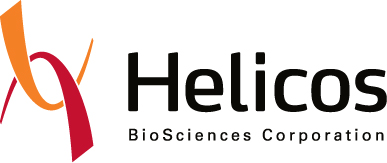

The 9th annual Bioinformatics Open Source Conference (BOSC 2008) will
take place in [Toronto, Ontario, Canada](wp:Toronto "wikilink"), as one
of several Special Interest Group (SIG) meetings occurring in
conjunction with the 16th annual Intelligent Systems for Molecular
Biology Conference ([ISMB 2008](http://www.iscb.org/ismb2008/)).

Keynote Speaker
===============

This year our Keynote speaker will be [Julian
Lombardi](http://en.wikipedia.org/wiki/Julian_Lombardi), Senior Research
Scholar with Duke University. The title of his presentation will be:

**Croquet: An Open Collaboration Architecture for Scientific
Visualization and Simulation**

Overview
========

The Bioinformatics Open Source Conference (BOSC) is sponsored by the
[Open Bioinformatics Foundation](OBF "wikilink") (O|B|F), a non-profit
group dedicated to promoting the practice and philosophy of Open Source
software development within the biological research community. Many Open
Source bioinformatics packages are widely used by the research community
across many application areas and form a cornerstone in enabling
research in the genomic and post-genomic era. Open source bioinformatics
software has facilitated rapid innovation and dissemination of new
computational methods as well as informatics infrastructure. Since the
work of the Open Source Bioinformatics Community represents some of the
most cutting edge of Bioinformatics in general, the overall theme for
the conference this year is "Tackling Hard Problems with Emerging
Technologies". Topics under this umbrella include cyberinfrastructure,
grid computing and workflow management and discovery, and visualization.
We will also have a series of update talks about the main Open Source
Bioinformatics Software suites.

One of the hallmarks of BOSC is the coming together of the open source
developer community in one location. A face-to-face meeting of this
community creates synergy where participants can work together to create
use cases, prototype working code, or run bootcamps for developers from
other projects as short, informal, and hands-on tutorials in new
software packages and emerging technologies. In short, BOSC is not just
a conference for presentations of completed work, but is a dynamic
meeting where collaborative work gets done.

Important Dates
===============

March 10: Call for speakers and abstracts is open.

May 11: Abstract submission deadline. All abstracts must be submitted
through our Open Conference Systems site.

June 2: Notification of accepted talks.

June 4: Early registration discount cut-off.

June 6: Authors of accepted talks must notify the Program Committee of
their acceptance by e-mailing
[bosc@open-bio.org](mailto:bosc%40open-bio%2eorg) (revised abstracts
must be posted to the Open Conference Systems site.

June 9: [Schedule for BOSC 2008](BOSC_2008_schedule "wikilink") posted.
Call for lightning talks and [Birds of a
Feather](BOSC_2008/Birds-of-a-Feather "wikilink") sessions opens.

July 18-19: BOSC 2008!

Schedule
========

Abstract submissions for full presentations were closed as of May 11,
2008, and the [current schedule has been
posted](BOSC_2008_schedule "wikilink").

You may also download the entire BOSC program with the schedule and all
abstracts as a [PDF
file](http://www.open-bio.org/w/images/b/b6/BOSC2008_program.pdf)
(1971KB).

Important Information for Presenters
------------------------------------

### Audio/Visual Resources

-   Presenters are encouraged to bring their own laptops/

`for their presentations.`

-   If a presentor does not bring a laptop, he/she will be able to
    borrow one from one of the organizers. In this case, please contact
    the organizing committee at
    [bosc@open-bio.org](mailto:bosc%40open-bio%2eorg) to
    confirm arrangements.
-   A high speed internet connection will be available.

### Slide Availability

-   Slides from BOSC2008 have been posted on SlideShare. See links to
    slides from the [schedule](BOSC_2008_schedule "wikilink").
-   Presenters, if you have not already done so, please e-mail your
    slides to the organizers at
    [bosc@open-bio.org](mailto:bosc%40open-bio%2eorg).

Call for Lightning Talks/Demos/Birds of a Feather Sessions
----------------------------------------------------------

### Lightning Talks and Software Demonstrations

The program committee is currently seeking speakers for the lightning
talks. Lightning talks are quick - only five minutes long - and a great
opportunity for you to give people a quick summary of your open source
project, code, idea, or vision of the future. Or, if you are involved in
the development of novel Open Source Software, you could use the time to
give a quick demonstration of your work.

If you are interested in giving a Lightning Talk or Software
Demonstration at BOSC 2008, please e-mail us at
[bosc@open-bio.org](mailto:bosc%40open-bio%2eorg):

-   a brief title and summary (one or two lines)
-   a URL for the project page, if applicable
-   the specific open source license used for your software or your
    release plans (NOTE: the Open Source License Requirement also
    applies to Lightning talks).

We will accept entries on-line until BOSC starts, but space for demos
and lightning talks is limited.

### Birds of a Feather Sessions

One of the more popular activities at BOSC are the Birds-of-a-Feather
sub-meetings that people organize at the end of each days session. These
are free-form meetings organized by the attendees themselves.
Traditionally, some BOF's have been formed to allow developers and users
of individual [OBF](OBF "wikilink") software to meet each other
face-to-face to discuss the project, but other meetings have been formed
to discuss completely new ideas. These meetings offer a unique
opportunity for individuals to explore more about the activities of the
various Open Source Projects, and, in some cases, even take an active
role influencing the future of Open Source Software development. If you
would like to create a BOF, just sign up for a [ wiki
account](Special:Userlogin "wikilink"), login, and edit the
[BOSC\_2008/Birds-of-a-Feather](BOSC_2008/Birds-of-a-Feather "wikilink")
page.

Main Session Topics
-------------------

This year, BOSC is accepting abstract submissions on the conference
theme "Tackling Hard Problems with Emerging Technologies". The
conference theme reflects that there are new technologies emerging on
both the scientific front (new sequencing technologies, etc.) and the IT
front (workflows, mash-up, web 2.0, improvements in all of the major
programming languages, etc.), which may allow the open source community
to solve problems that were previously intractable. Abstracts may be
submitted for the following topics.

**1. Cyberinfrastructure** - We are interested in presentations on
topics dealing with the development of infrastructure on the web to
facilitate software and data re-use (mashups, or traditional),
interoperability and inter-process communication, system/service
discovery, and data movement and modeling in distributed systems. This
may include peer-to-peer systems of data transfer, Web Services, various
flavors of data representation (SOAP, JSON, XML, others), and
technologies commonly referred to under the Web 2.0 paradigm (e.g.
folksonomies/tagging, user-based content generation, content feeds, and
Social Networking).

**2. Grid Computing and Workflow Management and Discovery** - We
particularly invite talks that report progress in making workflow
systems easier to use and on how to do distributed-collaborative
research , e.g. workflows that encompass the coordination of systems
running in different parts of the world.

**3. Visualization** - Visualization is a maturing area of open source
software development. We particularly invite talks that demonstrate
innovative visualization systems, especially those which work in the
context of workflows.

**4. Open Source Software** - Speakers are invited to present talks on
the use, development, or philosophy of open source software in
bioinformatics.

**5. Bio\* Open Source Project Updates** - We invite abstracts from the
representatives of the open source projects sponsored by or affiliated
to the O|B|F (see [Projects](Projects "wikilink")).

Notes on Submissions
--------------------

### Open Source License Requirement

The [Open Bioinformatics Foundation](OBF "wikilink"), which is the sole
sponsor of BOSC, is dedicated to promoting the practice and philosophy
of Open Source Software Development within the Biological Research
Community. For this reason, in order to be considered for acceptance,
any talk submitted to be presented at BOSC which concerns a specific
software system to be used by the research community must be licensed
with a recognized Open Source License, and be available for download by
anyone using ftp, cvs/subversion, or as a tar/zip file from the Project
Website.

See the following websites for further details:

-   [Recognized Open Source
    Licenses](http://www.opensource.org/licenses/)
-   [Definition of the Open Source
    Philosophy](http://www.opensource.org/docs/definition.php)

### How Do I Submit?

The deadline for abstract submissions for full presentations was May 11,
2008. Abstract submissions were not accepted via e-mail this year. All
abstracts were submitted through our [Open Conference
Systems](http://events.open-bio.org/BOSC2008/openconf.php) site. *Note:
the BOSC 2008 OCS site has been taken down. If you need to access this
site, you should contact the current BOSC organizers at
<bosc@open-bio.org>. — [Kdahlquist](User:Kdahlquist "wikilink"); 00:42,
4 December 2009 (UTC)*

You will need to prepare a short, 50-word abstract, and a full abstract
to upload as a PDF file or plain text file. Full abstracts must be one
page in length. Place the title and authors of the abstract at the top
of the page and use 1 inch (2.5 cm) margins on the top, sides, and
bottom of the page.

NOTE: The Open Conference Systems abstract submission system will tell
you to upload a "paper". This refers to your one-page full abstract. The
one-page abstract will appear in the SIG booklet distributed by ISMB and
no other papers will be published from this conference. There will not
be a poster session at BOSC, only presentations.

Accepted talks will be 10-20 minutes, depending on the session. You will
be notified of the length of your talk upon abstract acceptance.

Registration
============

Please see the [ISMB registration
site](http://www.iscb.org/ismb2008/registration.php) for details. Online
registration opened March 6, 2008.

Feedback on BOSC 2008 and Planning for BOSC 2009
================================================

Give us your feedback on BOSC 2008 so we can plan for BOSC 2009, the
10th Annual BOSC! Sign up and login to the discussion page and give us
your suggestions, and volunteer for BOSC 2009.

Contact
=======

Chair of the conference and of the organizing committee is Kam
Dahlquist. Aside from Dr. Dahlquist, the 2008 BOSC Organizing Committee
consists of Chris Dagdigian, Hilmar Lapp, Darin London, and Jason
Stajich. For more information about the conference or the call for
abstracts, please contact the organizers at [custom
papers](http://www.research-service.com/) site.

NOTE: Abstract submissions will not be accepted via e-mail this year.
All abstracts must be submitted through our Open Conference Systems site
which will open Monday, March 10, 2008.

Sponsors
========

The keynote speaker and student travel fellowships to BOSC 2008 were
made possible by [Helicos Biosciences
Corporation](http://www.helicosbio.com/) and an anonymous donor. Thank
you. 

<Category:BOSC> <Category:Conferences> [Category:BOSC
Conferences](Category:BOSC_Conferences "wikilink")
