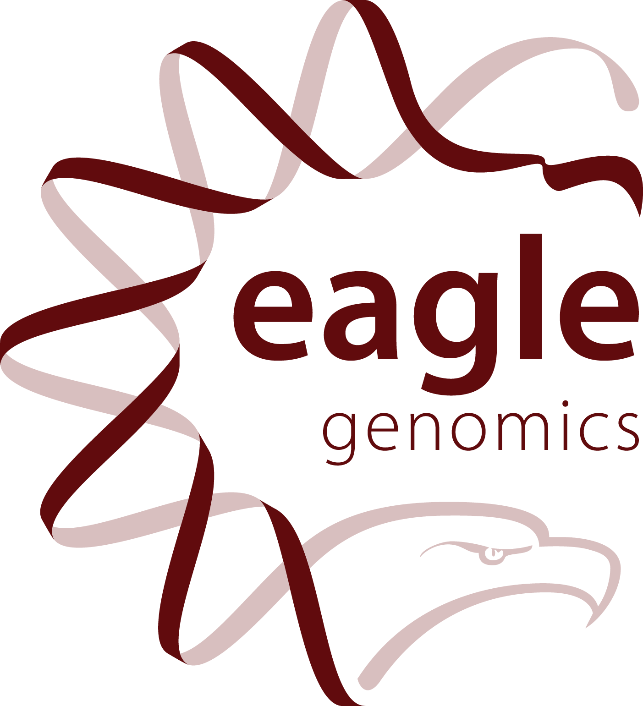

The 11th Annual Bioinformatics Open Source Conference (BOSC) 2010 will
be held for two days in conjunction with [the 18th Annual International
Conference on Intelligent Systems for Molecular Biology (ISMB
2010)](http://www.iscb.org/ismb2010) in Boston, Massachusetts, USA. The
dates of BOSC 2010 are July 9-10; the main ISMB Conference runs July
11-13, 2010. BOSC attendees are also invited to participate in the
[Codefest 2010](Codefest_2010 "wikilink") programming session on July
7-8.

**ANNOUNCEMENT:** Abstract acceptances were delayed slightly; authors
will be receiving notification by e-mail in the next 24 hours. *—
[Kdahlquist](User:Kdahlquist "wikilink") 20:17, 6 May 2010 (UTC)*

Overview
--------

The Bioinformatics Open Source Conference (BOSC) is sponsored by the
Open Bioinformatics Foundation (O|B|F), a non-profit group dedicated to
promoting the practice and philosophy of Open Source software
development within the biological research community.

Many open source bioinformatics packages are widely used by the research
community across many application areas and form a cornerstone in
enabling research in the genomic and post-genomic era. Open source
bioinformatics software has facilitated rapid innovation, dissemination,
and wide adoption of new computational methods, reusable software
components, and standards. One of the hallmarks of BOSC is the coming
together of the open source developer community in one location to meet
face-to-face. This creates synergy where participants can work together
to create use cases, prototype working code, or run bootcamps for
developers from other projects as short, informal, and hands-on
tutorials in new software packages and emerging technologies. In short,
BOSC is not just a conference for presentations of completed work, but
is a dynamic meeting where collaborative work gets done and attendees
can learn about new or on-going developments that they can directly
apply to their own work.

Keynote Speakers
----------------

### Guy Coates

[Guy Coates](http://uk.linkedin.com/pub/guy-coates/3/b5b/9b0), Group
leader of the Informatics Systems Group at the [Wellome Trust Sanger
Institute](http://www.sanger.ac.uk/), will be one of our keynote
speakers at BOSC 2010. Guy Coates is an expert in large Linux/Unix
systems architecture, management and application optimization, next-gen
DNA sequencing pipelines, very large database systems (&gt;50TB), and
high performance compute clusters (1500+ CPUs). He will lead off the
conference, with a talk entitled:

***Clouds: all fluff and no substance?*** Cloud architectures have made
plenty of impact in the press over the past 18 months, but have they
made any impact in solving real bioinformatics challenges? This talk
will detail the Sanger Institute's experiences with the cloud, both good
and bad, and ask what needs to be done to prepare the cloud for the era
of commodity sequencing and $500 genomes.

### Ross Gardler

Our other keynote speaker will be [Ross
Gardler](http://www.linkedin.com/in/rossgardler), Vice President for
Community Development at the Apache Software Foundation and Manager for
OSS Watch (University of Oxford), which helps institutions and projects
in the UK that are using or developing free and open source software. He
has also performed Computer Science and Management research and teaching
in both the UK and West Indies. In his talk, he will share with the
O|B|F community the insights he has gained in community building for
Apache and other open source projects.

Important Dates
---------------

-   February 26, 2010: Call for abstracts opens
-   March 9, 2010: Registration opens
-   **April 15, 2010: Deadline for submitting abstracts**
-   May 5, 2010: Notification of accepted abstracts. *Abstract
    acceptances were delayed slightly; authors will be receiving
    notification by e-mail in the next 24 hours. —
    [Kdahlquist](User:Kdahlquist "wikilink") 20:17, 6 May 2010 (UTC)*
-   May 28, 2010: Early Registration Discount Cut-off Date
-   **July 7-8, 2010: [Codefest 2010](Codefest_2010 "wikilink")
    programming session**
-   **July 9-10, 2010: BOSC 2010!**

Sessions
--------

-   **OpenBio [SolutionChallenge](SolutionChallenge "wikilink")** --
    Bioinformatics library providers: please join us in a friendly
    competition to solve a shared biological problem, demonstrating the
    utility of your toolkit alongside other developers.
    -   Instead of the traditional Bio\* updates that we've had at
        previous conferences, this year, we're planning to organize
        these talks around a central theme: the OpenBio
        Solution Challenge. We start with a biological question of
        general interest, and the project talks will focus around how
        you would solve that problem using your toolkit and
        programming language.
    -   This is meant to provide a challenge for OpenBio contributors, a
        nice tutorial style overview of various projects and approaches
        for other programmers, and a fun opportunity to compete and
        learn from other projects. Conference attendees will vote on
        their favorite solution, with the winner receiving fame and
        fortune (warning: fortune not guaranteed).
    -   Specific challenges are being discussed on the
        [SolutionChallenge](SolutionChallenge "wikilink") page and
        through the various Bio\* mailing lists. Alternately, each
        project could highlight a challenge that they particularly do
        well, focusing tutorial-style on how to solve a
        particular problem.
    -   (Of course, we would still welcome traditional Bio\* Update
        abstracts, too!)
-   **Approaches to analyzing high-throughput 'omics data** --
    Presentation of projects that use the MapReduce framework either for
    1.  parallelized analysis of possibly terabyte size data sets from
        next-gen sequencing and mass spec proteomics or
    2.  parallelization of bioinformatics algorithms in general (e.g.,
        the Apache Mahout project).

  
Projects may involve Hadoop (MapReduce API + HDFS) as well as associated
open source toolkits (Hbase, Hive, Pig, Cascading, etc.) or other NoSQL
non-relational data stores.

-   **Cloud-based approaches to improving software and data
    accessibility** -- The emergence of [cloud
    computing](http://en.wikipedia.org/wiki/Cloud_computing) has made
    highly scalable cluster computing available to
    computational biologists. Services such as [Amazon Elastic Compute
    Cloud](http://aws.amazon.com/ec2/) combined with [publicly available
    datasets](http://aws.amazon.com/publicdatasets/#1) promise to lower
    the overhead to participate in large scale data analyses. We are
    interested in talks focused around how the community can build up
    resources and datasets for cloud infrastructure, as well as the
    sharing of insights, and the contribution of implemented workflows.
    Current implementations and initiatives are encouraged to submit
    abstracts for talks and join in the pre-conference [Codefest
    session](http://www.open-bio.org/wiki/Codefest_2010).
-   **The Semantic Web in open source bioinformatics** -- Emerging
    [Semantic Web](http://en.wikipedia.org/wiki/Semantic_Web)
    technologies promise to improve data interoperability
    and accessibility. Seeing these developments as promising for life
    science researchers who struggle daily with new file formats and
    incompatible datasets, [BioHackathon
    2010](http://hackathon3.dbcls.jp/) focused around current semantic
    resources and tools for bioinformatics. We solicit session talks
    from researchers using RDF and related technologies in their
    research and data analyses, with a special focus on documenting how
    these tools can contribute to open data access.
-   **Open Source Software** -- Open source software that does not fit
    neatly into the above categories.
-   **Lightning Talks** -- short, 5 minute talks intended to introduce
    very recent developments, initiate discussion, or highlight
    resources of interest to BOSC attendees. Abstracts for Lightning
    Talks will be accepted up to the first day of BOSC and will be
    accepted based on space availability and conformance to the Open
    Source License Requirement.

Student Travel Awards
---------------------

Through generous sponsorship from [Eagle
Genomics](http://www.eaglegenomics.com/) and an anonymous donor, we are
pleased to announce the competition for three Student Travel Awards for
BOSC 2010. Each winner will be awarded $250 to defray the costs of
travel to BOSC 2010.

-   To apply for the award, submit your abstract by the April 15
    deadline through the Open Conference Systems site.
-   Be sure to check the box indicating that you are a graduate student.
-   Your abstract will undergo the normal review process for BOSC. In
    addition, the BOSC Organizing Committee will review the student
    abstracts and pick the three best abstracts for the Student
    Travel Awards.
-   You will be notified of your award by the abstract notification
    deadline shown above.
-   You will still need to make your own travel arrangements for BOSC.
    The award will take the form of a check or reimbursement to take
    place at the conference itself. You will receive more details upon
    notification of the award.

Abstract Submission Information
-------------------------------

The deadline for abstract submissions is Thursday, April 15. **Abstract
submissions are now closed.** Abstract submissions were not be accepted
via e-mail this year. All abstracts were submitted through our [Open
Conferences System](http://events.open-bio.org/BOSC2010/) site.

Abstracts must be **one page** in length and submitted **as a PDF file
only**. Please observe the following formatting guidelines:

-   Use 1 inch (2.5 cm) margins on the top, sides, and bottom of
    the page.
-   List the following elements in order from the top of the page:
    -   Title
    -   Authors, with the presenting author's name underlined.
    -   Author affiliations, including the e-mail address of the
        presenting author.
    -   URL for the overall project web site
    -   URL for accessing the code
    -   The particular Open Source License being used
-   The abstracts will be presented "as is" in the program booklet;
    please help your all-volunteer Organizing Committee by following the
    formatting guidelines above.
-   **NOTE: upload your one-page, PDF-formatted abstract to the Open
    Conference System site as the *File*.** The text box for the
    *Abstract* is optional; the PDF file is what will be reviewed.

Accepted talks will be 10-20 minutes, depending on the session. You will
be notified of the length of your talk upon abstract acceptance.

Submissions for Lightning Talks (length ~5 minutes) will be accepted up
until the day of the conference, though submission to the program
following the above guidelines is strongly encouraged to facilitate
better planning. The open-source license requirement (see below) applies
equally to lightning talks.

### Open Source License Requirement

The [Open Bioinformatics Foundation](OBF "wikilink"), which is the sole
sponsor of BOSC, is dedicated to promoting the practice and philosophy
of Open Source Software Development within the biological research
community. For this reason, if a submitted talk proposal concerns a
specific software system for use by the research community, then that
software must be licensed with a recognized Open Source License, and be
available for download, including source code, by a tar/zip file
accessed through ftp/http or through a widely used version control
system like cvs/subversion/git/bazaar/Mercurial.

See the following websites for further information:

-   [Recognized Open Source
    Licenses](http://www.opensource.org/licenses/)
-   [Definition of the Open Source
    Philosophy](http://www.opensource.org/docs/definition.php)

First-ever Published BOSC Proceedings
-------------------------------------

The BOSC Organizing Committee is pleased to announce that this year we
will be publishing the first-ever BOSC Proceedings in the Open Access
journal, [BMC
Bioinformatics](http://www.biomedcentral.com/bmcbioinformatics/).

-   Presenters at BOSC 2010 are invited to submit a 4-5 page manuscript
    for publication in the Open Access journal, [BMC
    Bioinformatics](http://www.biomedcentral.com/bmcbioinformatics/).
-   Manuscripts will be due after the conference on August 15, 2010 to
    give authors time to refine their submission based on discussion at
    BOSC (especially for participants in the OpenBio
    Solution Challenge).
-   Manuscripts for all [ Session topics](BOSC_2010#Sessions "wikilink")
    will be considered.
-   Manuscripts will be peer-reviewed (abstract acceptance to BOSC does
    not guarantee publication in the Proceedings).
-   Manuscripts must conform to BMC Bioinformatics [ author guidelines
    and
    formatting](Media:Instructions_for_authors_-_BMC_-_Appendix_A.pdf "wikilink"),
    although submissions will be processed through BOSC, *NOT* the BMC
    Bioinformatics submission web site.
-   Authors will be charged the fee of GBP 550 per article, invoiced by
    and paid directly to BioMed Central. This fee is payable regardless
    of any BioMed Central membership arrangements, and it shall be the
    responsibility of the author to pay this sum to BioMed Central for
    inclusion in the Proceedings.

Organizing Committee
--------------------

**Chair**

-   [Kam D. Dahlquist](http://myweb.lmu.edu/kdahlqui) (Loyola
    Marymount University)

**Members**

-   [Brad Chapman](http://bcbio.wordpress.com) ([Biopython
    developer](http://biopython.org); Mass General Hospital)
-   [Nomi Harris](http://www.linkedin.com/in/nomiharris) (O|B|F Board)
-   [Michael Heuer](http://biojava.org/wiki/Michael_Heuer)
    (BioJava Developer)
-   [Darin London](http://www.bioperl.org/wiki/Darin_London)
    (BioPerl Developer)
-   Steffen Möller (Institute for Neuro- und Bioinformatics,
    Lübeck, Germany)
-   Jim Procter (University of Dundee, Scotland)
-   Ron Taylor (Pacific Northwest National Laboratory)

**Ex Officio (Members of the O|B|F Board)**

-   [Chris Dagdigian](http://www.bioperl.org/wiki/Chris_Dagdigian)
-   [Hilmar Lapp](http://www.bioperl.org/wiki/Hilmar_Lapp)
-   [Jason Stajich](http://www.bioperl.org/wiki/Jason_Stajich)

### Previous BOSCs

The first BOSC was held in 2000. Please see [past BOSC
conferences](Past_BOSC_conferences "wikilink") for information about the
first ten conferences.

### Contact Us

-   If you wish to be on the mailing list for BOSC-related
    announcements, including the call for abstracts and deadline
    reminders, please subscribe to the
    [Bosc-announce](http://lists.open-bio.org/mailman/listinfo/bosc-announce) list.
-   The deadline for abstract submissions is Thursday, April 15.
    Abstract submissions will **not** be accepted via e-mail this year.
    All abstracts are to be submitted through our [Open Conferences
    System](http://events.open-bio.org/BOSC2010/) site.
-   For more information about the conference, please contact the
    organizers at [bosc@open-bio.org](mailto:bosc@openbio.org).

Sponsors
--------

The keynote speakers and student travel fellowships to BOSC 2010 were
made possible by [Eagle Genomics, Ltd.](http://www.eaglegenomics.com/)
and an anonymous donor. Thank you.

<Category:BOSC> <Category:Conferences> [Category:BOSC
Conferences](Category:BOSC_Conferences "wikilink")
