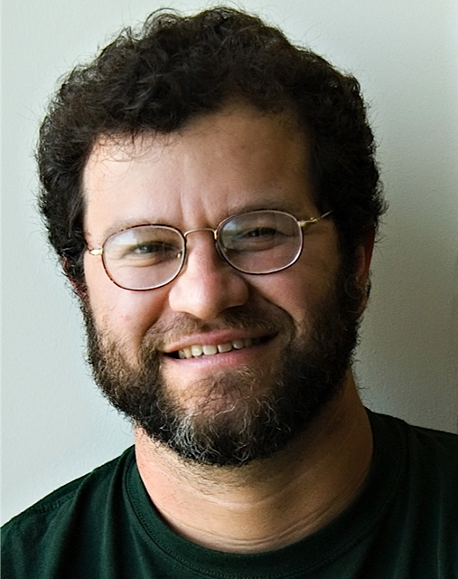

The 13th Annual Bioinformatics Open Source Conference (BOSC 2012) will
take place July 13-14, 2012, in Long Beach, CA, right before [ISMB
2012](http://www.iscb.org/ismb2012). Registration is through
[ISMB](http://www.iscb.org/ismb2012-registration) (but you don't have to
register for ISMB itself in order to register for BOSC). Check out the
**[preliminary schedule](BOSC_2012_Schedule "wikilink")**!

Important Dates
---------------

-   April 13, 2012: Deadline for submitting abstracts for talks
-   July 11-12, 2012: [Codefest 2012](Codefest_2012 "wikilink") ([Loyola
    Marymount University](http://www.lmu.edu/), Los Angeles, California)
-   **July 13-14, 2012: BOSC 2012** (Long Beach,
    California)--[preliminary schedule](BOSC_2012_Schedule "wikilink")
-   July 15-17, 2012: [ISMB 2012](http://www.iscb.org/ismb2012) (Long
    Beach, California)
-   July 19-20, 2012: [EU-codefest 2012](EU_Codefest_2012 "wikilink")
    (Lodi, Italy)

Overview
--------

The Bioinformatics Open Source Conference (BOSC) is a satellite of
[ISMB](http://www.iscb.org/ismb2012). It is sponsored by the Open
Bioinformatics Foundation (O|B|F), a non-profit group dedicated to
promoting the practice and philosophy of Open Source software
development within the biological research community.

Open Source software has flourished in the bioinformatics community for
well over a decade. When the first BOSC (Bioinformatics Open Source
Conference) was held in 2000, there were already a number of popular
open source bioinformatics packages, and the number and range of these
projects has increased dramatically since then. Many open source
bioinformatics packages are widely used by the research community across
a wide variety of applications. Open source bioinformatics software has
facilitated rapid innovation, dissemination, and wide adoption of new
computational methods, reusable software components, and standards.

BOSC brings together bioinformatics open source developers from all over
the world so they can forge connections each other (both within and
across projects), increase the visibility of their work, and collaborate
to build shared resources. Participants can work together to create use
cases, prototype working code, or run hands-on tutorials in new software
packages and emerging technologies. For those who are bioinformatics
software users rather than developers, BOSC introduces or updates them
on a wide array of projects that they might find useful.

Please spread the word about BOSC to interested developers; all are
welcome. On Twitter, follow @BOSC2012 and use hash tag \#bosc2012.

Sessions
--------

**[Preliminary schedule](BOSC_2012_Schedule "wikilink")**

-   **Cloud and Parallel Computing** -- This session will cover
    cloud-based approaches to improving software and data accessibility.
    The emergence of [cloud
    computing](http://en.wikipedia.org/wiki/Cloud_computing) has made
    highly scalable cluster computing available to
    computational biologists. Services such as [Amazon's Elastic Compute
    Cloud](http://aws.amazon.com/ec2/) combined with [publicly available
    datasets](http://aws.amazon.com/publicdatasets/#1) promise to lower
    the overhead to participate in large scale data analyses. Talks will
    focus on how the community can build up resources, datasets, and
    workflows for making the best use of cloud infrastructure. We will
    also include talks on data-parallel approaches to analyzing massive
    data sets, such as those resulting from next-generation sequencing
    and mass spec proteomics, and reports on the parallelization of
    bioinformatics algorithms in general.
-   **Genome-scale Data Management** -- This session will focus on
    processes and technologies that support the creating, managing and
    reporting of genomic data. This session is appropriate for
    discussion of systems that involve components such as (but not
    limited to) Ensembl and GMOD/Chado data stores, Taverna and Galaxy
    analysis workflows, and BioMart and InterMine warehouses.
-   **Linked Data and Translational Knowledge Discovery** -- Linked Data
    is an emerging set of conventions on using basic Semantic Web
    standards (HTTP URIs and
    [RDF](http://dev.isb-sib.ch/projects/uniprot-rdf/) in particular) to
    expose, share, and connect data, information, and knowledge online.
    This session will explore the application of Linked Data and other
    knowledge-discovery techniques and paradigms to help advance our
    understanding of human health and disease.
-   **Software Interoperability** -- Open Source approaches to
    integrating the latest bioinformatics tools. Examples of
    interoperability environments include Galaxy, Cytoscape, caBIG,
    and myGrid.
-   **Bioinformatics Open Source Project Updates** -- This session will
    feature short talks from ongoing projects describing their
    recent progress. Abstracts will be solicited from open source
    projects affiliated with the O|B|F (see
    <http://www.open-bio.org/wiki/Projects>), including the Bio\*
    projects, DAS, BioMOBY, EMBOSS, and GMOD, but any other open-source
    project will be equally eligible to submit presentations for
    this session.
-   **Panel: Bioinformatics Paper Reviews: Open Standards and Standards
    of Openness** -- This panel will cover two interrelated types of
    openness in bioinformatics paper reviews:

<!-- -->

<!-- -->

-   Shared standards/criteria that all reviewers could use when judging
    bioinformatics papers.
-   The requirement that authors make their software/methods/data
    available so that reviewers can replicate and evaluate the work
    described in the paper.

Should bioinformatics reviewers be encouraged--or required--to use a
standardized set of review criteria? (Some possible criteria are
described [in this blog
post](http://ivory.idyll.org/blog/may-12/blog-review-criteria-for-bioinfo.html).)
Should bioinformatics journals require authors, as a condition for
publication, to release their tools and scripts? Can we develop
procedures for fairly and systematically testing bioinformatics
software, and should this testing be done openly (rather than secretly
by anonymized paper reviewers)? These and other related topics will be
discussed by a panel of experienced and opinionated bioinformatics
researchers, in conversation with members of the audience.

</ul>
Keynote Speakers
----------------

### Jonathan Eisen

Dr. Eisen is a professor at the University of California, Davis, where
he holds appointments in the Genome Center, the Department of Evolution
and Ecology and the Department of Medical Microbiology and Immunology.
In addition, he has an adjunct position at the Department of Energy
Joint Genome Institute in Walnut Creek, CA. Prior to moving to UC Davis
he was on the faculty at The Institute for Genomic Research (TIGR) for
eight years. His research focuses on the genomic basis for the origin of
novelty (how new processes and functions originate), in particular in
microbes. Dr. Eisen is heavily involved in the Open Access publishing
movement and is Academic Editor in Chief of PLoS Biology. He is also an
active blogger and microblogger (e.g., see
[phylogenomics.blogspot.com](http://phylogenomics.blogspot.com) and
[twitter.com/phylogenomics](http://twitter.com/phylogenomics)).

His talk is entitled **Science Wants to Be Open - If Only We Could Get
Out of Its Way**:

*Scientific research and education is inherently an open activity. Yet
the culture of scientific practice has inserted barriers in the way of
this openness in every conceivable area from peer review, to publishing,
to sharing resources, to education. I will argue that most or even all
of these barriers are unnecessary and should be eliminated for
scientific progress to be most efficient.*

### Carole Goble

Carole Goble is a full professor in the School of Computer Science at
the University of Manchester, UK, where she co-leads the Information
Management Group. She has an international reputation in Semantic Web,
Distributed computing, and Social Computing for scientific
collaboration. She is the Director of the myGrid project, which has
produced the widely-used Taverna open source software; myExperiment, a
social web site that enables researchers to share scientific workflows;
and the Biocatalogue of web services for the life sciences.

In 2008 Carole was awarded the inaugural Microsoft Jim Gray award for
outstanding contributions to e-Science. In 2010 she was elected a Fellow
of the Royal Academy of Engineering for her contributions to e-Science.
In 2012 she was nominated for the Benjamin Franklin award for open
science in Biology.

Carole's talk is entitled **If I build it will they come?**:

*Over the years I have built a bunch of open source software and
services for researchers: the Taverna workflow system, myExperiment for
workflow sharing, BioCatalogue for services, SEEK for Systems Biology
data and models, and most recently MethodBox for longitudinal data sets.
As well as building software we built communities: development
communities and user communities. So what drives/hinders adoption? What
do I know now that I wished I had known before? How do we sustain
communities on time-limited grants? How do we build it so they come,
stay and join in?*

### Open Source License Requirement

The [Open Bioinformatics Foundation](OBF "wikilink"), which sponsors
BOSC, is dedicated to promoting the practice and philosophy of Open
Source Software Development within the biological research community.
For this reason, if a submitted talk proposal concerns a specific
software system for use by the research community, then that software
must be licensed with a recognized Open Source License, and be available
for download, including source code, by a tar/zip file accessed through
ftp/http or through a widely used version control system like
cvs/subversion/git/bazaar/Mercurial.

See the following websites for further information:

-   [Recognized Open Source
    Licenses](http://www.opensource.org/licenses/)
-   [Definition of the Open Source
    Philosophy](http://www.opensource.org/docs/definition.php)

### Posters at BOSC

There are a few spots reserved for walk-in last-minute posters. Your
poster should not exceed these dimensions: 46 inches wide by 45 inches
high.

Sponsors
--------

We thank [Eagle Genomics, Ltd.](http://www.eaglegenomics.com/) and an
anonymous donor for sponsoring three Student Travel Awards at BOSC 2012.

Student Travel Awards
---------------------

Thanks to generous sponsorship from [Eagle
Genomics](http://www.eaglegenomics.com/) and an anonymous donor, we are
pleased to announce the competition for three Student Travel Awards for
BOSC 2012. Each winner will get free admission to BOSC (a $190-290
value).

BOSC Organizing Committee
-------------------------

**Chair**

-   Nomi L. Harris (Lawrence Berkeley National Laboratory)

**Members**

-   [Jan Aerts](http://www.esat.kuleuven.be/scd/person.php?persid=473)
    (Katholieke Universiteit Leuven)
-   [Brad Chapman](http://bcbio.wordpress.com) ([Biopython
    developer](http://biopython.org); [Harvard School of Public
    Health](http://compbio.sph.harvard.edu/chb/))
-   [Peter Cock](http://www.scri.ac.uk/staff/petercock) ([Biopython
    developer](http://biopython.org); James Hutton Institute, formerly
    Scottish Crop Research Institute)
-   Christopher Fields (National Center for Supercomputing Applications)
-   [Hilmar Lapp](http://www.bioperl.org/wiki/Hilmar_Lapp) (National
    Evolutionary Synthesis Center)
-   Peter Rice (European Bioinformatics Institute)

**Ex Officio (Members of the O|B|F Board)**

-   [Chris Dagdigian](http://www.bioperl.org/wiki/Chris_Dagdigian)
-   [Kam D. Dahlquist](http://myweb.lmu.edu/kdahlqui)
-   [Jason Stajich](http://www.bioperl.org/wiki/Jason_Stajich)

Previous BOSCs
--------------

-   The first BOSC was held in 2000.
-   [BOSC 2011](BOSC_2011 "wikilink") took place in Vienna in July 2011.
-   [ Information about the first 12
    conferences](Past_BOSC_conferences "wikilink")

Contact Us
----------

-   [Follow BOSC on Twitter](http://twitter.com/#!/BOSC2012): @BOSC2012
-   If you'd like to join the mailing list for BOSC-related
    announcements, including the call for abstracts and deadline
    reminders, please subscribe to the
    [Bosc-announce](http://lists.open-bio.org/mailman/listinfo/bosc-announce) list.
    This list has low traffic, and your address will be kept private.
-   If you have questions about the conference, please contact the
    organizers at <bosc@open-bio.org>.

<Category:BOSC> <Category:Conferences> [Category:BOSC
Conferences](Category:BOSC_Conferences "wikilink")
