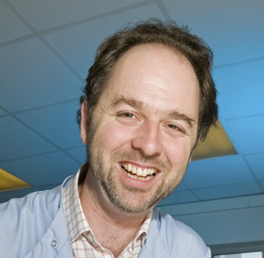

|                                            |     |                                                                                                                                                                                          |
|--------------------------------------------|-----|------------------------------------------------------------------------------------------------------------------------------------------------------------------------------------------|
|  |     | The 14th Annual Bioinformatics Open Source Conference (BOSC 2013) will take place July 19-20, 2013, in Berlin, Germany, right before [ISMB/ECCB 2013](http://www.iscb.org/ismbeccb2013). 
                                                                                                                                                                                                                                              
                                                    Important Dates                                                                                                                                                                           
                                                    ---------------                                                                                                                                                                           
                                                                                                                                                                                                                                              
                                                    -   March 12, 2103: Call for BOSC abstracts opens                                                                                                                                         
                                                    -   April 7-8, 2013: BOSC/Broad Interoperability Hackathon, Cambridge, MA                                                                                                                 
                                                    -   April 12, 2013: BOSC abstracts due                                                                                                                                                    
                                                    -   July 17-18, 2013: Codefest 2013, Berlin                                                                                                                                               
                                                    -   July 19-20, 2013: **BOSC 2013**, Berlin                                                                                                                                               
                                                    -   July 19-23, 2013: [ISMB/ECCB 2013](http://www.iscb.org/ismbeccb2013),                                                                                                                 |

Overview
--------

The Bioinformatics Open Source Conference (BOSC) is a satellite of
[ISMB](http://www.iscb.org/ismbeccb2013). It is sponsored by the Open
Bioinformatics Foundation (O|B|F), a non-profit group dedicated to
promoting the practice and philosophy of Open Source software
development within the biological research community.

Open Source software has flourished in the bioinformatics community for
well over a decade. When the first BOSC (Bioinformatics Open Source
Conference) was held in 2000, there were already a number of popular
open source bioinformatics packages, and the number and range of these
projects has increased dramatically since then. BOSC covers the wide
range of open source bioinformatics software packages that have been
successfully developed and adopted by the community, and encompasses the
growing movement of Open Science, with its focus on transparency,
reproducibility, and data provenance. We welcome submissions relating to
all aspects of open source bioinformatics software and open science,
including new computational methods, reusable software components,
visualization, interoperability, and other approaches that help to
advance research in the biomolecular sciences. Two full days of talks,
posters, panel discussions, and informal discussion groups will enable
BOSC attendees to interact with other developers and share ideas and
code, as well as learning about some of the latest developments in the
field of open source bioinformatics.

Please spread the word about BOSC--all are welcome. On Twitter, follow
@BOSC2013 and use hash tag \#bosc2013.

Session Topics
--------------

-   Cloud and Parallel Computing
-   Genome-scale Data Management
-   Software Interoperability
-   Open Science and Reproducible Research
-   Visualization
-   Bioinformatics Open Source Project Updates
-   Panel (TBD)

Keynote Speakers
----------------

### Cameron Neylon

Cameron Neylon is Advocacy Director for the Public Library of Science, a
research biophysicist and well known agitator for opening up the process
of research. He speaks regularly on issues of Open Science including
Open Access publication, Open Data, and Open Source as well as the wider
technical and social issues of applying the opportunities the internet
brings to the practice of science. He was named as a SPARC Innovator in
July 2010 for work on the Panton Principles and is a recipient of the
Blue Obelisk for contributions to open data. He writes regularly at his
blog, [Science in the Open](http://cameronneylon.net/).

BOSC Open Source License Requirement
------------------------------------

The [Open Bioinformatics Foundation](OBF "wikilink"), which sponsors
BOSC, is dedicated to promoting the practice and philosophy of Open
Source Software Development within the biological research community.
For this reason, if a submitted talk proposal concerns a specific
software system for use by the research community, then that software
must be licensed with a recognized Open Source License, and be available
for download, including source code, by a tar/zip file accessed through
ftp/http or through a widely used version control system like
cvs/subversion/git/bazaar/Mercurial.

See the following websites for further information:

-   [Recognized Open Source
    Licenses](http://www.opensource.org/licenses/)
-   [Definition of the Open Source
    Philosophy](http://www.opensource.org/docs/definition.php)

BOSC Organizing Committee
-------------------------

**Chair**

-   Nomi L. Harris (Lawrence Berkeley National Laboratory)

**Members**

-   [Jan Aerts](http://www.esat.kuleuven.be/scd/person.php?persid=473)
    (Katholieke Universiteit Leuven)
-   [Brad Chapman](http://bcbio.wordpress.com) ([Biopython
    developer](http://biopython.org); [Harvard School of Public
    Health](http://compbio.sph.harvard.edu/chb/))
-   [Peter Cock](http://www.scri.ac.uk/staff/petercock) ([Biopython
    developer](http://biopython.org); James Hutton Institute)
-   Christopher Fields (National Center for Supercomputing Applications)
-   [Jeremy Goecks](http://bx.mathcs.emory.edu/people/jeremy/)
    (Emory University)
-   Hans-Rudolf Hotz (Friedrich Miescher Institute for
    Biomedical Research)
-   [Hilmar Lapp](http://www.bioperl.org/wiki/Hilmar_Lapp) (National
    Evolutionary Synthesis Center)

**Ex Officio (Members of the O|B|F Board)**

-   [Chris Dagdigian](http://www.bioperl.org/wiki/Chris_Dagdigian)
-   [Kam D. Dahlquist](http://myweb.lmu.edu/kdahlqui)
-   [Jason Stajich](http://www.bioperl.org/wiki/Jason_Stajich)

Previous BOSCs
--------------

-   The first BOSC was held in 2000.
-   [BOSC 2012](BOSC_2012 "wikilink") took place in Long Beach,
    California, in July 2012.
-   [ Information about the first 12
    conferences](Past_BOSC_conferences "wikilink")

Contact Us
----------

-   [Follow BOSC on Twitter](http://twitter.com/#!/BOSC2012): @BOSC2013,
    \#bosc2013
-   If you'd like to join the mailing list for BOSC-related
    announcements, including the call for abstracts and deadline
    reminders, please subscribe to the
    [Bosc-announce](http://lists.open-bio.org/mailman/listinfo/bosc-announce) list.
    This list has low traffic, and your address will be kept private.
-   If you have questions about the conference, or would like to
    volunteer to help out, please contact the organizers at
    <bosc@open-bio.org>.

<Category:BOSC> <Category:Conferences> [Category:BOSC
Conferences](Category:BOSC_Conferences "wikilink")
