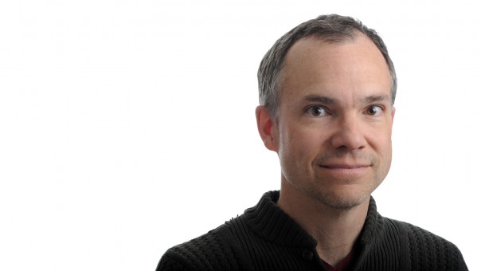

|                                            |     |                                                                                                                                                                                                                                                                                                                                                                                                                                                                                                                                                                                                             |
|--------------------------------------------|-----|-------------------------------------------------------------------------------------------------------------------------------------------------------------------------------------------------------------------------------------------------------------------------------------------------------------------------------------------------------------------------------------------------------------------------------------------------------------------------------------------------------------------------------------------------------------------------------------------------------------|
|  |     | The 14th Annual Bioinformatics Open Source Conference (BOSC 2013) took place July 19-20, 2013, in Berlin, Germany, right before [ISMB/ECCB 2013](http://www.iscb.org/ismbeccb2013). The **[conference schedule is available here as HTML](BOSC_2013_Schedule "wikilink")** (including links to presentations) and **[ here as a PDF file](Media:BOSC2013_schedule.pdf "wikilink")** (A4 format). The **[complete program](http://www.open-bio.org/bosc2013/BOSC2013-program.pdf)**, including all accepted talk and poster abstracts, is **[here](http://www.open-bio.org/bosc2013/BOSC2013-program.pdf)**. 
                                                                                                                                                                                                                                                                                                                                                                                                                                                                                                                                                                                                                                                                 
                                                    Conference report: Harris NL, Cock PJA, Chapman BA, Goecks J, Hotz H et al. (2013) The Bioinformatics Open Source Conference (BOSC) 2013. PeerJ PrePrints \[1:e83v1 <https://peerj.com/preprints/83/>\] ([ Local Copy](Media:BOSC2013_report.pdf "wikilink"))                                                                                                                                                                                                                                                                                                                                                |

Important Dates
---------------

-   July 17-18, 2013: [Codefest 2013](Codefest_2013 "wikilink"), Berlin
-   July 19-20, 2013: **BOSC 2013**, ICC Berlin, Berlin --
    **[schedule](BOSC_2013_Schedule "wikilink")**
-   July 19-23, 2013: [ISMB/ECCB
    2013](http://www.iscb.org/ismbeccb2013), ICC Berlin, Berlin

<!-- -->

-   July 11-12, 2014: [BOSC 2014](BOSC_2014 "wikilink"), Boston, MA

Overview
--------

The Bioinformatics Open Source Conference (BOSC) is a two-day Special
Interest Group of [ISMB](http://www.iscb.org/ismbeccb2013). It is
sponsored by the Open Bioinformatics Foundation (O|B|F), a non-profit
group dedicated to promoting the practice and philosophy of Open Source
software development within the biological research community.

Open Source software has flourished in the bioinformatics community for
well over a decade. When the first BOSC (Bioinformatics Open Source
Conference) was held in 2000, there were already a number of popular
open source bioinformatics packages, and the number and range of these
projects has increased dramatically since then. BOSC covers the wide
range of open source bioinformatics software packages that have been
successfully developed and adopted by the community, and encompasses the
growing movement of Open Science, with its focus on transparency,
reproducibility, and data provenance. We welcome submissions relating to
all aspects of open source bioinformatics software and open science,
including new computational methods, reusable software components,
visualization, interoperability, and other approaches that help to
advance research in the biomolecular sciences. Two full days of talks,
posters, panel discussions, and informal discussion groups will enable
BOSC attendees to interact with other developers and share ideas and
code, as well as learning about some of the latest developments in the
field of open source bioinformatics.

Please spread the word about BOSC--all are welcome. On Twitter, [follow
@OBF\_BOSC](https://twitter.com/OBF_BOSC) and use [hash tag
\#bosc2013](https://twitter.com/search?q=%23BOSC2013).

Keynote Speakers
----------------

This year's keynote speakers will be Sean Eddy of the Howard Hughes
Medical Institute's Janelia Farm, and Cameron Neylon of the Public
Library of Science.

  [More information about BOSC
2013 Keynote Speakers](BOSC_Keynote_Speakers "wikilink")

Session Topics
--------------

The conference schedule is available **[here as
HTML](BOSC_2013_Schedule "wikilink")** and **[ here as a PDF
file](Media:BOSC2013_schedule.pdf "wikilink")**, including [Birds of a
Feather (BoF) meetings](BOSC_2013/BOFs "wikilink").

-   **Open Science and Reproducible Research** -- New this year, this
    session encompasses the theory and practice of open science,
    including open notebook science, open data, transparent and
    reproducible workflows, and shared standards for reviewing and
    publishing research papers.
-   **Cloud and Parallel Computing** -- This session focuses on
    approaches that use cloud and other massively parallel
    infrastructures for processing and analyzing large and heterogeneous
    biological data. We are particularly interested in solutions
    demonstrating how to build new or extend existing software,
    resources and workflows to perform at scale for "Big Data" problems.
-   **Genome-scale Data Management** -- This session encompasses
    software and other tools designed for managing, exploring, and
    analyzing genome-level data to address research questions, including
    but not limited to genome assembly, variant prediction, eQTL
    analysis, and phylogenomic methods.
-   **Visualization** -- Current data acquisition technologies are
    moving us more and more towards a "data first, hypothesis later"
    paradigm for scientific research. As a result, data visualization
    and visual analytics are of increasing importance. This session
    focuses on approaches for interactive as well as static visual
    representations of biomedical data, ranging from exploration
    to explanation.
-   **Software Interoperability** -- This session covers Open Source
    approaches to integrating the latest bioinformatics tools. Building
    flexible, reproducible workflows with connected tools is essential
    to modern bioinformatics. The goal of this session is to investigate
    how we can increase tool connectivity and help communities work
    better together.
-   **Translational Bioinformatics** -- This session will explore
    applications of biological and medical informatics to the
    development of personalized healthcare, therapies, and a better
    understanding of human health and disease. Topics include the
    analysis of large scale population and family sequencing data,
    bioinformatics methodologies for clinical research, and tools for
    discovering clinically useful associations in human databases. We
    especially welcome work that bridges the gap between research and
    patients, making analysis tools available and understandable
    for non-scientists.
-   **Bioinformatics Open Source Project Updates** -- This session will
    feature short talks from ongoing projects describing their
    recent progress. Abstracts will be solicited from open source
    projects affiliated with the O|B|F (see
    <http://www.open-bio.org/wiki/Projects>), including the Bio\*
    projects, DAS, BioMOBY, EMBOSS, and GMOD, but any other open-source
    project will be equally eligible to submit abstracts for
    this session.
-   **[Panel: Strategies for funding and maintaining open source
    software](BOSC_Panel_2013 "wikilink")**

Submitting Abstracts
--------------------

The deadline for abstract submissions for talks was April 12, 2013. Late
poster abstracts were accepted until June 7. We have reserved a few
spaces for walk-in posters, which [must meet the BOSC requirements of
open source and recognized
license](BOSC_Abstract_Submission "wikilink"). The ISMB staff specify
that posters should not exceed the following dimensions: 0.95 m wide x
1.30 m high.

Sponsor
-------

We thank [Eagle Genomics, Ltd.](http://www.eaglegenomics.com/) for
helping to sponsor three Student Travel Awards at BOSC 2013. Each
student winner will receive $250 towards travel expenses. In addition,
the Open Bioinformatics Foundation will grant these three students free
admission to the conference.

BOSC Organizing Committee
-------------------------

**Chair**

-   Nomi L. Harris (Lawrence Berkeley National Laboratory)

**Members**

-   [Jan Aerts](http://www.esat.kuleuven.be/scd/person.php?persid=473)
    (Katholieke Universiteit Leuven)
-   [Brad Chapman](http://bcbio.wordpress.com) ([Biopython
    developer](http://biopython.org); [Harvard School of Public
    Health](http://compbio.sph.harvard.edu/chb/))
-   [Peter Cock](http://www.scri.ac.uk/staff/petercock) ([Biopython
    developer](http://biopython.org); James Hutton Institute)
-   Christopher Fields (National Center for Supercomputing Applications)
-   [Jeremy Goecks](http://bx.mathcs.emory.edu/people/jeremy/)
    (Emory University)
-   Hans-Rudolf Hotz (Friedrich Miescher Institute for
    Biomedical Research)
-   [Hilmar Lapp](http://www.bioperl.org/wiki/Hilmar_Lapp) (National
    Evolutionary Synthesis Center)

**Ex Officio (Members of the O|B|F Board)**

-   [Chris Dagdigian](http://www.bioperl.org/wiki/Chris_Dagdigian)
-   [Jason Stajich](http://www.bioperl.org/wiki/Jason_Stajich)

Previous BOSCs
--------------

-   BOSC has been held yearly since 2000.
-   [BOSC 2012](BOSC_2012 "wikilink") took place in Long Beach,
    California, in July 2012.
-   [ Information about the first 13 BOSC
    conferences](Past_BOSC_conferences "wikilink")

Contact Us
----------

-   [Follow BOSC on Twitter](http://twitter.com/#!/BOSC2012):
    @OBF\_BOSC, \#bosc2013
-   If you'd like to join the mailing list for BOSC-related
    announcements, including the call for abstracts and deadline
    reminders, please subscribe to the
    [Bosc-announce](http://lists.open-bio.org/mailman/listinfo/bosc-announce) list.
    This list has low traffic, and your address will be kept private.
-   If you have questions about the conference, or would like to
    volunteer to help out, please contact the organizers at
    <bosc@open-bio.org>.

<Category:BOSC> <Category:Conferences> [Category:BOSC
Conferences](Category:BOSC_Conferences "wikilink")
