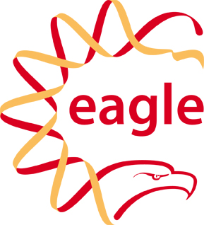

 The 15th Annual
Bioinformatics Open Source Conference (BOSC 2014) was held at the Hynes
Convention Center in Boston on July 11-12, right before [ISMB
2014](https://www.iscb.org/ismb2014) as one of the official ISMB SIG
satellite meetings. Feedback welcome via email bosc@open-bio.org or
[@OBF\_BOSC on Twitter](https://twitter.com/OBF_BOSC).

**[Complete Schedule](http://www.open-bio.org/wiki/BOSC_2014_Schedule)**
(with links to slides and videos of the talks)

Media
-----

Storify Tweet archives for [Day
One](https://storify.com/pjacock/bosc-2014-day-one), [Day
Two](https://storify.com/pjacock/bosc-2014-day-two/) and [during
ISMB](https://storify.com/pjacock/bosc-during-ismb-2014/).

Brad Chapman's [blog
posts](http://smallchangebio.wordpress.com/2014/07/11/notes-bioinformatics-open-source-conference-2014-day-1-afternoon-visualization-project-updates-and-lightning-talks/)

[BioInform article about Philip Bourne's keynote
talk](http://www.open-bio.org/w/images/d/dd/Bosc2014-bioinform.pdf)
(posted with permission)

[James Malone's blog
post](http://drjamesmalone.blogspot.co.uk/2014/07/a-paradigm-shift-on-bioinformatics.html)

Important Dates
---------------

-   July 9-10, 2014: [Codefest 2014](Codefest_2014 "wikilink"), Boston,
    MA
-   July 11-12, 2014: BOSC 2014, Boston, MA
-   July 12-16, 2014: [ISMB 2014](http://www.iscb.org/ismb2014), Boston,
    MA
-   September 18-19, 2014: [EU-Codefest
    2014](http://www.open-bio.org/wiki/EU-Codefest_2014), Cambridge, UK

Overview
--------

The Bioinformatics Open Source Conference (BOSC) is run as a two-day
meeting before the annual ISMB conference. It is sponsored by the Open
Bioinformatics Foundation (O|B|F), a non-profit group dedicated to
promoting the practice and philosophy of Open Source software
development and Open Science within the biological research community.

Open Source software has flourished in the bioinformatics community for
well over a decade. When the first BOSC (Bioinformatics Open Source
Conference) was held in 2000, there were already a number of popular
open source bioinformatics packages, and the number and range of these
projects has increased dramatically since then. covers the wide range of
open source bioinformatics software being developed, and encompasses the
growing movement of Open Science, with its focus on transparency,
reproducibility, and data provenance. We welcome submissions relating to
all aspects of bioinformatics and open science software, including new
computational methods, reusable software components, visualization,
interoperability, and other approaches that help to advance research in
the biomolecular sciences. Two full days of talks, posters, panel
discussions, and informal discussion groups will enable BOSC attendees
to interact with other developers and share ideas and code, as well as
learning about some of the latest developments in the field of open
source bioinformatics.

Please spread the word about BOSC--all are welcome. On Twitter, [follow
@OBF\_BOSC](https://twitter.com/OBF_BOSC) and use [hash tag
\#bosc2014](https://twitter.com/search?q=%23BOSC2014).

Registration
------------

Because BOSC is run as a two-day Special Interest Group (SIG) meeting at
the annual ISMB conference, [registration is via ISMB
2014](https://www.iscb.org/ismb2014-registration). You can attend just
BOSC, or combine this with attending the full ISMB conference as well.

Note that this year we have [waived the BOSC registration fee for
student presenters of full-length
talks](http://news.open-bio.org/news/2014/03/free-student-presenters-bosc-2014/).

If you need a formal invitation letter for your USA VISA application,
please contact the ISMB:
<https://www.iscb.org/ismb2014-registration#visainvitation>

Sponsors
--------

BOSC is organised by the [Open Bioinformatics
Foundation](Main_Page "wikilink"), a non-profit, volunteer-run group
dedicated to promoting the practice and philosophy of Open Source
software development and Open Science within the biological research
community.

|                                                                                                                                           |              |                                                                                                                                    |          |                                                                                                         |
|-------------------------------------------------------------------------------------------------------------------------------------------|--------------|------------------------------------------------------------------------------------------------------------------------------------|----------|---------------------------------------------------------------------------------------------------------|
|  |              |  |          |  |
|                                             |              |                                    |

We thank [Eagle Genomics](http://www.eaglegenomics.com/) for sponsoring
the BOSC Student Travel Awards again this year, and welcome the open
access journal [GigaScience](http://www.gigasciencejournal.com/), and
[Curoverse](http://curoverse.com) (the team behind the open source
platform [Arvados](http://arvados.org)) as new sponsors for BOSC 2014.

We are grateful to [Google](http://www.google.com/) for their generous
support for videorecording BOSC 2014.

Session Topics
--------------

-   **Open Science and Reproducible Research** -- covers the theory and
    practice of open science, including open notebook science, open
    data, transparent and reproducible workflows, and shared standards
    for reviewing and publishing research papers.
-   **Software Interoperability** -- includes Open Source approaches to
    integrating the latest bioinformatics tools, exploring how we can
    increase tool connectivity and help communities work
    better together.
-   **Genome-scale Data and Beyond** -- encompasses software and other
    tools designed for managing, exploring, and analyzing large-scale
    data to address research questions, such as genome assembly, variant
    prediction, eQTL analysis, phylogenomics, and epigenetics.
-   **Visualization** -- focuses on approaches for interactive as well
    as static visual representations of biomedical data, ranging from
    exploration to explanation.
-   **Translational Bioinformatics** -- explores applications of
    biological and medical informatics to the development of
    personalized healthcare, therapies, and a better understanding of
    human health and disease. Topics include the analysis of large scale
    population and family sequencing data, bioinformatics methodologies
    for clinical research, and tools for discovering clinically useful
    associations in human databases.
-   **Bioinformatics Open Source Project Updates** -- features short
    talks from ongoing projects describing their recent progress.
    Abstracts will be solicited from open source projects affiliated
    with the O|B|F (see <http://www.open-bio.org/wiki/Projects>),
    including the Bio\* projects, DAS, BioMOBY, EMBOSS, and GMOD, but
    any other open-source project will be equally eligible to submit
    abstracts for this session.
-   **Panel**: Reproducibility: Rewards and Challenges

Keynote Speakers
----------------

This year's keynote speakers will be Philip Bourne (NIH) and C. Titus
Brown (Michigan State University).

[More information about BOSC 2014 Keynote
Speakers](BOSC_2014_Keynote_Speakers "wikilink")

Submitting Abstracts
--------------------

The deadline for submitting abstracts to be considered for full talks
was Friday, April 4, 2014. We still have a few spots reserved for
last-minute posters--[submit your abstract
here](http://www.open-bio.org/wiki/BOSC_Abstract_Submission).

Organizing Committee
--------------------

**Co-Chairs**

-   [Peter Cock](http://www.scri.ac.uk/staff/petercock) ([Biopython
    developer](http://biopython.org); [James Hutton
    Institute](http://www.hutton.ac.uk))
-   Nomi L. Harris (Lawrence Berkeley National Laboratory)

**Members**

-   Raoul Jean Pierre Bonnal (Istituto Nazionale Genetica Molecolare
    (National Institute of Molecular Genetics), Italy)
-   [Brad Chapman](http://bcbio.wordpress.com) ([Biopython
    developer](http://biopython.org); [Harvard School of Public
    Health](http://compbio.sph.harvard.edu/chb/))
-   [Robert
    Davey](http://www.tgac.ac.uk/bioinformatics/sequencing-informatics/robert-davey/)
    (The Genome Analysis Centre)
-   Christopher Fields (National Center for Supercomputing Applications)
-   Hans-Rudolf Hotz (Friedrich Miescher Institute for
    Biomedical Research)
-   [Hilmar Lapp](http://www.bioperl.org/wiki/Hilmar_Lapp) (National
    Evolutionary Synthesis Center)

**Ex Officio (Members of the O|B|F Board)**

-   [Chris Dagdigian](http://www.bioperl.org/wiki/Chris_Dagdigian)
-   [Jason Stajich](http://www.bioperl.org/wiki/Jason_Stajich)

Previous BOSCs
--------------

-   BOSC has been held yearly since 2000.
-   [BOSC 2013](BOSC_2013 "wikilink") took place in Berlin, Germany, in
    July 2013. See [Harris et al. (2013) The Bioinformatics Open Source
    Conference (BOSC) 2013. PeerJ PrePrints
    1:e83v1](https://peerj.com/preprints/83/)
-   [ Information about the first 14 BOSC
    conferences](Past_BOSC_conferences "wikilink")

Contact Us
----------

-   [Follow BOSC on Twitter](https://twitter.com/OBF_BOSC): @OBF\_BOSC,
    \#bosc2014
-   If you'd like to join the mailing list for BOSC-related
    announcements, including the call for abstracts and deadline
    reminders, please subscribe to the
    [Bosc-announce](http://lists.open-bio.org/mailman/listinfo/bosc-announce) list.
    This list has low traffic, and your address will be kept private.
-   If you have questions about the conference, or would like to
    volunteer to help out, please contact the organizers at
    <bosc@open-bio.org>.

<Category:BOSC> <Category:Conferences> [Category:BOSC
Conferences](Category:BOSC_Conferences "wikilink")
