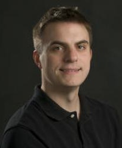

BOSC 2014 is pleased to announce the following keynote speakers:

### Philip Bourne

 Philip E. Bourne
PhD is the Associate Director for Data Science at the NIH and formerly
Associate Vice Chancellor for Innovation and Industry Alliances, and
Professor of Pharmacology at the University of California San Diego.
Bourne's work at the NIH focuses on accelerating the rate of knowledge
discovery from the ever increasing amounts of biomedical data at all
scales – from genomes to populations.

Bourne's laboratory focuses on relevant biological and educational
outcomes derived from computation and scholarly communication. This
implies algorithms, text mining, machine learning, metalanguages,
biological databases, and visualization applied to problems in systems
pharmacology, evolution, cell signaling, apoptosis, immunology and
scientific dissemination. He has published over 300 papers and 5 books,
one of which sold over 150,000 copies. Previously he co-founded 4
companies: ViSoft Inc., Protein Vision Inc., a company distributing
independent films for free and most recently SciVee. Bourne is the
co-founder and founding Editor-in-Chief of the open access journal PLOS
Computational Biology.

Bourne is a Past President of the International Society for
Computational Biology, an elected fellow of the American Association for
the Advancement of Science (AAAS), the International Society for
Computational Biology (ISCB) and the American College of Medical
Informatics.

Bourne is committed to professional development through the Ten Simple
Rules series of articles and a variety of lectures and video
presentations. Awards include: the Jim Gray eScience Award (2010), the
Benjamin Franklin Award (2009), the Flinders University Convocation
Medal for Outstanding Achievement (2004), the Sun Microsystems
Convergence Award (2002) and the CONNECT Award for new inventions (1996
& 97).

Dr. Bourne will speak about "Biomedical Research as an Open Digital
Enterprise":

*The biomedical research lifecycle is fast becoming completely digital
and increasingly open to the point that publishing could simply become
changing the access control on given research objects comprising ideas,
hypotheses, data, software, results, conclusions, reviews, grants and so
on. This offers immense opportunities for software developers to enable
the enterprise. I will describe a vision for the digital enterprise and
what the NIH and others are doing to support the notion with the intent
to accelerate scientific discovery.*

------------------------------------------------------------------------

### C. Titus Brown

C. Titus Brown is an assistant professor in the Department of Computer
Science and Engineering and the Department of Microbiology and Molecular
Genetics. He earned his PhD ('06) in developmental molecular biology
from the California Institute of Technology. Brown is director of the
laboratory for Genomics, Evolution, and Development (GED) at Michigan
State University. He is a member of the Python Software Foundation and
an active contributor to the open source software community. His
research interests include computational biology, bioinformatics, open
source software development, and software engineering.

Dr. Brown's topic is "A History of Bioinformatics (in the year 2039)".

*In 2039, I expect to look back at the last 25 years of biology and see
both wonderful surprises and missed opportunities. In this talk, I will
attempt to predict both some surprises and some of the opportunities I
worry that we will have missed over the next 25 years.*

------------------------------------------------------------------------

[Back to BOSC 2014 home page](BOSC_2014 "wikilink")
