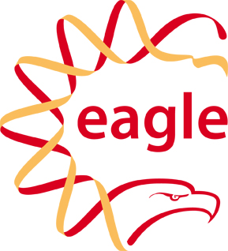

You can download the [full program with abstracts
(PDF)](http://www.open-bio.org/bosc2014/BOSC2014_program.pdf), however
this wiki page is considered the definitive schedule and will be updated
with any last minute changes.

This year we have allocated all the talks an equal slot, 15 minutes plus
3 minutes for questions (making 18 minutes), except for the project
update session where this is reduced to 10 minutes plus 2 minutes for
questions (making 12 minutes in all). Lightning talks are 5 minutes only
(no questions), and are intended for a brief introduction with the
expectation that people who are interested in the topic will find the
speaker during a break or poster session to talk with them.

We aim to record all the talks and the video links will be posted here,
along with links to slides where available.

Pre-BOSC Codefest: July 9-10, 2014
----------------------------------

See [ Codefest 2014](Codefest_2014 "wikilink") for details.

BOSC Day 1: Friday, 11 July 2014
--------------------------------

| Time            | Topic                                                                                                                                                                                                                                                                                                                                                                                                                                                                                                                                | Speaker \[Poster\], Moderator, or notes                      |
|-----------------|--------------------------------------------------------------------------------------------------------------------------------------------------------------------------------------------------------------------------------------------------------------------------------------------------------------------------------------------------------------------------------------------------------------------------------------------------------------------------------------------------------------------------------------|--------------------------------------------------------------|
| **7:30-9:00**   | **Registration**                                                                                                                                                                                                                                                                                                                                                                                                                                                                                                                     | Early arrival is recommended as there are usually long lines |
| 9:00-9:15       | Introduction and Welcome                                                                                                                                                                                                                                                                                                                                                                                                                                                                                                             | Nomi Harris and/or Peter Cock (Chairs, BOSC 2014)            |
| 9:15-10:15      | [Keynote: A History of Bioinformatics (in the Year 2039)](BOSC_2014_Keynote_Speakers "wikilink") ([video](http://video.open-bio.org/video/1/a-history-of-bioinformatics-in-the-year-2039), [slideshare](http://www.slideshare.net/c.titus.brown/2014-bosckeynote), [notes](http://ivory.idyll.org/blog/2014-bosc-keynote.html))                                                                                                                                                                                                      | C. Titus Brown                                               |
| **10:15-10:45** | **Coffee Break**                                                                                                                                                                                                                                                                                                                                                                                                                                                                                                                     |                                                              |
| *10:45-12:30*   | ***Session: Genome-scale Data and Beyond***                                                                                                                                                                                                                                                                                                                                                                                                                                                                                          | Chair: Chris Fields |--                                      |
| 11:03-11:21     | \[Genome-Scale\] A Framework for Benchmarking RNA-seq Pipelines ([video](http://video.open-bio.org/video/3/a-framework-for-benchmarking-rna-seq-pipelines))                                                                                                                                                                                                                                                                                                                                                                          | Rory Kirchner                                                |
| 11:21-11:39     | \[Genome-Scale\] New Frontiers of Genome Assembly with SPAdes 3.1                                                                                                                                                                                                                                                                                                                                                                                                                                                                    | Andrey Prjibelski \[P2\]                                     |
| 11:39-11:57     | \[Genome-Scale\] SigSeeker: An Ensemble for Analysis of Epigenetic Data ([video](http://video.open-bio.org/video/5/sigseeker-an-ensemble-for-analysis-of-epigenetic))                                                                                                                                                                                                                                                                                                                                                                | Jens Lichtenberg \[P3\]                                      |
| 11:57-12:15     | \[Genome-Scale\] Galaxy as an Extensible Job Execution Platform                                                                                                                                                                                                                                                                                                                                                                                                                                                                      | John Chilton                                                 |
| 12:15-12:30     | [Open Bioinformatics Foundation (OBF) update](http://www.open-bio.org/wiki/Main_Page)                                                                                                                                                                                                                                                                                                                                                                                                                                                | Hilmar Lapp (OBF President)                                  |
| **12:30-13:30** | **Lunch**                                                                                                                                                                                                                                                                                                                                                                                                                                                                                                                            | (and poster session)                                         |
| **13:00-14:00** | **Poster Session and Birds of a Feather** (overlapping with lunch)                                                                                                                                                                                                                                                                                                                                                                                                                                                                   | Suggest a BOF topic [here!](BOSC_2014/BOFs "wikilink")       |
| *14:00-15:30*   | ***Session: Visualization***                                                                                                                                                                                                                                                                                                                                                                                                                                                                                                         | Chair: Rob Davey                                             |
| 14:00-14:18     | \[Visualization\] WormGUIDES: an Interactive Informatic Developmental Atlas at Subcellular Resolution                                                                                                                                                                                                                                                                                                                                                                                                                                | Anthony Santella \[P4\]                                      |
| 14:18-14:36     | \[Visualization\] BioJS: an Open Source Standard for Biological Visualisation                                                                                                                                                                                                                                                                                                                                                                                                                                                        | Manuel Corpas \[P5\]                                         |
| 14:36-14:54     | \[Visualization\] Biodalliance: a Fast, Extensible Genome Browser                                                                                                                                                                                                                                                                                                                                                                                                                                                                    | Thomas Down                                                  |
| 14:54-15:12     | \[Visualization\] TGAC Browser: Visualisation Solutions for Big Data in the Genomic Era ([video](http://video.open-bio.org/video/11/tgac-browser-visualisation-solutions-for-big-dat))                                                                                                                                                                                                                                                                                                                                               | Anil S. Thanki \[P6\]                                        |
| 15:12-15:30     | \[Visualization\] Explore, Analyze, and Share Genomic Data Using Integrated Genome Browser                                                                                                                                                                                                                                                                                                                                                                                                                                           | Ann Loraine                                                  |
| **15:30-16:00** | **Coffee Break**                                                                                                                                                                                                                                                                                                                                                                                                                                                                                                                     |                                                              |
| *16:00-17:00*   | ***Session: Bioinformatics Open Source Project Updates***                                                                                                                                                                                                                                                                                                                                                                                                                                                                            | Chair: Peter Cock                                            |
| 16:00-16:12     | \[Updates\] BioMart 0.9 – Introducing Tools for Data Analysis and Visualisation ([video](http://video.open-bio.org/video/13/biomart-09-introducing-tools-for-data-analysis))                                                                                                                                                                                                                                                                                                                                                         | Arek Kasprzyk                                                |
| 16:12-16:24     | \[Updates\] Biocaml: The OCaml Bioinformatics Library                                                                                                                                                                                                                                                                                                                                                                                                                                                                                | Ashish Agarwal                                               |
| 16:24-16:36     | \[Updates\] [BioRuby and Distributed Development](https://github.com/pjotrp/biogems.info/blob/master/doc/abstracts/BOSC2014_BioRuby_dev.md)                                                                                                                                                                                                                                                                                                                                                                                          | Pjotr Prins                                                  |
| 16:36-16:48     | \[Updates\] Biopython Project Update ([video](http://video.open-bio.org/video/16/biopython-project-update))                                                                                                                                                                                                                                                                                                                                                                                                                          | Wibowo Arindrarto                                            |
| 16:48-17:00     | \[Updates\] Shared Bioinformatics Databases Within Unipro UGENE                                                                                                                                                                                                                                                                                                                                                                                                                                                                      | Ivan Protsyuk \[P7\]                                         |
| *17:00-17:30*   | ***Session: Lightning Talks***                                                                                                                                                                                                                                                                                                                                                                                                                                                                                                       | Chair: Peter Cock                                            |
| 17:00-17:05     | \[Lightning\] Fostering the Next Generation of Data-driven Open Science with R ([video](http://video.open-bio.org/video/18/fostering-the-next-generation-of-data-driven-open))                                                                                                                                                                                                                                                                                                                                                       | Karthik Ram                                                  |
| 17:07-17:12     | \[Lightning\] Tripal: an Open Source Toolkit for Building Genomic and Genetic Data Websites and Databases                                                                                                                                                                                                                                                                                                                                                                                                                            | Margaret Staton                                              |
| 17:14-17:19     | \[Lightning\] PLUTo: Phyloinformatic Literature Unlocking Tools ([video](http://video.open-bio.org/video/20/pluto-phyloinformatic-literature-unlocking-tools))                                                                                                                                                                                                                                                                                                                                                                       | Ross Mounce                                                  |
| 17:21-17:26     | \[Lightning\] A Publication Model that Aligns with the Key Open Source Software Principles ([video](http://video.open-bio.org/video/21/a-publication-model-that-aligns-with-the-key-open))                                                                                                                                                                                                                                                                                                                                           | Michael L. Markie \[P8\]                                     |
| 17:27-17:30     | Announcements                                                                                                                                                                                                                                                                                                                                                                                                                                                                                                                        | Nomi Harris and/or Peter Cock                                |
| 17:30-18:30     | **[BOFs](BOSC_2014/BOFs "wikilink")**                                                                                                                                                                                                                                                                                                                                                                                                                                                                                                | Suggest a BOF topic [here!](BOSC_2014/BOFs "wikilink")       |
| 19:00           | *Pay-your-own-way Friday BOSC dinner* (FULL) [The Asgard Irish Pub and Restaurant](http://www.classicirish.com/asgard-home.php), [350 Massachusetts Avenue, Cambridge, MA](https://maps.google.com/maps?ll=42.352697,-71.0733475&z=15&geocode=FXAthgId4UjD-ylJGc0sBXrjiTEgso4wQw9wIA;FT1nhgId6RvD-yn13UfwVHfjiTESJTW6VTsm6Q&saddr=Hynes+Convention+Center+Station&daddr=The+Asgard+Irish+Pub+and+Restaurant,+350+Massachusetts+Ave,+Cambridge,+MA+02139&dirflg=r&output=classic&dg=ntvb) (1.2 miles north of the convention center). | Only those who have already RSVPed will be admitted.         |
||

  

BOSC Day 2: Saturday, 12 July 2014
----------------------------------

| Time            | Topic                                                                                                                                                              | Speaker or Moderator                                                                                             |
|-----------------|--------------------------------------------------------------------------------------------------------------------------------------------------------------------|------------------------------------------------------------------------------------------------------------------|
| 8:55-9:00       | Announcements                                                                                                                                                      | Peter Cock and/or Nomi Harris (Chairs, BOSC 2014)                                                                |
| 9:00-9:15       | [ Codefest 2014 Report](Codefest_2014 "wikilink") ([video](http://video.open-bio.org/video/22/codefest-2014-report))                                               | Brad Chapman                                                                                                     |
| 9:15-10:15      | | [Keynote: Biomedical Research as an Open Digital Enterprise](BOSC_2014_Keynote_Speakers "wikilink") ([slidesshare](http://www.slideshare.net/pebourne/bosc2014)) | Philip Bourne                                                                                                    |
| **10:15-10:45** | **Coffee Break**                                                                                                                                                   |                                                                                                                  |
| *10:45-12:30*   | ***Session: Software Interoperability***                                                                                                                           | Chair: Raoul Bonnal                                                                                              |
| 10:45-11:03     | \[Interoperability\] Pathview: an R/Bioconductor Package for Pathway-based Data Integration and Visualization                                                      | Weijun Luo \[P9\]                                                                                                |
| 11:03-11:21     | \[Interoperability\] Use of Semantically Annotated Resources in the Mobyle2 Web Framework                                                                          | Hervé Ménager                                                                                                    |
| 11:21-11:39     | \[Interoperability\] Towards Ubiquitous OWL Computing: Simplifying Programmatic Authoring of and Querying with OWL Axioms                                          | Hilmar Lapp                                                                                                      |
| 11:39-11:57     | \[Interoperability\] Integrating Taverna Player into Scratchpads                                                                                                   | Robert Haines \[P10\]                                                                                            |
| 11:57-12:15     | \[Interoperability\] [Small Tools for Bioinformatics](https://github.com/pjotrp/bioinformatics)                                                                    | Pjotr Prins                                                                                                      |
| **12:30-13:30** | **Lunch**                                                                                                                                                          | (and poster session)                                                                                             |
| **13:00-14:00** | **Poster Session and Birds of a Feather** (overlapping with lunch)                                                                                                 | Suggest a BOF topic [here!](BOSC_2014/BOFs "wikilink")                                                           |
| *14:00-15:30*   | ***Session: Open Science and Reproducible Research***                                                                                                              | Chair: Hilmar Lapp                                                                                               |
| 14:00-14:18     | \[Open Science\] SEEK for Science: A Data Management Platform which Supports Open and Reproducible Science                                                         | Carole Goble \[P11\]                                                                                             |
| 14:18-14:36     | \[Open Science\] Arvados: Achieving Computational Reproducibility and Data Provenance in Large-Scale Genomic Analyses                                              | Brett Smith                                                                                                      |
| 14:36-14:54     | \[Open Science\] Enhancing the Galaxy Experience through Community Involvement                                                                                     | Daniel Blankenberg                                                                                               |
| 14:54-15:12     | \[Open Science\] Supporting Dynamic Community Developed Biological Pipelines                                                                                       | Brad Chapman                                                                                                     |
| 15:12-15:30     | \[Open Science\] Open as a Strategy for Durability, Reproducibility and Scalability                                                                                | Jonathan Rees                                                                                                    |
| **15:30-16:00** | **Coffee Break**                                                                                                                                                   |                                                                                                                  |
| 16:00-17:00     | **Panel**: Reproducibility: Rewards and Challenges                                                                                                                 | Moderator: Brad Chapman; Panelists: Phil Bourne, Titus Brown, Varsha Khodiyar, Kaitlin Thaney                    |
| 17:00-17:10     | Presentation of Student Travel Awards & Concluding Remarks                                                                                                         | Nomi Harris (Co-Chair, BOSC 2014)                                                                                |
| 17:10-18:00     | [BOFs](BOSC_2014/BOFs "wikilink")                                                                                                                                  | Suggest a BOF topic [here!](BOSC_2014/BOFs "wikilink")                                                           |
| 19:00           | Pay-your-own-way BOSC Saturday dinner: [Summer Shack](http://www.summershackrestaurant.com/locations/boston/), 50 Dalton St., Boston                               | Dinner now FULL. If you RSVPed yes but can't attend, please [edit your RSVP](http://doodle.com/iqhmez2rz57trazg) |
||

Note: the ISMB reception starts at 17:30...

------------------------------------------------------------------------

### Posters

If the speaker also gave a talk, any poster link will be above (posters
1 to 11). This table lists poster-only presentations.

| Poster | Title                                                                                                           | Presenter                               |
|--------|-----------------------------------------------------------------------------------------------------------------|-----------------------------------------|
| P12    | Advantages and challenges of using the Galaxy API within an integrated data analysis and visualization platform | Ilya Sytchev                            |
| P13    | Connecting computational steps for NGS, and beyond.                                                             | Laurent Gautier                         |
| P14    | Updates to MISO, the open-source NGS LIMS project                                                               | Xingdong Bian                           |
| P15    | Running Taverna Workflows within IPython Notebook                                                               | Alan Williams / Aleksandra Pawlik (TBC) |
| P16    | Reconstruction of ancestral genomes in presence of gene gain and loss                                           | Shuai Jiang                             |
| P17    | *Withdrawn*                                                                                                     | *Withdrawn*                             |
| P18    | GEPETTO Update: An Open Source Framework for Gene Prioritization                                                | Hoan Nguyen                             |
| P19    | NeoPipe: An Open Source Framework for Protein sequence analysis                                                 | Hoan Nguyen                             |
| P20    | MyGene.info updates: scalable gene-centric web services with user contributions                                 | Chunlei Wu                              |
| P21    | Aiding the journey from data to publication in the plant sciences                                               | Robert Davey                            |
| P22    | Bio2RDF mobile: an app for biological semantic web databases                                                    | Maxime Déraspe                          |
| P23    | Tripal: an open source toolkit for building genomic and genetic data websites and databases                     | Margaret Staton                         |
| P24    | BioBuilds: A Model for Long Term Sustainability of Open Source Bioinformatics                                   | Chris Mueller                           |
| P25    | GigaGalaxy: A GigaSolution for reproducible and sustainable genomic data publication and analysis               | Scott Edmunds                           |
| ...    | ...                                                                                                             | ...                                     |
||

------------------------------------------------------------------------

|                                                                                                                                           |              |                                                                                                                                    |          |                                                                                                         |
|-------------------------------------------------------------------------------------------------------------------------------------------|--------------|------------------------------------------------------------------------------------------------------------------------------------|----------|---------------------------------------------------------------------------------------------------------|
|  |              |  |          |  |
|                                             |              |                                    |

We thank [Eagle Genomics](http://www.eaglegenomics.com/) for sponsoring
the BOSC Student Travel Awards again this year, and welcome the open
access journal [GigaScience](http://www.gigasciencejournal.com/), and
[Curoverse](http://curoverse.com) (the team behind the open source
platform [Arvados](http://arvados.org)) as new sponsors for BOSC 2014.

We are grateful to [Google](http://www.google.com/) for their generous
support for videorecording BOSC 2014.

------------------------------------------------------------------------

Return to **[ BOSC 2014](BOSC_2014 "wikilink")** main page
----------------------------------------------------------

<Category:BOSC> <Category:Conferences> [Category:BOSC
Conferences](Category:BOSC_Conferences "wikilink")
