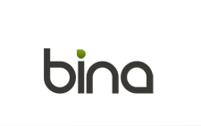
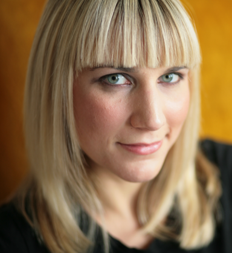

Thanks to all for a successful meeting! Slides and videos will be posted
soon.

Check out the complete [schedule](BOSC_2015_Schedule "wikilink") with
links to slides, posters and videos - mostly on our [F1000 Research BOSC
Channel](http://f1000research.com/channels/BOSC).

The full program including abstracts is available
[here](http://www.open-bio.org/bosc2015/BOSC2015-program-with-abstracts.pdf).

Summaries of BOSC 2015 by Participants
--------------------------------------

There were over 2000 tweets about \#BOSC2015, and a number of blog
posts, some of which are listed below.

-   Brad Chapman's excellent summaries: [Day
    1 (morning)](https://smallchangebio.wordpress.com/2015/07/10/bosc2015day1a/),
    [Day
    2 (afternoon)](https://smallchangebio.wordpress.com/2015/07/11/bosc2015day1b/),
    [Day
    2 (morning)](https://smallchangebio.wordpress.com/2015/07/11/notes-bioinformatics-open-source-conference-2015-day-2-morning-ewan-birney-open-science-and-reproducibility/),
    [Day
    2 (afternoon)](https://smallchangebio.wordpress.com/2015/07/11/bosc2015day2b/)

<!-- -->

-   Peter Cock's Storify of BOSC tweets: [part
    one](https://storify.com/pjacock/bosc-2015-day-one), [part
    two](https://storify.com/pjacock/bosc-2015-day-two)

<!-- -->

-   [Bruno Vieira's
    Storify](https://storify.com/bmpvieira/dublin-conferences) about
    Codefest, BOSC, and ISMB/ECCB 2015

<!-- -->

-   [GigaScience blog
    post](http://blogs.biomedcentral.com/gigablog/2015/07/12/open-bioinformatics-irish-free-software-state/)

<!-- -->

-   [Matt Pearce's blog post about BOSC and
    BioSolr](http://www.flax.co.uk/blog/2015/07/13/biosolr-at-bosc-2015-open-source-search-for-bioinformatics/)

<!-- -->

-   [Kai Blin's thoughts on BOSC and why we shouldn't overengineer
    bioinformatics
    analyses](http://phdops.kblin.org/2015-on-overengineering.html)

<!-- -->

-   [Konrad Förstner's
    wrap-up](http://thedaoofflow.fluxionary.net/2015/07/bosc-2015-wrap-up/)

<!-- -->

-   [Konst Okonechnikov's summary ("BOSC 2015: amazing
    as always")](http://okko73313.blogspot.de/2015/07/bosc-2015-amazing-as-always.html)

If you wrote a BOSC report and would like it to be listed here, please
email us at bosc@open-bio.org.

Overview
--------

The Bioinformatics Open Source Conference (BOSC) is run as a two-day
meeting before the annual [ISMB
conference](http://www.iscb.org/ismbeccb2015). It is sponsored by the
Open Bioinformatics Foundation (O|B|F), a non-profit group dedicated to
promoting the practice and philosophy of Open Source software
development and Open Science within the biological research community.

Open Source software has flourished in the bioinformatics community for
well over a decade. When the first BOSC was held in 2000, there were
already many popular open source bioinformatics packages, and the number
and range of these projects has increased dramatically since then. BOSC
covers the wide range of open source bioinformatics software being
developed, and encompasses the growing movement of Open Science, with
its focus on transparency, reproducibility, and data provenance. We
welcome submissions relating to all aspects of bioinformatics and open
science software, including new computational methods, reusable software
components, visualization, interoperability, and other approaches that
help to advance research in the biomolecular sciences. Two full days of
[talks, posters, panel discussions](BOSC_2015_Schedule "wikilink"), and
[iinformal discussion
groups](https://docs.google.com/document/d/1yaSjWEZzwiAk6jUiKVk_pbmru1uCJuGbgITIyI3kmfI/edit#)
will enable BOSC attendees to interact with other developers and share
ideas and code, as well as learning about some of the latest
developments in the field of open source bioinformatics.

We also organize a two-day community development session prior to the
conference ([Codefest 2015](Codefest_2015 "wikilink")). This is an
opportunity for anyone interested in open science, biology and
programming to meet, discuss and work collaboratively. Everyone is
welcome to attend Codefest (whether or not you attend BOSC).

Please spread the word about BOSC--all are welcome. On Twitter, [follow
@OBF\_BOSC](https://twitter.com/OBF_BOSC) and use [hash tag
\#bosc2015](https://twitter.com/search?q=%23BOSC2015).

Sponsors
--------

BOSC is organised by the [Open Bioinformatics
Foundation](Main_Page "wikilink"), a non-profit, volunteer-run group
dedicated to promoting the practice and philosophy of Open Source
software development and Open Science within the biological research
community.

|                                                                                                  |                                                                                                                                    |                                                                                                              |
|--------------------------------------------------------------------------------------------------|------------------------------------------------------------------------------------------------------------------------------------|--------------------------------------------------------------------------------------------------------------|
|  |                                                                                                                                    |  |
|    |  |                           |

We are grateful to [Google](http://www.google.com/) for their generous
support for videorecording BOSC 2015, and we thank
[Curoverse](http://curoverse.com) (the team behind the open source
platform [Arvados](http://arvados.org)) as a returning sponsor and
[Bina](http://bina.com/) as our newest sponsor.

If you would like to be a sponsor of BOSC, please contact us at at
bosc@open-bio.org.

Important Dates
---------------

-   [Codefest 2015](Codefest_2015 "wikilink"): July 8-9, 2015, Dublin
    (Trinity College)
-   **BOSC 2015: July 10-11, 2015, Dublin**
-   ISMB/ECCB 2015: July 10-14, 2015, Dublin

Registration
------------

Because BOSC is run as a two-day Special Interest Group (SIG) meeting at
the annual ISMB conference, [registration is via ISMB/ECCB
2015](https://www.iscb.org/ismbeccb2015-registration). You can register
for BOSC (which allows you to drop in on other SIGs as well), or
register to attend the full ISMB/ECCB conference plus BOSC.

If you need a formal invitation letter for your Ireland VISA
application, please [contact the
ISMB](https://www.iscb.org/ismbeccb2015-registration#visainvitation).

Session Topics
--------------

We welcome submissions relating to all aspects of bioinformatics and
open science software, including (but not limited to):

-   **Open Science and Reproducible Research** -- covers the theory and
    practice of open science, including open notebook science, open
    data, transparent and reproducible workflows, and shared standards
    for reviewing and publishing research papers.
-   **Standards and Interoperability** -- includes standards such as
    ontologies, formats, etc, as well as Open Source approaches to
    integrating the latest bioinformatics tools, exploring how we can
    increase tool connectivity and help communities work
    better together.
-   **Data Science** -- encompasses software and approaches to managing,
    exploring, and analyzing large-scale data to address research
    questions, such as genome assembly, variant prediction, eQTL
    analysis, phylogenomics, and epigenetics.
-   **Visualization** -- focuses on approaches for interactive as well
    as static visual representations of biomedical data, ranging from
    exploration to explanation.
-   **Translational Bioinformatics** -- explores applications of
    biological and medical informatics to the development of
    personalized healthcare, therapies, and a better understanding of
    human health and disease. Topics include the analysis of large scale
    population and family sequencing data, bioinformatics methodologies
    for clinical research, and tools for discovering clinically useful
    associations in human databases.
-   **Bioinformatics Open Source Libraries and Projects** -- features
    short talks from new or ongoing projects describing their
    recent progress. Abstracts will be solicited from open source
    projects affiliated with the O|B|F (see
    <http://www.open-bio.org/wiki/Projects>), including the Bio\*
    projects, DAS, BioMOBY, EMBOSS, and GMOD, but any other open-source
    project will be equally eligible to submit abstracts for
    this session.
-   **[Panel: Open Source, Open Door: increasing diversity in the
    bioinformatics open source community.](BOSC_2015_Panel "wikilink")**
    *Chair*: Monica Munoz-Torres. *Panelists*: Holly Bik, Michael R.
    Crusoe, Aleksandra Pawlik, Jason Williams.

Keynote Speakers
----------------

This year's keynote speakers will be Holly Bik (University of
Birmingham) and Ewan Birney (EMBL-EBI).

**[More information about BOSC 2015 Keynote
Speakers](BOSC_2015_Keynote_Speakers "wikilink")**

Organizing Committee
--------------------

**Co-Chairs**

-   [Peter Cock](http://www.scri.ac.uk/staff/petercock) ([Biopython
    developer](http://biopython.org); [James Hutton
    Institute](http://www.hutton.ac.uk))
-   Nomi L. Harris (Lawrence Berkeley National Laboratory)

**Outreach Coordinator**

-   [Sarah Hird](https://sites.google.com/site/sarahhird/) (University
    of California, Davis)

**Members**

-   [Brad Chapman](http://bcbio.wordpress.com) ([Biopython
    developer](http://biopython.org); [Harvard School of Public
    Health](http://compbio.sph.harvard.edu/chb/))
-   [Robert
    Davey](http://www.tgac.ac.uk/bioinformatics/sequencing-informatics/robert-davey/)
    (The Genome Analysis Centre)
-   Christopher Fields (National Center for Supercomputing Applications)
-   Karsten Hokamp (Smurfit Institute of Genetics, Trinity College
    Dublin, Ireland)
-   [Hilmar Lapp](http://www.bioperl.org/wiki/Hilmar_Lapp) (Center for
    Genomic and Computational Biology (GCB), Duke University)
-   [Mónica
    Muñoz-Torres](http://berkeleybop.org/person/monica-munoz-torres)
    (Berkeley Bioinformatics Open Source Projects)

**Ex Officio (Members of the O|B|F Board)**

-   [Chris Dagdigian](http://www.bioperl.org/wiki/Chris_Dagdigian)

Review Committee
----------------

Nomi Harris, Brad Chapman, Peter Cock, Karsten Hokamp, Raoul Bonnal,
Chris Fields, Karen Cranston, Jens Lichtenberg, Eric Talevich, Frank
Nothaft, Michael Heuer, Monica Muñoz-Torres, Francesco Strozzi,
Hans-Rudolf Hotz, Timothy Booth, Tiago Antao, George Githinji, Manuel
Corpas, Thomas Down, Sarah Hird, Scott Markel, Rob Davey, Spencer
Bliven, Michael Reich, Lorena Pantano, Björn Grüning, Hilmar Lapp,
Daniel Blankenberg, Amye Kenall, Hervé Menager.

Survey about BOSC 2015 location
-------------------------------

We have asked you, and you have spoken! 59 past and/or future BOSC
attendees participated in our survey, answering questions about what
they liked at BOSC 2014, what changes they’d like to see, and—most
importantly—what they thought about the proposal to possibly hold BOSC
2015 in Norwich (UK) just after the Galaxy Community Conference, rather
than as an ISMB SIG. Although some survey participants indicated that
they would be more likely to attend BOSC 2015 if it were co-located with
GCC, the majority prefer BOSC to remain an ISMB SIG, so we will hold
BOSC 2015 in Dublin on 10-11 July, 2015, right before ISMB 2015.

Although the survey is now closed, we are always happy to hear your
suggestions for BOSC 2015. (We are particularly interested in increasing
diversity at BOSC, and we welcome suggestions of people to invite.) You
can reach us at bosc@open-bio.org.

Previous BOSCs
--------------

-   BOSC has been held yearly since 2000.
-   [BOSC 2014](BOSC_2014 "wikilink") took place in Boston, MA, July
    11-12, 2014.
-   [ Information about the first 14 BOSC
    conferences](Past_BOSC_conferences "wikilink")

Contact Us
----------

-   [Follow BOSC on Twitter](https://twitter.com/OBF_BOSC): @OBF\_BOSC,
    \#bosc2015
-   If you'd like to join the mailing list for BOSC-related
    announcements, including the call for abstracts and deadline
    reminders, please subscribe to the
    [bosc-announce](http://lists.open-bio.org/mailman/listinfo/bosc-announce) list.
    This list has low traffic, and your address will be kept private.
-   If you have questions about the conference, or would like to
    volunteer to help out, please contact the organizers at
    <bosc@open-bio.org>.

ISMB Code of Conduct
--------------------

In March 2015, ISMB published a [Code of
Conduct](http://www.iscb.org/ismbeccb2015-general-info/ismbeccb2015-coc)
that applies to SIGs (including BOSC) as well as the main ISMB/ECCB
meeting.

<Category:BOSC> <Category:Conferences> [Category:BOSC
Conferences](Category:BOSC_Conferences "wikilink")
