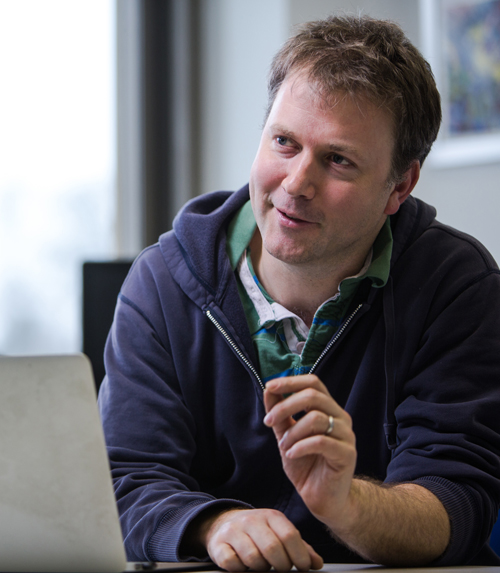

[BOSC 2015](BOSC_2015 "wikilink") is pleased to announce the following
keynote speakers:

### Holly Bik

Dr Holly Bik is a Birmingham Fellow (assistant professor) in the School
of Biosciences at the University of Birmingham, UK. She obtained her
Ph.D. in molecular phylogenetics at the University of Southampton, UK
(working in conjunction with the Natural History Museum, London),
followed by subsequent postdoctoral appointments at the Hubbard Center
for Genome Studies at the University of New Hampshire and the UC Davis
Genome Center.

Her research uses high-throughput environmental sequencing approaches
(rRNA surveys, metagenomics) to explore biodiversity and biogeographic
patterns in microbial eukaryote assemblages, with an emphasis on
nematodes in marine sediments. Through active collaborations with
computer scientists and participation in software development projects,
her long-term research aims to address existing bottlenecks encountered
in –Omic analyses focused on microbial eukaryotes.

Holly's keynote talk topic is "Bioinformatics: Still a scary world for
biologists".

*Many biological disciplines remain staunchly traditional, where
high-throughput DNA sequencing and bioinformatics have not yet become
widely adopted. In this talk, I'll discuss the ongoing challenges and
barriers facing biologists in the age of 'Omics, based on my experiences
in transitioning from nematode taxonomy to computational biology
research.*

Homepage: [Holly Bik](http://www.hollybik.com/about/)

------------------------------------------------------------------------

### Ewan Birney

Dr Ewan Birney is Joint Associate Director of EMBL-EBI, as well as
Interim Head of the Centre for Therapeutic Target Validation. Together
with Dr Rolf Apweiler, he has strategic responsibility and oversight for
bioinformatics services at EMBL-EBI.

Ewan played a vital role in annotating the genome sequences of the
human, mouse, chicken and several other organisms; this work has had a
profound impact on our understanding of genomic biology. He led the
analysis group for the ENCODE project, which is defining functional
elements in the human genome. He was also one of the leaders of the
BioPerl project. Ewan’s main areas of research include functional
genomics, assembly algorithms, statistical methods to analyse genomic
information (in particular information associated with individual
differences) and compression of sequence information.

He has received a number of prestigious awards including the 2003
Francis Crick Award from the Royal Society, the 2005 Overton Prize from
the International Society for Computational Biology and the 2005
Benjamin Franklin Award for contributions in Open Source Bioinformatics.
He was elected a Fellow of the Royal Society in 2014.

Ewan was a cofounder of the [Open Bioinformatics
Foundation](Main_Page "wikilink"), the organization that sponsors BOSC,
and has been involved in BOSC since the first conference in 2000. He
chaired the meeting in 2001, and gave one of the keynote talks in 2002.
We are delighted to have him back as a keynote speaker for 2015.

Ewan's talk topic will be announced soon.

Homepage: [Ewan Birney](https://www.ebi.ac.uk/~birney/), Twitter:
[@ewanbirney](https://twitter.com/ewanbirney)

------------------------------------------------------------------------

[Back to BOSC 2015 home page](BOSC_2015 "wikilink")
