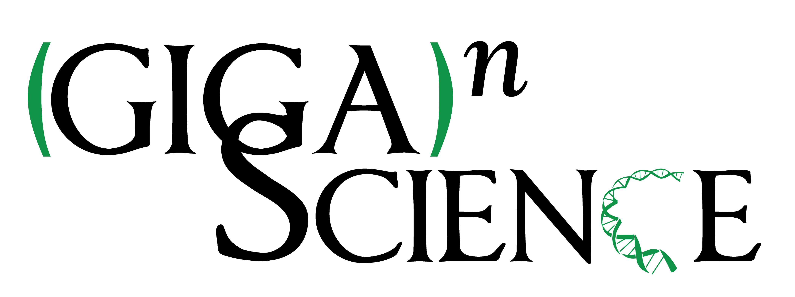

The full program including abstracts is available
[here](http://www.open-bio.org/bosc2015/BOSC2015-program-with-abstracts.pdf).

The PDF of this schedule (without abstracts) is available
[here](http://www.open-bio.org/w/images/2/2c/BOSC2015-schedule.pdf).

However, this wiki page is considered the definitive schedule and will
be updated with any last minute changes.

Sponsors
--------

We are grateful to [Google](http://www.google.com/) for their generous
support for videorecording BOSC 2015, and we thank
[Curoverse](http://curoverse.com) (the team behind the open source
platform [Arvados](http://arvados.org)) as a returning sponsor and
welcome [Bina](http://bina.com/) as our newest sponsor.

|                                                                                                  |                                                                                                                                    |                                                                                                              |
|--------------------------------------------------------------------------------------------------|------------------------------------------------------------------------------------------------------------------------------------|--------------------------------------------------------------------------------------------------------------|
|  |                                                                                                                                    |  |
|    |  |                           |

Pre-BOSC: Codefest 2015
-----------------------

See [Codefest 2015](Codefest_2015 "wikilink") for details.

BOSC Day 1 (Friday, 10 July, 2015)
----------------------------------

| **Time**     | **Title**                                                                                                                                                            | **Speaker \[Poster\] / Chair**                                                       |
|--------------|----------------------------------------------------------------------------------------------------------------------------------------------------------------------|--------------------------------------------------------------------------------------|
| 7:30-9:00    | **Registration**                                                                                                                                                     |                                                                                      |
| 9:00-9:15    | **Introduction and Welcome**                                                                                                                                         | Nomi Harris and Peter Cock (Co-Chairs, BOSC 2015)                                    |
| 9:15-10:15   | **Keynote:** **Bioinformatics: Still a scary world for biologists**                                                                                                  | Holly Bik                                                                            |
| 10:15-10:45  | ***Coffee Break***                                                                                                                                                   |                                                                                      |
| 10:45-12:30  | **Session: Data Science**                                                                                                                                            | Chair: Rob Davey                                                                     |
| 10:45- 11:02 | Apollo: Scalable & collaborative curation for improved comparative genomics                                                                                          | Mónica Muñoz-Torres \[P1\]                                                           |
| 11:02-11:19  | GOexpress: A R/Bioconductor package for the identification and visualisation of robust gene ontology signatures through supervised learning of gene expression data  | Kévin Rue-Albrecht \[P2\]                                                            |
| 11:19-11:36  | Arvados: A Free Software Platform for Big Data Science                                                                                                               | Peter Amstutz                                                                        |
| 11:36-11:53  | Bringing Hadoop into Bioinformatics with Cloudgene and CloudMan                                                                                                      | Sebastian Schoenherr                                                                 |
| 11:53-12:10  | Segway: semi-automated genome annotation                                                                                                                             | Michael Hoffman \[P3\]                                                               |
| 12:10-12:15  | QualiMap 2.0: quality control of high throughput sequencing data                                                                                                     | Konstantin Okonechnikov \[P4\]                                                       |
| 12:15-12:20  | A Genomics Virtual Laboratory                                                                                                                                        | Andrew Lonie \[P5\]                                                                  |
| 12:20-12:25  | BioSolr: Building better search for bioinformatics                                                                                                                   | Tony Burdett \[P6\]                                                                  |
| 12:25-12:30  | Prioritization of structural variants based on known biological information                                                                                          | Brad Chapman                                                                         |
| 12:30-13:30  | ***Lunch***                                                                                                                                                          |                                                                                      |
| 13:00-14:00  | **Poster Session and [Birds of a Feather sessions](https://docs.google.com/document/d/1yaSjWEZzwiAk6jUiKVk_pbmru1uCJuGbgITIyI3kmfI/edit#)** (overlapping with lunch) |                                                                                      |
| 14:00-15:30  | **Session: Standards and Interoperability**                                                                                                                          | Chair: Peter Cock                                                                    |
| 14:00-14:17  | Portable workflow and tool descriptions with the CWL                                                                                                                 | Michael R. Crusoe \[P7\]                                                             |
| 14:17-14:34  | From peer-reviewed to peer-reproduced: a role for research objects in scholarly publishing in the life sciences                                                      | Alejandra Gonzalez-Beltran                                                           |
| 14:34-14:51  | Demystifying the Interoperability of Disparate Genomic Resources                                                                                                     | Daniel Blankenberg                                                                   |
| 14:51-15:08  | Increasing the utility of Galaxy workflows                                                                                                                           | John Chilton                                                                         |
| 15:10-15:15  | Kipper: A software package for sequence database versioning for Galaxy bioinformatics servers                                                                        | Damion Dooley                                                                        |
| 15:15-15:20  | Evolution of the Galaxy tool ecosystem - happier developers, happier users                                                                                           | Martin Čech \[P8\]                                                                   |
| 15:20-15:25  | Bionode - Modular and universal bioinformatics                                                                                                                       | Bruno Vieira \[P9\]                                                                  |
| 15:25-15:30  | The EDAM Ontology                                                                                                                                                    | Hervé Ménager \[P10\]                                                                |
| 15:30-16:00  | ***Coffee Break***                                                                                                                                                   |                                                                                      |
| 16:00-17:00  | **[Panel: Open Source, Open Door: increasing diversity in the bioinformatics open source community](BOSC_2015_Panel "wikilink")**                                    | ***Moderator***: Mónica Muñoz-Torres                                                 
                                                                                                                                                                                                                                                                             
                                                                                                                                                                                       ***Panelists***: Holly Bik, Michael R. Crusoe, Aleksandra Pawlik, Jason Williams      |
| 17:00-17:10  | Open Bioinformatics Foundation (OBF) Update                                                                                                                          | Hilmar Lapp (President, OBF)                                                         |
| 17:10-17:15  | **Announcements**                                                                                                                                                    | Nomi Harris                                                                          |
| 17:15-18:30  | BOF/Unconference: [Building successful open-source bioinformatics developer communities](http://www.hub-hub.de/wiki/index.php?title=BOSC2015Unconf) (Part 1)         | Aidan Budd, Dave Clements, Manuel Corpas, Natasha Wood                               |
| 17:15-18:30  | **[BOFs](https://docs.google.com/document/d/1yaSjWEZzwiAk6jUiKVk_pbmru1uCJuGbgITIyI3kmfI/edit#)**: Feel free to organize one!                                        |                                                                                      |
| 19:00-       | Pay-your-own-way BOSC dinner at Kennedy's (FULL)                                                                                                                     | [RSVP](http://doodle.com/mcqehfpytzutwzum) (limited space --you must RSVP to attend) |

BOSC Day 2 (Saturday, 11 July, 2015)
------------------------------------

| **Time**    | **Title**                                                                                                                                                    | **Speaker / Chair**                                    |
|-------------|--------------------------------------------------------------------------------------------------------------------------------------------------------------|--------------------------------------------------------|
| 9:00-9:05   | **Announcements**                                                                                                                                            | Peter Cock and Nomi Harris                             |
| 9:05-9:15   | Codefest 2015 Report                                                                                                                                         | Brad Chapman (Codefest 2015 Organizer)                 |
| 9:15-10:15  | **Keynote:** **Big Data in Biology**                                                                                                                         | Ewan Birney                                            |
| 10:15-10:45 | ***Coffee Break***                                                                                                                                           |                                                        |
| 10:45-12:30 | **Session: Open Science** **and Reproducibility**                                                                                                            | Chair: Mónica Muñoz-Torres                             |
| 10:45-11:02 | A curriculum for teaching Reproducible Computational Science bootcamps                                                                                       | Hilmar Lapp                                            |
| 11:02-11:19 | Research shared: www.researchobject.org                                                                                                                      | Norman Morrison \[P11\]                                |
| 11:19-11:36 | Nextflow: a tool for deploying reproducible computational pipelines                                                                                          | Paolo Di Tommaso \[P12\]                               |
| 11:36-11:53 | Free beer today: how iPlant + Agave + Docker are changing our assumptions about reproducible science                                                         | John Fonner \[P13\]                                    |
| 11:55-12:00 | The 500 builds of 300 applications in the HeLmod repository will at least get you started on a full suite of scientific applications                         | Aaron Kitzmiller                                       |
| 12:00-12:05 | Bioboxes: Standardised bioinformatics tools using Docker containers.                                                                                         | Peter Belmann \[P14\]                                  |
| 12:05-12:10 | The perfect fit for reproducible interactive research: Galaxy, Docker, IPython                                                                               | Björn Grüning                                          |
| 12:10-12:15 | COPO: Bridging the Gap from Data to Publication in Plant Science                                                                                             | Robert Davey \[P15\]                                   |
| 12:15-12:20 | ELIXIR UK building on Data and Software Carpentry to address the challenges in computational training for life scientists                                    | Aleksandra Pawlik \[P16\]                              |
| 12:20-12:25 | Parallel recipes: towards a common coordination language for scientific workflow management systems                                                          | Yves Vandriessche \[P17\]                              |
| 12:25-12:30 | openSNP - personal genomics and the public domain                                                                                                            | Bastian Greshake \[P18\]                               |
| 12:30-13:30 | ***Lunch***                                                                                                                                                  |                                                        |
| 13:00-14:00 | **Poster Session and [BOFs](https://docs.google.com/document/d/1yaSjWEZzwiAk6jUiKVk_pbmru1uCJuGbgITIyI3kmfI/edit#) (overlapping with lunch)**                |                                                        |
| 14:00-14:40 | **Session: Translational Bioinformatics**                                                                                                                    | Chair: Brad Chapman                                    |
| 14:00-14:17 | CIViC: Crowdsourcing the Clinical Interpretation of Variants in Cancer                                                                                       | Malachi Griffith \[P19\]                               |
| 14:17-14:34 | From Fastq To Drug Recommendation - Automated Cancer Report Generation using OncoRep & Omics Pipe                                                            | Tobias Meissner \[P20\]                                |
| 14:35-14:40 | Cancer Informatics Collaboration and Computation: Two Initiatives of the U.S. National Cancer Institute                                                      | Ishwar Chandramouliswaran \[P21\]                      |
| 14:40-15:30 | **Session: Bioinformatics Open Source Project Updates**                                                                                                      | Chair: Nomi Harris                                     |
| 14:40-14:57 | Biopython Project Update 2015                                                                                                                                | João Rodrigues                                         |
| 14:57-15:14 | The biogems community: Challenges in distributed software development in bioinformatics                                                                      | George Githinji and Pjotr Prins                        |
| 15:14-15:31 | Apache Taverna: Sustaining research software at the Apache Software Foundation                                                                               | Stian Soiland-Reyes \[P22\]                            |
| 15:30-16:00 | ***Coffee Break***                                                                                                                                           |                                                        |
| 16:00-16:30 | **Session: Visualization**                                                                                                                                   | Chair: Karsten Hokamp                                  |
| 16:00-16:17 | Simple, Shareable, Online RNA Secondary Structure Diagrams                                                                                                   | Peter Kerpedjiev                                       |
| 16:17-16:22 | BioJS 2.0: an open source standard for biological visualization                                                                                              | Guy Yachdav \[P23\]                                    |
| 16:22-16:27 | Visualising Open PHACTS linked data with widgets                                                                                                             | Ian Dunlop \[P24\]                                     |
| 16:30-17:00 | **Session: Late-Breaking Lightning Talks**                                                                                                                   | Chair: Hilmar Lapp                                     |
| 16:30-16:35 | Biospectra-by-sequencing genetic analysis platform                                                                                                           | Aurelie Laugraud \[P25\]                               |
| 16:35-16:40 | PhyloToAST: Bioinformatics tools for species-level analysis and visualization of complex microbial communities                                               | Shareef Dabdoub                                        |
| 16:40-16:45 | Otter/ZMap/SeqTools: A productive alternative to web browser genome visualisation                                                                            | Gemma Guest \[P26\]                                    |
| 16:45-16:50 | aRchive: enabling reproducibility of Bioconductor package versions                                                                                           | Nitesh Turaga \[P27\]                                  |
| 16:50-16:55 | Developing an Arvados BWA-GATK pipeline                                                                                                                      | Pjotr Prins \[P28\]                                    |
| 16:55-17:00 | Out of the box cloud solution for Next-Generation Sequencing analysis                                                                                        | Freerk van Dijk \[P29\]                                |
| 17:00-17:10 | Concluding Remarks                                                                                                                                           | Nomi Harris and Peter Cock                             |
| 17:15-18:30 | BOF/Unconference: [Building successful open-source bioinformatics developer communities](http://www.hub-hub.de/wiki/index.php?title=BOSC2015Unconf) (Part 2) | Aidan Budd, Dave Clements, Manuel Corpas, Natasha Wood |
| 17:10-18:10 | **[BOFs](https://docs.google.com/document/d/1yaSjWEZzwiAk6jUiKVk_pbmru1uCJuGbgITIyI3kmfI/edit#)**: Feel free to organize one!                                |                                                        |
| 19:00       | Pay-your-own-way dinner at the Workshop Gastropub. RSVP [here](http://doodle.com/v2p89ytinbb9d9xa) if you want to join us.                                   |                                                        |

### Posters

If the speaker also has a talk, the poster link will be above (posters 1
to 29). This table lists poster-only presentations.

| Poster | Title                                                                                                  | Presenter              |
|--------|--------------------------------------------------------------------------------------------------------|------------------------|
| P30    | Aequatus: Visualising complex similarity relationships among species                                   | Anil Thanki            |
| P31    | MOLGENIS Workbench for Systems Medicine                                                                | K. Joeri van der Velde |
| P32    | SPINGO: a rapid species-classifier for microbial amplicon sequences                                    | Feargal Ryan           |
| P33    | ANNOgesic - A computational pipeline for RNA-Seq based transcriptome annotations of bacteria           | Konrad Förstner        |
| P34    | BioXSD — a data model for sequences, alignments, features, measured and inferred values                | Matúš Kalaš            |
| P35    | MGkit: A Metagenomic Framework For The Study Of Microbial Communities                                  | Francesco Rubino       |
| P36    | From scaffold to submission in a day: a new software pipeline for rapid genome annotation and analysis | Sascha Steinbiss       |
||

  

BOSC 2015 Organizing Committee
------------------------------

**Nomi Harris** and **Peter Cock** (Co-Chairs)

Brad Chapman, Rob Davey, Chris Fields, Sarah Hird, Karsten Hokamp,
Hilmar Lapp, Mónica Muñoz-Torres

BOSC 2015 Program Committee
---------------------------

Nomi Harris, Brad Chapman, Peter Cock, Karsten Hokamp, Raoul Bonnal,
Chris Fields, Karen Cranston, Jens Lichtenberg, Eric Talevich, Frank
Nothaft, Michael Heuer, Mónica Muñoz-Torres, Francesco Strozzi,
Hans-Rudolf Hotz, Timothy Booth, Tiago Antão, George Githinji, Manuel
Corpas, Thomas Down, Sarah Hird, Scott Markel, Rob Davey, Spencer
Bliven, Michael Reich, Lorena Pantano, Björn Grüning, Hilmar Lapp,
Daniel Blankenberg, Amye Kenall, Hervé Menager

BOSC is a community effort—we thank all those who made it possible,
including the organizing committee, the program committee, the session
chairs, our sponsors, and the ISMB SIG chair, Steven Leard.

If you are interested in helping to organize BOSC 2016, please email
email bosc@open-bio.org

Return to [BOSC 2015](BOSC_2015 "wikilink") main page
-----------------------------------------------------

<Category:BOSC> <Category:Conferences> [Category:BOSC
Conferences](Category:BOSC_Conferences "wikilink")
