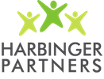

OpenBio Codefest 2014 will take place July 9th and 10th, 2014 (the
Wednesday and Thursday before [BOSC 2014](BOSC_2014 "wikilink")) in
Cambridge, Massachusetts at [hack/reduce](http://www.hackreduce.org/).
This is a great opportunity for open source bioinformatics developers to
meet and work collaboratively. We hope to have developers from projects
such as [BioPerl](http://bioperl.org),
[BioJava](http://www.biojava.org), [Biopython](http://biopython.org),
[BioRuby](http://www.bioruby.org), [Galaxy](http://wiki.g2.bx.psu.edu/)
and [GenomeSpace](http://www.genomespace.org) in attendance. Everyone is
welcome to attend.

This is the fifth annual pre-[BOSC](BOSC "wikilink")
[Codefest](Codefest "wikilink"), continuing work from [Codefest
2010](Codefest_2010 "wikilink") in Boston, [Codefest
2011](Codefest_2011 "wikilink") in Vienna, [Codefest
2012](Codefest_2012 "wikilink") in Los Angeles, and [Codefest
2013](Codefest_2013 "wikilink") in Berlin.

It will be followed by the [EU-Codefest
2014](EU-Codefest_2014 "wikilink") in England in September 2014.

Goals
-----

Most open source bioinformatics projects are coordinated remotely, with
users from all over the world contributing and organizing themselves
through mailing lists and chats. Contributors work on these projects in
their spare time, balancing open source commitments with their day jobs
and life outside of the computer.

The objective of the Codefest is to give these talented developers a
chance to be fully focused on the projects for a few days, interacting
in real time. Previous
[Hackathons](http://www.open-bio.org/wiki/Hackathon) have been immensely
successful at producing new high quality code and innovative project
developments.

The goals for the two days are determined entirely by attendees. Please
add your project ideas to the [shared Google
document](https://docs.google.com/document/d/1yADE2bb0rEU6TASxuSPsvTdHvh_rtCXzJrsL3NWzxXE/edit?usp=sharing).
We'll use this brainstorming discussion document to prepare directions
for the two days of work.

Attendees
---------

You are very welcome to attend. There is no cost, we only ask you to
register to help organize numbers for food and beverages. Please add
yourself if you are interested to [this Google
spreadsheet](https://docs.google.com/spreadsheet/ccc?key=0Agxg-o4ZmoZ4dHU1OXhrczV3Q3d5eE9CUVhBc1dGNWc&usp=sharing)
We'll coordinate through the [Codefest 2014 mailing
list](https://groups.google.com/forum/?fromgroups#!forum/openbio-codefest-2014),
so please sign up to receive updates.

Logistics
---------

|                                                                                                                                |
|--------------------------------------------------------------------------------------------------------------------------------|
|  |

[hack/reduce](http://www.hackreduce.org/), a wonderful hacker space in
Cambridge, has agreed to host us for the two days. It's located a short
walk from the Kendall Square Red Line [T stop](http://mbta.com/):
[Google map](http://goo.gl/maps/c8qkV)

Thanks to [Amazon](http://aws.amazon.com) all participants will receive
a $100 AWS credit to support work at the Hackathon.

Thanks to the generosity of our sponsors we will have coffee, lunch and
dinner for both days. We plan to meet at 9am and work throughout the day
and evening. Timing is flexible so come when you are able and contribute
as much as you'd like. On July 10th we'll have a BBQ dinner at Brad's
house in Somerville to thank everyone for all the hard work. The rough
schedule highlights for the two days are:

-   July 9th, 9am: Greetings, introduction, organization and coffee
-   July 9th, 1pm: Lunch, post-lunch organization
-   July 9th, 6pm: Dinner, wrap-up discussions, continue working as long
    as you like
-   July 10th, 9am: Greetings, organization and coffee
-   July 10th, 1pm: Lunch, post-lunch organization
-   July 10th, 3:30pm: Prepare codefest progress reports and slides for
    BOSC
-   July 10th, 5-8pm: BBQ at Brad's house in Somerville

Our recommendation for housing is to look at [AirBnb near Kendall,
Central or Harvard square on the Cambridge side of the River or Back
Bay/Fenway on the Hynes Convention center
side](https://www.airbnb.com/s/boston--ma?checkin=07/08/2014&checkout=07/11/2014&price_max=250&sw_lat=42.336674148099135&sw_lng=-71.11771635949663&ne_lat=42.37715666811412&ne_lng=-71.06630377709917&zoom=14&search_by_map=true).
Generally you want to be near [the MBTA train (the
T)](http://mbta.com/schedules_and_maps/subway/). Red line stops like
Kendall, Central, Harvard, Porter or Davis offer good access to
Hack/Reduce with a short walk from the Kendall train station. The Green
line (B, C, and D; not E) stop at Hynes Convention Center, and you can
transfer from Green to Red at Park Street Station downtown.

Sponsors
--------

|                                                                                                         |          |                                                                                                                                                        |                                                                                                  |
|---------------------------------------------------------------------------------------------------------|----------|--------------------------------------------------------------------------------------------------------------------------------------------------------|--------------------------------------------------------------------------------------------------|
|  |          |  |  |
|           |

We thank [Curoverse](http://curoverse.com), [Harbinger Partners,
Inc.](http://harbinger-partners.com/) and [Amazon Web
Services](http://aws.amazon.com/) for sponsoring the BOSC CodeFest 2014.

Organizers
----------

-   [Brad Chapman](http://bcbio.wordpress.com/)
-   [Michael Heuer](http://github.com/heuermh/)

