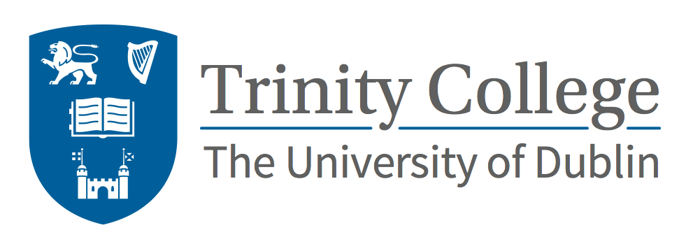

OpenBio Codefest 2015 will take place July 8th and 9th, 2015 (the
Wednesday and Thursday before [BOSC 2015](BOSC_2015 "wikilink")) in
Dublin, Ireland. This is an opportunity for anyone interested in open
science, biology and programming to meet, discuss and work
collaboratively. Everyone is welcome to attend.

This is the sixth annual pre-[BOSC](BOSC "wikilink")
[Codefest](Codefest "wikilink"). Previous fun and successful events were
[Codefest 2010](Codefest_2010 "wikilink") in Boston, [Codefest
2011](Codefest_2011 "wikilink") in Vienna, [Codefest
2012](Codefest_2012 "wikilink") in Los Angeles, [Codefest
2013](Codefest_2013 "wikilink") in Berlin, and [Codefest
2014](Codefest_2014 "wikilink") in Boston.

Objectives
----------

The goal of Codefest is to bring open source bioinformatics programmers
together to have an enjoyable and productive two days. Practically this
results in a number useful outcomes:

-   Improving and expanding existing open source code, documentation and
    infrastructure (see the summaries from [Codefest
    2014](https://docs.google.com/presentation/d/114yvrK0Veasc_ns_rg484j2xxRi1h7wNlU2XKONuUqY/edit)
    and [Codefest
    2013](http://bcb.io/2013/07/18/summary-from-bioinformatics-open-science-codefest-2013-tools-infrastructure-standards-and-visualization/)
    for examples of work accomplished in previous years).

<!-- -->

-   Developing new communities working on shared problems. For example,
    the [Common Workflow
    Language](https://groups.google.com/forum/#!forum/common-workflow-language)
    developed from discussions at Codefest 2014.

<!-- -->

-   Establishing new relationships for training, helping to expand the
    open source bioinformatics community.

<!-- -->

-   Preparing and publishing [papers about the work
    accomplished](http://www.biomedcentral.com/1471-2105/15/S14/S7).

Outcomes
--------

2015 was another productive and fun event. Here are some of the outputs
of the 2 days:

-   [slide deck summarizing major project
    accomplishments](https://docs.google.com/presentation/d/1MVRIQWyg3KPuK5Fqa6A_9bvgQ1AlU7LIU_S4ldDZ96k/edit?usp=sharing)
-   [Codefest overview from Guillermo
    Carrasco](http://mussol.org/2015/07/11/codefest-and-bosc-2015-lots-of-workflows-and-docker/)
-   [Codefest experience report from Robin
    Andeer](http://www.robinandeer.com/blog/2015/07/08/bosc-codefest-2015/)
-   [Johan Dahlberg's summary of his Codefest
    work](http://uppsala-bioinformatics.se/thoughts/?p=61)
-   [Pictures from Luka
    Stojanovic](https://drive.google.com/folderview?id=0B8ns4TUYMoKLfnZBM09GSDNpQzNpdVJfbXpmMHhoYkhXblNWenRsRDJ0OURsUVRSUUszQUk&usp=sharing)
-   [Twitter storify from Bruno
    Vieira](https://storify.com/bmpvieira/dublin-conferences)

Why attend
----------

-   For new members of the community: meet and learn with existing open
    source programmers. First timers are welcome at Codefest.

<!-- -->

-   For current community members: expand your network and strengthen
    existing relationships. Teach and learn from new community members.
    Focus on open source work without interruptions. Discuss questions
    and problems in real time.

<!-- -->

-   For everyone: discuss and learn from the community. Teach others
    what you know. Build new friendships and collaborations.

What to expect
--------------

The OpenBio Codefest is a collaborative two day working session. The
only requirement for attendance is that you have an interest in open
source software and solving scientific problems. We will have
contributors to open source bioinformatics tools present to
collaboratively work with, and we welcome new attendees who want to
learn and contribute to open source code or documentation.

The rough structure of the two days is:

-   Start with introductions from everyone attending about their goals
    and plans for the two days.

<!-- -->

-   Assemble into working groups based on shared interests like
    programming languages, open source projects or biological questions.
    We use the [collaboratively brainstormed Google
    document](https://docs.google.com/document/d/1BJ_l4LG_RiCukJaDSkK4-_apr2nBtFr4gUYQHo1HeVQ/edit)
    as the basis for setting up groups. Attendees determine the goals
    for the two days. If you have an idea for a project, please add it
    before the event. Any and all suggestions are welcome.

<!-- -->

-   Work and discuss. Enjoy the productive time.

<!-- -->

-   We'll have regular breaks where each group can deliver short reports
    on their progress.

<!-- -->

-   We have informal lunches, dinners and drinks as a way for everyone
    to get to know each other better.

<!-- -->

-   At the end of the two days, we summarize contributions and work
    accomplished in a BOSC presentation and meeting report.

Please feel free to get in touch with any of the organizers with
questions. You are very welcome at Codefest.

Attending
---------

You are very welcome to attend. There is no cost, we only ask you to
register to help organize numbers. Please add yourself if you are
interested to [this Google
spreadsheet](https://docs.google.com/spreadsheets/d/1STl3x-KcInCxpGBgBHDz2C_LvrudXDe1X9d68NpH0Tk/edit?usp=sharing)
We'll coordinate through the [Codefest 2015 mailing
list](https://groups.google.com/forum/?fromgroups#!forum/openbio-codefest-2015),
so please sign up to discuss and receive updates.

If you're not able to physically attend in Dublin, we're still more than
happy to have you participate in Codefest. Please sign up on the [the
Google
spreadsheet](https://docs.google.com/spreadsheets/d/1STl3x-KcInCxpGBgBHDz2C_LvrudXDe1X9d68NpH0Tk/edit?usp=sharing)
and list yourself as remote only. We set up a [Gitter chat
room](https://gitter.im/chapmanb/obf-codefest) we can use to coordinate
and discuss in real time.

Logistics
---------

|                                                                                                                        |
|------------------------------------------------------------------------------------------------------------------------|
|  |

Codefest 2015 will be hosted at [Trinity College
Dublin](http://www.tcd.ie/) by the schools of [Natural
Sciences](http://naturalscience.tcd.ie/),
[Computing](https://www.scss.tcd.ie/) and
[Engineering](http://www.tcd.ie/Engineering/). We'll be located in the
[beautiful Museum
Building](https://www.google.ie/search?q=museum+building+tcd&safe=off&espv=2&biw=1280&bih=963&tbm=isch&tbo=u&source=univ&sa=X&ei=hTeJVduLKeip7AbF55PQBA&ved=0CD4QsAQ)
in the center of the Trinity Campus in downtown Dublin:

-   We'll be in the Drawing office, in the Civil Engineering department,
    within the Museum Building.
-   \[<https://www.google.ie/maps/place/Museum+Bldg,+Trinity+College+Dublin,+Dublin/@53.3434376,-6.2546054,17z/data>=!4m2!3m1!1s0x48670e9a9223bbc3:0x8004c87f5b97e752
    Map\]
-   [Virtual tour](http://www.tcd.ie/virtualtour/civilengineering/)
-   [pictures of the
    room](https://drive.google.com/folderview?id=0Bwxg-o4ZmoZ4eUJaLVZpc0N3Zjg&usp=sharing)

The agenda for the 2 days is:

-   July 8th, 9am: Greetings, introduction, organization. We'll have
    coffee and some pastries/fruit.
-   July 8th, 1pm: Sandwiches provided for lunch,
    post-lunch organization.
-   July 8th, 5pm: Finish for the day
-   July 8th, 6pm: Dinner in Dublin -- [The Market
    Bar](http://marketbar.ie/), [map](http://marketbar.ie/node/31)
-   July 9th, 9am: Greetings, organization and coffee/fruit.
-   July 9th, 1pm: Sandwiches provided for lunch, post-lunch
    organization
-   July 9th, 4pm: Prepare codefest progress reports and slides for BOSC
-   July 9th, 5pm: Finish for the day
-   July 9th, 6pm: Dinner in Dublin --
    [Wagamama](http://www.wagamama.ie/restaurants/dublin-south-king-street),
    \[<https://www.google.ie/maps/place/Wagamama/@53.3412563,-6.262336,17z/data>=!4m2!3m1!1s0x48670e9c2dee159d:0x351b0efa3ccd6309
    map\]

We're always looking for sponsors interested in being involved with the
open source community for help with food and coffee. If interested,
please get in touch with [Brad](https://github.com/chapmanb).

Sponsors
--------

|                                                                                                              |
|--------------------------------------------------------------------------------------------------------------|
|  |
|                |

We thank [Curoverse](http://curoverse.com) and
[Bina](http://www.bina.org) for sponsoring the BOSC CodeFest 2015.

Organizers
----------

-   [Brad Chapman](http://bcb.io/)
-   [Andrew
    Jackson](http://www.tcd.ie/Zoology/research/research/theoretical/andrewjackson.php)

