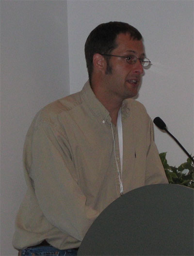

Darin London is the chair for the [BOSC](BOSC "wikilink") conferences.
Darin is currently employed at [Duke University](http://www.duke.edu)'s
[Intitute for Genome Sciences & Policy](http://www.genome.duke.edu)
after a two year term with [BioMart](http://www.biomart.org) at the
[EBI](http://www.ebi.ac.uk).

<Category:People>
