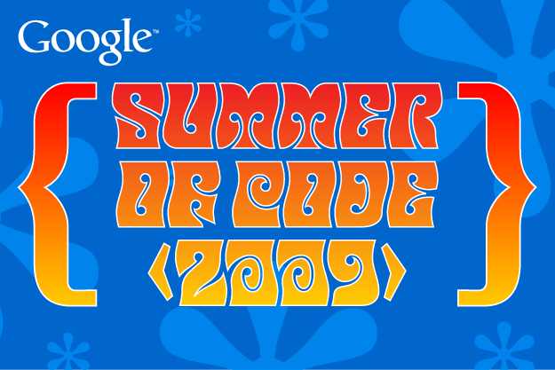

Once again in 2010, the OBF is applying to the [Google Summer of
Code](http://socghop.appspot.com/) (GSoC) program as an umbrella
organization for all OBF-affiliated projects.

This page serves as a collection point for ideas, projects,
prerequisites, solution approaches, mentors, other people or channels to
contact for more information.

About Google Summer of Code
---------------------------

 For those not familiar with
the program, Google Summer of Code (GSoC) is maybe best described as a
remote student internship program for globally distributed,
collaboratively developed open-source projects. The program offers
eligible student developers stipends to write code for open source
projects over a period of 3 summer months ("flip bits, not burgers").
Aside from the stipend, perhaps the most important qualitative
difference of this program is that students are paired with mentors, who
are typically experienced developers from the project to which the
student would be contributing, and who can guide the student to interact
productively with the community, prevent getting stuck in obstacles, and
avoid chasing down the wrong direction. The program is global - students
and mentors may be located anywhere where they have internet connection
(\[<http://socghop.appspot.com/document/show/program/google/gsoc2009/faqs#not_eligible>
except for countries affected by US trade restrictions\]), and no travel
is required. Thus, other than the stipend and the mentorship, the
internship mirrors normal contributors to such distributed development
projects, which is a useful learning experience in itself, as the skills
needed to be effective at this are typically not taught in computer
science curricula, yet are highly desired in an increasingly global IT
industry.

From the viewpoint of participating open-source projects, the program
not only offers to pay students for contributing, but more importantly
offers an opportunity to recruit new developers in a way that allows far
more people to leap over the barrier from interested user to code
contributor.

See
\[<http://socghop.appspot.com/document/show/program/google/gsoc2009/faqs#about_gsoc>
the GSoC FAQs and documentation\] for further information, and see below
for [reference facts such as eligibility and
timelines](#Reference_Facts_.26_Links:_Google_Summer_of_Code_2009 "wikilink").

Contact
-------

Our organization administrators are primary administrator [Robert
Buels](User:RobertBuels "wikilink")
([rmb32@cornell.edu](mailto:rmb32%40cornell%2eedu)) and backup
administrator [Hilmar Lapp](User:Lapp "wikilink")
([hlapp@gmx.net](mailto:hlapp%40gmx%2enet)).

If you are a student interested in applying for a Google Summer of Code
project with our organization, please send questions and project ideas
to the develop mailing list of the pertinent OBF project.

How do you know which project is pertinent and the address of its
developer mailing list? The [projects under the OBF umbrella are listed
below](#Open-Bio_projects_involved "wikilink"), with home page and
developer mailing lists. Each project idea lists the OBF project it is a
part of; look it up in the list below and you have the information you
need. If you want to propose your own project idea and the project to
which you would contribute isn't obvious, send email to
[gsoc@lists.open-bio.org](mailto:gsoc%40lists%2eopen-bio%2eorg).
However, do not worry overly much about picking the right OBF project at
the outset. If you are unsure, simply make your best guess, and other
members of the email list will help you to find the best organization to
suit your idea.

Some of us also can regularly be found on IRC, see the list of OBF
projects below for information on which projects have a channel and the
name of the channel. *(If you do not have an IRC client installed, you
might find the [comparison on
Wikipedia](http://en.wikipedia.org/wiki/List_of_IRC_clients), the
[Google
directory](http://directory.google.com/Top/Computers/Software/Internet/Clients/Chat/IRC/),
or the [IRC Reviews](http://www.ircreviews.org/clients/) helpful. For
Macs, [X-Chat Aqua](http://en.wikipedia.org/wiki/X-Chat) works pretty
well. If you have never used IRC, try the [IRC
Primer](http://irchelp.org/irchelp/ircprimer.html) at [IRC
Help](http://irchelp.org/), which also has links to lots of other
material.)*

For applying, please make sure you read our [documentation on
information that students should know and guidelines we expect you to
follow](#What_should_prospective_students_know.3F "wikilink") *before*
you apply. We don't have a format template for application that you need
to adhere to, but we do ask that you include specific kinds of
information. What those are is documented under "[When you
apply](#When_you_apply "wikilink")."

Ideas
-----

*Note: primary project mentors are in **bold font**. Biographical and
other information on the mentors is linked to in the [Mentors
section](#Mentors "wikilink").*

*Students: The project **ideas** below are suggested projects from
mentors, albeit well thought-out ones. You are welcome to propose your
own project if none of those below catches your interest, or if your
idea is more exciting to you, provided it is still a contribution to one
the OBF member projects (see list below). Just be aware that we can't
guarantee finding an appropriate mentor, but if we like your proposal we
will try. Regardless of what you decide to do, make sure you read and
follow the [guidelines for
students](#What_should_prospective_students_know.3F "wikilink") below.*

Mentor List
-----------

-   [Chris Fields](bp:User:Cjfields "wikilink") (U. Illinois at
    Urbana-Champaign; BioPerl)
-   [Mark Jensen](bp:User:Majensen "wikilink") (Fortinbras; BioPerl)

What should prospective students know?
--------------------------------------

### Before you apply

-   If you want to apply with your own idea, determine which OBF project
    you would be contributing to, and [contact us](#Contact "wikilink")
    early on so we can try to find a mentor.
-   Proposals should extend one of affiliated toolkits.
-   [Ask us questions](#Contact "wikilink") about the project idea you
    have in mind.
-   Write a project proposal draft, include a project plan (see below),
    and [bounce those off of us](#Contact "wikilink").

Again, **students are strongly encouraged to [contact
us](#Contact "wikilink") before applying**. Frequent and early
communication is extremely valuable for putting together successful
projects.

### When you apply

When applying, (aside from the information requested by Google) please
provide the following in your application material.

1.  Why you are interested in the project you are proposing and are
    well-suited to undertake it.
2.  A summary of your programming experience and skills.
3.  Programs or projects you have previously authored or contributed to,
    in particular those available as open-source, including, if
    applicable, any past Summer of Code involvement.
4.  A project plan for the project you are proposing, even if your
    proposed project is directly based on one of the ideas above.
    -   A project plan in principle divides up the whole project into a
        series of manageable milestones and timelines that, when all
        accomplished, logically lead to the end goal(s) of the project.
        Put in another way, a project plan explains what you expect you
        will need to be doing, and what you expect you need to have
        accomplished, at which time, so that at the end you reach the
        goals of the project.
    -   Do not take this part lightly. A compelling plan takes a
        significant amount of work. Empirically, applications with no or
        a hastily composed project plan have not been competitive, and a
        more thorough project plan can easily make an applicant
        outcompete another with more advanced skills.
    -   A good plan will require you to thoroughly think about the
        project itself and how one might want to go about the work.
    -   We don't expect you to have all the experience, background, and
        knowledge to come up with the final, real work plan on your own
        at the time you apply. We do expect your plan to demonstrate,
        however, that you have made the effort and thoroughly dissected
        the goals into tasks and successive accomplishments that
        make sense.
    -   We strongly recommend that you bounce your proposed project and
        your project plan draft off of us, using either the pertinent
        developers mailing list or the IRC channel(s). Through the
        project plan exercise you will inevitably discover that you are
        missing a lot of the pieces - we are there to help you fill
        those in as best as we can.

5.  Any obligations or plans for the summer during the coding period
    that may possibly conflict.
    -   We expect the your GSoC projec to be your primary focus over
        the summer. It should not be regarded as a part-time occupation.
    -   If you feel that you can manage other work obligations
        concurrently with your Summer of Code project, make your case
        and support it with evidence.
    -   Be honest and open. If it turns out later that you weren't clear
        about other obligations, at best (i.e., if your accomplishment
        record at that point is spotless) our trust in you will be
        severely degraded. Also, if you are accepted, discuss with your
        GSoC mentor before taking on additional obligations.
    -   One of the most common reasons for students to struggle or fail
        is being overcommitted. Do not set yourself up for failure! GSoC
        summers should be fun and rewarding!

### Other information

-   Our [2009 application
    document](http://docs.google.com/Doc?id=dhs98hzv_7zn8bxqjm) with
    Google's questions and our answers.
-   For questions of eligibility, see the [GSoC eligibility requirements
    for
    students](http://code.google.com/opensource/gsoc/2009/faqs.html#0_1_eligibility_83343977761348_13148542340972003).
    These requirements must be met on April 20, 2009.
-   There is also a [Google group for posting GSoC
    questions](http://groups.google.com/group/google-summer-of-code-discuss)
    (and receiving answers; note that you will need to sign up for
    the group) that relate to the program itself (and are not specific
    to our organization).
-   Students receive a stipend from Google if accepted. See the [Google
    SoC FAQ on
    payments](http://code.google.com/opensource/gsoc/2009/faqs.html#0_1_administrivia_842873138659_49145328697313184)
    for full documentation.

Open-Bio Projects Accepting Applicants
--------------------------------------

[BioPerl](bp:Main_Page "wikilink") :  

:\* [Project website](bp:Main_Page "wikilink")

:\* Quick links:

:\*\* [Information for new
developers](bp:Becoming_a_developer "wikilink")

:\*\* source code browser for
[bioperl-live](http://code.open-bio.org/svnweb/index.cgi/bioperl/browse/bioperl-live/trunk)
(the main BioPerl code base), and [all BioPerl
sub-projects](http://code.open-bio.org/svnweb/index.cgi/bioperl/)

:\*\* [Priority list](bp:Project_priority_list "wikilink") of things
that need work, as another source for student-conceived project ideas

:\*\* [Mailing lists](bp:Mailing_lists "wikilink")

:\*\* IRC: \#bioperl on [Freenode](http://freenode.net)

[BioJava](http://biojava.org) :  

:\* [Project website](http://biojava.org)

:\* Quick links:

:\*\* [Proposal for BioJava3](http://biojava.org/wiki/BioJava3_Proposal)
as another source for student-conceived project ideas

:\*\* source code for
[biojava-live](http://code.open-bio.org/svnweb/index.cgi/biojava/browse/biojava-live/trunk)
(the main BioJava code base) and [all BioJava
sub-projects](http://code.open-bio.org/svnweb/index.cgi/biojava/)

:\*\* [Mailing lists](http://biojava.org/wiki/BioJava:MailingLists)

:\*\* No IRC channel at present

[Biopython](biopython:Main_Page "wikilink") :  

:\* [Project website](biopython:Main_Page "wikilink")

:\* Quick links:

:\*\* [Information for contributors](biopython:Contributing "wikilink")

:\*\* [Mailing lists](biopython:Mailing_lists "wikilink")

:\*\* [ Source Code](biopython:SourceCode "wikilink")

:\*\* No IRC channel at present

[BioRuby](http://bioruby.org) :  

:\* [Project website](http://bioruby.org)

:\* Quick links:

:\*\* [developers mailing
list](http://lists.open-bio.org/mailman/listinfo/bioruby)

:\*\* [source code](http://github.com/bioruby/bioruby/tree/master)

:\*\* No IRC channel at present

[BioSQL](biosql:Main_Page "wikilink") :  

:\* [Project website](biosql:Main_Page "wikilink")

:\* Quick links:

:\*\* Current [enhancement
requests](http://biosql.org/wiki/Enhancement_Requests) as another source
for student-conceived project ideas

:\*\* [developers mailing
list](http://biosql.org/mailman/listinfo/biosql-l)

:\*\* [source
code](http://code.open-bio.org/svnweb/index.cgi/biosql/browse/biosql-schema/trunk)

:\*\* No IRC channel at present

[BioLib](http://biolib.open-bio.org) :  

:\* [Project website](http://biolib.open-bio.org)

:\* Quick links:

:\*\* [developers mailing
list](http://lists.open-bio.org/mailman/listinfo/biolib-dev)

:\*\* [source code](http://github.com/pjotrp/biolib/tree/master)

:\*\* No IRC channel at present

Reference Facts & Links: [Google Summer of Code 2010](http://socghop.appspot.com/)
------------------------------------------------------------------------------------------------------------------

-   Mentoring organizations apply between March 9-13, 2009. Accepted
    mentoring organizations will be published March 18. See [full set of
    timelines](http://code.google.com/opensource/gsoc/2009/faqs.html#0_1_timeline_5354032302481437_).
-   Google expects to accept around 150 mentoring organizations, a bit
    less than in 2008 (when they accepted 175). If the trend over the
    past years is any indication, this will be out of at least 3x as
    many organizations that apply.
-   Students apply between March 23-April 3, 2009. The [eligibility
    requirements for
    students](http://code.google.com/opensource/gsoc/2009/faqs.html#0_1_eligibility_83343977761348_13148542340972003)
    are in the GSoC FAQ.
-   [Development occurs
    on-line](http://code.google.com/opensource/gsoc/2009/faqs.html#0_1_development_where_91701355_4247830955169275),
    there is no requirement or expectation to travel, neither for
    students nor for mentors.

[Category:Google Summer of
Code](Category:Google_Summer_of_Code "wikilink")
