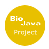
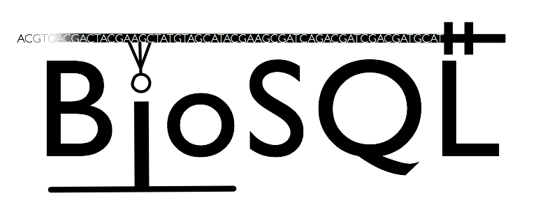
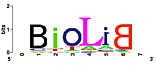

 Once again in 2010, the
OBF is applying to the [Google Summer of
Code](http://code.google.com/soc) (GSoC) program as an umbrella
organization for all OBF-affiliated projects.

This page serves as a collection point for ideas, projects,
prerequisites, solution approaches, mentors, other people or channels to
contact for more information.

About Google Summer of Code
---------------------------

For those not familiar with the program, Google Summer of Code (GSoC) is
a student internship program for open-source projects. The program
offers eligible student developers stipends to write code for open
source projects over a period of 3 summer months ("flip bits, not
burgers"). Aside from the stipend, one of the most important features of
the program is that students are paired with mentors, who are typically
experienced developers from the project to which the student
contributes. The mentor guides the student to work productively within
the community, and helps the student avoid obstacles and pitfalls. The
program is global - students and mentors may be located anywhere where
they have internet connection (except for countries affected by US trade
restrictions), and no travel is required. Thus, aside from the stipend
and mentorship aspects, the student's experience in the internship
closely mirrors normal work on distributed development projects.
Effective work habits for distributed development are typically not
taught in computer science curricula, yet are highly desired in the
increasingly global software and IT industries.

From the viewpoint of each open-source project, the program not only
offers to pay students for contributing, but more importantly offers an
opportunity to recruit new developers who will hopefully go on to become
regular, sustained contributors.

See the [Main GSoC Site](http://code.google.com/soc) for more
information and FAQs, and see below for [other facts such as eligibility
and timelines ](#Other_Facts_.26_Links "wikilink").

Mentors and Project Ideas
-------------------------

Mentors and project ideas are hosted on each member project's wiki on a
dedicated Google Summer of Code page. See each of the member projects,
linked below, for more details about any project:

-   [(BioPerl) Major BioPerl
    reorganization](http://bioperl.org/wiki/Google_Summer_of_Code#Major_BioPerl_reorganization)
-   [(BioPerl) Lightweight Sequence objects and Lazy
    Parsing](http://bioperl.org/wiki/Google_Summer_of_Code#Lightweight_Sequence_objects_and_Lazy_Parsing)
-   [(BioPerl) Alignment Subsystem
    Refactoring](http://bioperl.org/wiki/Google_Summer_of_Code#Alignment_Subsystem_Refactoring)
-   [(BioPerl) Perl Run Wrappers for External Programs in a
    Flash](http://bioperl.org/wiki/Google_Summer_of_Code#Perl_Run_Wrappers_for_External_Programs_in_a_Flash)
-   [(Biopython) Biopython and PyCogent
    interoperability](http://biopython.org/wiki/Google_Summer_of_Code#Biopython_and_PyCogent_interoperability)
-   [(Biopython) Galaxy phylogenetics pipeline
    development](http://biopython.org/wiki/Google_Summer_of_Code#Galaxy_phylogenetics_pipeline_development)
-   [(Biopython) Accessing R phylogenetic tools from
    Python](http://biopython.org/wiki/Google_Summer_of_Code#Accessing_R_phylogenetic_tools_from_Python)
-   [(Biopython) PDB-Tidy: Command-line tools for manipulating PDB
    files](http://biopython.org/wiki/Google_Summer_of_Code#PDB-Tidy:_command-line_tools_for_manipulating_PDB_files)
-   [(BioJava) All-Java Multiple Sequence
    Alignment](http://biojava.org/wiki/Google_Summer_of_Code)
-   [(BioRuby) Ruby 1.9.2 support of
    BioRuby](http://bioruby.open-bio.org/wiki/Google_Summer_of_Code#Ruby_1.9.2_support_of_BioRuby)
-   [(BioRuby) Implementation of algorithm to infer gene duplications in
    BioRuby](http://bioruby.open-bio.org/wiki/Google_Summer_of_Code#Implementation_of_algorithm_to_infer_gene_duplications_in_BioRuby)
-   [(Biolib) Mapping JAVA libraries to Perl/Ruby/Python using
    Biolib+SWIG+JNI](http://biolib.open-bio.org/wiki/GSoC2010)

*Note to students: project ideas on the wikis of member projects are
only selected projects, albeit well thought-out ones. You are encouraged
to propose your own project, just make sure it is still a contribution
to one the OBF member projects (see list below)! If we like your
proposal, we will try to find a mentor to help you with the project.
Regardless of what you decide to do, make sure you read and follow the
[guidelines for
students](#What_should_prospective_students_know.3F "wikilink") below.*

Contact
-------

For prospective students, the first point of contact should be the
mailing list of the OBF project you are interested in working with:

BioPerl: [bioperl-l@lists.open-bio.org](mailto:bioperl-l%40lists%2eopen-bio%2eorg)  
BioPython: [biopython@lists.open-bio.org](mailto:biopython%40lists%2eopen-bio%2eorg)  
BioJava: [biojava-l@lists.open-bio.org](mailto:biojava-l%40lists%2eopen-bio%2eorg)  
BioRuby: [bioruby@lists.open-bio.org](mailto:bioruby%40lists%2eopen-bio%2eorg)  
BioSQL: [biosql-l@lists.open-bio.org](mailto:biosql-l%40lists%2eopen-bio%2eorg)  
BioLib: [biolib-dev@lists.open-bio.org](mailto:biolib-dev%40lists%2eopen-bio%2eorg)  

Also, it would be a good idea to CC the organization adminstrator, so he
can make sure that you are properly taken care of:

Organization administrator: [Robert Buels](User:RobertBuels "wikilink") ([rmb32@cornell.edu](mailto:rmb32%40cornell%2eedu))  
Backup administrator: [Hilmar Lapp](User:Lapp "wikilink") ([hlapp@gmx.net](mailto:hlapp%40gmx%2enet))  

If you are not quite sure which project you would like to contribute to,
you can email to the organization administrator for help. However, do
not worry overly much about picking the right OBF project at the outset.
If you are unsure, simply make your best guess, and other members of the
email list will help you to find the best organization to suit your
idea.

Before applying, please read our [documentation on information that
students should know and guidelines we expect you to
follow](#What_should_prospective_students_know.3F "wikilink"). We also
require that you include certain information, listed below, under "[When
you apply](#When_you_apply "wikilink")."

Some mentors and developers can regularly be found on IRC, see the list
of OBF projects below for information on which projects have a channel
and the name of the channel. *(If you do not have an IRC client
installed, you might find the [comparison on
Wikipedia](http://en.wikipedia.org/wiki/List_of_IRC_clients), the
[Google
directory](http://directory.google.com/Top/Computers/Software/Internet/Clients/Chat/IRC/),
or the [IRC Reviews](http://www.ircreviews.org/clients/) helpful. For
Macs, [X-Chat Aqua](http://en.wikipedia.org/wiki/X-Chat) works pretty
well. If you have never used IRC, try the [IRC
Primer](http://irchelp.org/irchelp/ircprimer.html) at [IRC
Help](http://irchelp.org/), which also has links to lots of other
material.)*

Open-Bio Projects Accepting Applicants
--------------------------------------

[BioPerl](bp:Google_Summer_of_Code "wikilink") :  

:\* **[ BioPerl GSoC Page](bp:Google_Summer_of_Code "wikilink")** -
project ideas and mentors

:\* [Project website](bp:Main_Page "wikilink")

:\* [Information for new developers](bp:Becoming_a_developer "wikilink")

:\* source code browser for
[bioperl-live](http://code.open-bio.org/svnweb/index.cgi/bioperl/browse/bioperl-live/trunk)
(the main BioPerl code base), and [all BioPerl
sub-projects](http://code.open-bio.org/svnweb/index.cgi/bioperl/)

:\* [Priority list](bp:Project_priority_list "wikilink") of things that
need work, as another source for student-conceived project ideas

:\* [Mailing lists](bp:Mailing_lists "wikilink")

:\* IRC: \#bioperl on [Freenode](http://freenode.net)

[BioPython](biopython:Google_Summer_of_Code "wikilink") :  

:\* **[ BioPython GSoC
Page](biopython:Google_Summer_of_Code "wikilink")** - project ideas and
mentors

:\* [Project website](biopython:Main_Page "wikilink")

:\* [Information for contributors](biopython:Contributing "wikilink")

:\* [Mailing lists](biopython:Mailing_lists "wikilink")

:\* [ Source Code](biopython:SourceCode "wikilink")

:\* No IRC channel at present

[BioJava](http://biojava.org/wiki/Google_Summer_of_Code) :  

:\* **[BioJava GSoC
Page](http://biojava.org/wiki/Google_Summer_of_Code)** - project ideas
and mentors

:\* [BioJava modules](http://biojava.org/wiki/BioJava:Modules) as
another source for student-conceived project ideas

:\* source code for
[biojava-live](http://code.open-bio.org/svnweb/index.cgi/biojava/browse/biojava-live/trunk)
(the main BioJava code base) and [all BioJava
sub-projects](http://code.open-bio.org/svnweb/index.cgi/biojava/)

:\* [Mailing lists](http://biojava.org/wiki/BioJava:MailingLists)

:\* No IRC channel at present

[BioRuby](http://bioruby.org) :  

:\* **[BioRuby GSoC
Page](http://bioruby.open-bio.org/wiki/Google_Summer_of_Code)** -
project ideas and mentors

:\* [Project website](http://bioruby.org)

:\* [developers mailing
list](http://lists.open-bio.org/mailman/listinfo/bioruby)

:\* [source code](http://github.com/bioruby/bioruby/tree/master)

:\* No IRC channel at present

[BioSQL](biosql:Main_Page "wikilink") :  

:\* [Project website](biosql:Main_Page "wikilink")

:\* Current [enhancement
requests](http://biosql.org/wiki/Enhancement_Requests) as another source
for student-conceived project ideas

:\* [developers mailing
list](http://biosql.org/mailman/listinfo/biosql-l)

:\* [source
code](http://code.open-bio.org/svnweb/index.cgi/biosql/browse/biosql-schema/trunk)

:\* No IRC channel at present

[BioLib](http://biolib.open-bio.org) :  

:\* [Project website](http://biolib.open-bio.org)

:\* [developers mailing
list](http://lists.open-bio.org/mailman/listinfo/biolib-dev)

:\* [source code](http://github.com/pjotrp/biolib/tree/master)

:\* No IRC channel at present

Guide for prospective GSoC students
-----------------------------------

### Before you apply

-   Proposals should extend one of affiliated toolkits, not start a
    new project.
-   If you want to apply with your own idea, try to [contact
    us](#Contact "wikilink") early on so we can work with you to find a
    mentor and solidify your project idea and application.
-   [Ask us questions](#Contact "wikilink") about the project idea you
    have in mind.
-   Write a project proposal draft, include a project plan (see below),
    and [bounce those off of us](#Contact "wikilink").

Again, **students are strongly encouraged to [contact
us](#Contact "wikilink") as early as possible**. Frequent and early
communication is extremely valuable for putting together successful
projects.

### When you apply

When applying, (aside from the information requested by Google) please
provide the following in your application material.

1.  **Your complete contact information**, including full name, physical
    address, preferred email address, and telephone number, plus other
    pertinent contact information such as IRC handles, etc.
2.  Why you are interested in the project you are proposing and are
    well-suited to undertake it.
3.  A summary of your programming experience and skills.
4.  Programs or projects you have previously authored or contributed to,
    in particular those available as open-source, including, if
    applicable, any past Summer of Code involvement.
5.  A project plan for the project you are proposing, even if your
    proposed project is directly based on one of the proposed project
    ideas for member projects.
    -   A project plan in principle divides up the whole project into a
        series of manageable milestones and time-lines that, when all
        accomplished, logically lead to the end goal(s) of the project.
        Put in another way, a project plan explains what you expect you
        will need to be doing, and what you expect you need to have
        accomplished, at which time, so that at the end you reach the
        goals of the project.
    -   Do not take this part lightly. A compelling plan takes a
        significant amount of work. Empirically, applications with no or
        a hastily composed project plan have not been competitive, and a
        more thorough project plan can easily make an applicant out
        compete another with more advanced skills.
    -   A good plan will require you to thoroughly think about the
        project itself and how one might want to go about the work.
    -   We don't expect you to have all the experience, background, and
        knowledge to come up with the final, real work plan on your own
        at the time you apply. We do expect your plan to demonstrate,
        however, that you have made the effort and thoroughly dissected
        the goals into tasks and successive accomplishments that
        make sense.
    -   We strongly recommend that you bounce your proposed project and
        your project plan draft off of us, using either the pertinent
        developers mailing list or the IRC channel(s). Through the
        project plan exercise you will inevitably discover that you are
        missing a lot of the pieces - we are there to help you fill
        those in as best as we can.

6.  Any obligations, vacations, or plans for the summer that may require
    scheduling during the GSoC work period.
    -   We expect the your GSoC project to be your primary focus over
        the summer. It should not be regarded as a part-time occupation.
    -   If you feel that you can manage other work obligations
        concurrently with your Summer of Code project, make your case
        and support it with evidence.
    -   Be honest and open. If it turns out later that you weren't clear
        about other obligations, at best (i.e., if your accomplishment
        record at that point is spotless) our trust in you will be
        severely degraded. Also, if you are accepted, discuss with your
        GSoC mentor before taking on additional obligations.
    -   One of the most common reasons for students to struggle or fail
        is being overcommitted. Do not set yourself up for failure! GSoC
        summers should be fun and rewarding!

Other Facts & Links
-------------------

**Google Summer of Code Main Site: [1](http://code.google.com/soc)**

-   Mentoring organizations apply between March 8-12, 2010. Accepted
    mentoring organizations will be published March 19.
-   Google expects to accept around 150 mentoring organizations.
-   Students apply between March 22-April 2, 2010. See the [GSoC
    site](http://code.google.com/soc) for eligibility requirements.
-   Development is done entirely remotely and on-line, there is no
    requirement or expectation for either students or mentors to travel.
-   Org application documents, with Google's questions and our answers:
    -   [ 2010 ](Google_Summer_of_Code_2010_Org_Application "wikilink")
    -   [2009](http://docs.google.com/Doc?id=dhs98hzv_7zn8bxqjm)
-   For questions of eligibility, see the [2010 GSoC eligibility
    requirements for
    students](http://socghop.appspot.com/document/show/gsoc_program/google/gsoc2010/faqs#eligibility).
-   There is also a [Google group for posting GSoC
    questions](http://groups.google.com/group/google-summer-of-code-discuss)
    (and receiving answers; note that you will need to sign up for
    the group) that relate to the program itself (and are not specific
    to our organization).
-   Students receive a stipend from Google if accepted. See the [2010
    GSoC FAQ on
    payments](http://socghop.appspot.com/document/show/gsoc_program/google/gsoc2010/faqs#payments)
    for full documentation.

[Category:Google Summer of
Code](Category:Google_Summer_of_Code "wikilink")
