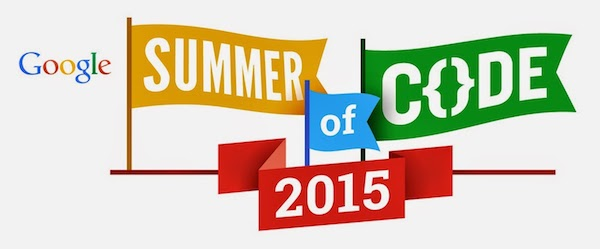

Google Summer of Code (GSoC) is a student internship program for
open-source projects. The program offers eligible student developers
stipends to write code for open source projects over a period of 3
summer months ("flip bits, not burgers"). See the **[Google Summer of
Code Main Site](http://code.google.com/soc)** for general information
about the Google Summer of Code program, how to apply, frequently asked
general questions, and more.

GSoC 2015
---------

The Google Summer of Code 2015 is ON! OBF is once again serving as a
[GSoC mentoring
organization](http://www.google-melange.com/gsoc/org2/google/gsoc2015/obf)
this year. Interested mentors and students should subscribe to the
OBF/GSoC [mailing
list](http://lists.open-bio.org/mailman/listinfo/gsoc). Please announce
yourself, so we know who you are! The details of each of our project
ideas are listed below, including potential mentors.

### Facts & Links

Time Line :  

:\* [GSoC 2015 time
line](http://www.google-melange.com/gsoc/events/google/gsoc2015)

GSoC 2015 FAQ :  

:\* For questions of eligibility, see the [GSoC 2015
FAQ](http://www.google-melange.com/gsoc/document/show/gsoc_program/google/gsoc2015/help_page).

Info from Google :  

:\* There is also a [Google group for posting GSoC
questions](http://groups.google.com/group/google-summer-of-code-discuss)
(and receiving answers; note that you will need to sign up for the
group) that relate to the program itself (and are not specific to our
organization).

:\* Students receive a stipend from Google if accepted. See the [GSoC
2015
FAQ](http://www.google-melange.com/gsoc/document/show/gsoc_program/google/gsoc2015/help_page)
for full documentation.

:\* Development is done entirely remotely and on-line; there is no
requirement or expectation for either students or mentors to travel.

### Why apply?

One of the most important features of the program is that students are
paired with mentors, who are typically experienced developers from the
project to which the student is contributing. The mentor guides the
student to work productively within the community, and helps the student
avoid obstacles and pitfalls. The program is global - students and
mentors may be located anywhere where they have an internet connection
(except for countries affected by US trade restrictions), and no travel
is required. Thus, aside from the stipend and mentorship aspects, the
student's experience in the internship closely mirrors normal work on
distributed development projects. Effective work habits for distributed
development are typically not taught as part of computer science
curricula, yet are highly desired in the increasingly global and
distributed software, IT, and biotechnology industries.

From the viewpoint of each open-source project, the program not only
offers to pay students for contributing, but more importantly, offers an
opportunity to recruit new developers who will hopefully go on to become
regular, sustaining contributors.

Project Ideas
-------------

Our GSoC ideas from each project are collected here: **[OBF Project
Ideas for GSoC 2015](Google_Summer_of_Code_2015_Ideas "wikilink")**

OBF Projects Accepting Applicants
---------------------------------

[BioPerl](bp:Google_Summer_of_Code "wikilink") :  

:\* **[ BioPerl GSoC Page](bp:Google_Summer_of_Code "wikilink")** -
project ideas and mentors

:\* [Project website](bp:Main_Page "wikilink")

:\* [Information for new developers](bp:Becoming_a_developer "wikilink")

:\* source code browser for
[bioperl-live](http://code.open-bio.org/svnweb/index.cgi/bioperl/browse/bioperl-live/trunk)
(the main BioPerl code base), and [all BioPerl
sub-projects](http://code.open-bio.org/svnweb/index.cgi/bioperl/)

:\* [Priority list](bp:Project_priority_list "wikilink") of things that
need work, as another source for student-conceived project ideas

:\* [Mailing lists](bp:Mailing_lists "wikilink")

:\* IRC: `#bioperl` on [Freenode](http://freenode.net)

[BioPython](biopython:Google_Summer_of_Code "wikilink") :  

:\* **[ BioPython GSoC
Page](biopython:Google_Summer_of_Code "wikilink")** - project ideas and
mentors

:\* [Project website](biopython:Main_Page "wikilink")

:\* [Information for contributors](biopython:Contributing "wikilink")

:\* [Mailing lists](biopython:Mailing_lists "wikilink")

:\* [ Source Code](biopython:SourceCode "wikilink")

:\* No IRC channel at present

[BioJava](http://biojava.org/wiki/Google_Summer_of_Code) :  

:\* **[BioJava GSoC
Page](http://biojava.org/wiki/Google_Summer_of_Code)** - project ideas
and mentors

:\* [BioJava modules](http://biojava.org/wiki/BioJava:Modules) as
another source for student-conceived project ideas

:\* source code for
[biojava-live](http://code.open-bio.org/svnweb/index.cgi/biojava/browse/biojava-live/trunk)
(the main BioJava code base) and [all BioJava
sub-projects](http://code.open-bio.org/svnweb/index.cgi/biojava/)

:\* [Mailing lists](http://biojava.org/wiki/BioJava:MailingLists)

:\* No IRC channel at present

[BioRuby](http://bioruby.org) :  

:\* **[BioRuby GSoC
Page](http://bioruby.open-bio.org/wiki/Google_Summer_of_Code)** -
project ideas and mentors

:\* [Project website](http://bioruby.org)

:\* [developers mailing
list](http://lists.open-bio.org/mailman/listinfo/bioruby)

:\* [source code](http://github.com/bioruby/bioruby/tree/master)

:\* IRC: `#bioruby` on [Freenode](http://freenode.net)

[BioSQL](biosql:Main_Page "wikilink") :  

:\* [Project website](biosql:Main_Page "wikilink")

:\* Current [enhancement
requests](http://biosql.org/wiki/Enhancement_Requests) as another source
for student-conceived project ideas

:\* [developers mailing
list](http://biosql.org/mailman/listinfo/biosql-l)

:\* [source
code](http://code.open-bio.org/svnweb/index.cgi/biosql/browse/biosql-schema/trunk)

:\* No IRC channel at present

[BioHaskell](http://biohaskell.org/) :  

:\* [Project website](http://biohaskell.org/)\]

:\* [Bioinformatics section on
HackageDB](http://hackage.haskell.org/packages/#cat:Bioinformatics)

[Biocaml](http://biocaml.org) :  

:\* [Project website](http://biocaml.org)

:\* [Mailing list](https://groups.google.com/d/forum/biocaml)

:\* [Project
ideas](http://www.open-bio.org/wiki/Google_Summer_of_Code_2015_Ideas#Biocaml)

Guide for prospective GSoC students
-----------------------------------

### Before you apply

-   Proposals should extend one of affiliated toolkits, not start a
    new project.
-   If you want to apply with your own idea, it's best to
    [contact](#Contact "wikilink") the OBF subproject you're interested
    in well before the application deadline, so we can work with you to
    find a mentor and solidify your project idea and application.
-   [Ask us questions](#Contact "wikilink") on the subproject mailing
    lists about the project idea you have in mind.
-   Write a project proposal draft, include a project plan (see below),
    and [send it to a project mailing list](#Contact "wikilink") for
    comments before submitting it.

Again, **students are strongly encouraged to [contact
us](#Contact "wikilink") as early as possible**. Frequent and early
communication is extremely valuable for putting together successful
projects.

### When you apply

When applying, (aside from the information requested by Google) please
provide the following in your application material.

1.  **Your complete contact information**, including full name, physical
    address, preferred email address, and telephone number, plus other
    pertinent contact information such as IRC handles, etc.
2.  Why you are interested in the project you are proposing and are
    well-suited to undertake it.
3.  A summary of your programming experience and skills.
4.  Programs or projects you have previously authored or contributed to,
    in particular those available as open-source, including, if
    applicable, any past Summer of Code involvement.
5.  A project plan for the project you are proposing, even if your
    proposed project is directly based on one of the proposed project
    ideas for member projects.
    -   A project plan in principle divides up the whole project into a
        series of manageable milestones and time-lines that, when all
        accomplished, logically lead to the end goal(s) of the project.
        Put in another way, a project plan explains what you expect you
        will need to be doing, and what you expect you need to have
        accomplished, at which time, so that at the end you reach the
        goals of the project.
    -   Do not take this part lightly. A compelling plan takes a
        significant amount of work. Empirically, applications with no or
        a hastily composed project plan have not been competitive, and a
        more thorough project plan can easily make an applicant out
        compete another with more advanced skills.
    -   A good plan will require you to thoroughly think about the
        project itself and how one might want to go about the work.
    -   We don't expect you to have all the experience, background, and
        knowledge to come up with the final, real work plan on your own
        at the time you apply. We do expect your plan to demonstrate,
        however, that you have made the effort and thoroughly dissected
        the goals into tasks and successive accomplishments that
        make sense.
    -   We strongly recommend that you bounce your proposed project and
        your project plan draft off of us, using either the pertinent
        developers mailing list or the IRC channel(s). Through the
        project plan exercise you will inevitably discover that you are
        missing a lot of the pieces - we are there to help you fill
        those in as best as we can.

6.  Any obligations, vacations, or plans for the summer that may require
    scheduling during the GSoC work period.
    -   We expect the your GSoC project to be your primary focus over
        the summer. It should not be regarded as a part-time occupation.
    -   If you feel that you can manage other work obligations
        concurrently with your Summer of Code project, make your case
        and support it with evidence.
    -   Be honest and open. If it turns out later that you weren't clear
        about other obligations, at best (i.e., if your accomplishment
        record at that point is spotless) our trust in you will be
        severely degraded. Also, if you are accepted, discuss with your
        GSoC mentor before taking on additional obligations.
    -   One of the most common reasons for students to struggle or fail
        is being overcommitted. Do not set yourself up for failure! GSoC
        summers should be fun and rewarding!

Student Progress Reports
------------------------

In addition to writing code, accepted students send weekly updates to
the OBF community on their project's progress. These updates allow us to
keep aware of how GSoC students are doing, give students a forum to ask
any questions, and promote overall community bonding.

At the beginning of the summer, we ask that you set up a blog for the
GSoC project (or a category/tag on your existing blog) which you will
use to summarize your progress every week, as well as longer posts about
your work if you'd like. (See [these](http://zruanweb.com/tag/gsoc.html)
[examples](http://www.yeyanbo.com/tag/gsoc.html) from 2013.)

Then, at the start of each week:

1.  Post an update on your blog: What did you do last week? What do you
    plan to do this week? Do you have any unanswered questions, any
    unsolved problems from the last week, interesting observations or
    anything else you'd like to mention?
2.  Email the URL and text of the post (or a short summary) to the host
    project's mailing list (your mentors will confirm which one to use)
    *and* the main OBF GSoC mailing list (gsoc@lists.open-bio.org).

You will be writing under your own name, but with a clear association
with your mentors, the OBF and its projects, so please take this
seriously and be professional. Remember that your blog will be one of
the first things found by anyone interested in the project you're
working on, and can be a valuable resource to them — as well as a
significant part of your online presence.

Contact
-------

Before applying, please read our [documentation on information that
students should know and guidelines we expect you to
follow](#What_should_prospective_students_know.3F "wikilink"). We also
require that you include certain information, listed below, under "[When
you apply](#When_you_apply "wikilink")."

### Staff and org Admins

Organization administrator: Eric Talevich (<eric.talevich@gmail.com>)  
Backup administrator: Raoul Bonnal ([email](mailto:ilpuccio.febo@gmail.com)) (IRC: helius | channels: \#obf-soc, \#bioruby, \#gsoc ) (Skype: ilpuccio)  

### Google Plus

[OBF Summer of
Code](https://plus.google.com/communities/103096212020630764091) on G+

### Email

For prospective students, the first point of contact should be the
mailing list of the OBF project you are interested in working with:

BioPerl: <bioperl-l@lists.open-bio.org>  
BioPython: <biopython@lists.open-bio.org>  
BioJava: <biojava-l@lists.open-bio.org>  
BioRuby: <bioruby@lists.open-bio.org>  
BioSQL: <biosql-l@lists.open-bio.org>  
BioLib: <biolib-dev@lists.open-bio.org>  

Also, it would be a good idea to CC the organization administrator
([Eric Talevich](User:EricTalevich "wikilink"),
<eric.talevich@gmail.com>), so he can make sure that you are properly
taken care of!

If you are not quite sure which project you would like to contribute to,
you can email to the organization administrator for help. However, do
not worry overly much about picking the right OBF project at the outset.
If you are unsure, simply make your best guess, and other members of the
email list will help you to find the best organization to suit your
idea.

### IRC - Internet Relay Chat

OBF IRC channels are maintained on [freenode](http://freenode.net),
connect your IRC client to `chat.freenode.net`.

Main OBF GSoC Channel: `#obf-soc`  
BioPerl: `#bioperl`  
BioRuby: `#bioruby`  

Some mentors and developers can regularly be found on IRC, see the list
of OBF projects below for information on which projects have a channel
and the name of the channel. And/or join `#obf-soc` on
[Freenode.](http://freenode.net) *(If you do not have an IRC client
installed, you might find the [comparison on
Wikipedia](http://en.wikipedia.org/wiki/List_of_IRC_clients), the
[Google
directory](http://directory.google.com/Top/Computers/Software/Internet/Clients/Chat/IRC/),
or the [IRC Reviews](http://www.ircreviews.org/clients/) helpful. For
Macs, [X-Chat Aqua](http://en.wikipedia.org/wiki/X-Chat) works pretty
well. If you have never used IRC, try the [IRC
Primer](http://irchelp.org/irchelp/ircprimer.html) at [IRC
Help](http://irchelp.org/), which also has links to lots of other
material.)*

Mentor Resources
----------------

-   [GSoC Mentoring Guide](http://en.flossmanuals.net/GSoCMentoring/)
-   [OBF Application Evaluation
    Guidelines](Google_Summer_of_Code_Application_Evaluation "wikilink")

Scientific Achievements
-----------------------

In this section we want to report all the scientific achievements of our
community, scientific papers or grant funded project that used the tools
developed during the Google Summer of Code over the years.

-   Sambamba: fast processing of NGS alignment formats.
    Bioinformatics (2015) doi: 10.1093/bioinformatics/btv098
    <http://bioinformatics.oxfordjournals.org/cgi/content/abstract/btv098>
-   bio-maf: The long intergenic noncoding RNA landscape of human
    lymphocytes highlights the regulation of T cell differentiation
    by linc-MAF-4. Ranzani V et al. Nat Immunol. 2015 Mar;16(3):318-25.
    doi: 10.1038/ni.3093. Epub 2015 Jan 26.
-   [vcf-mongo](http://www.open-bio.org/wiki/Google_Summer_of_Code_2014#Loris_Cro):
    Gene2Farm and WHEALBI European Research projects

Previous Years
--------------

This section contains links to content related to OBF's participation in
GSoC in previous years.

-   [2014](Google_Summer_of_Code_2014 "wikilink") - 6 student projects
-   [2012](Google_Summer_of_Code_2012 "wikilink") - 5 student projects
-   [2011](Google_Summer_of_Code_2011 "wikilink") - 6 student projects
-   [2010](Google_Summer_of_Code_2010 "wikilink") - 6 student projects

[Category:Google Summer of
Code](Category:Google_Summer_of_Code "wikilink")
