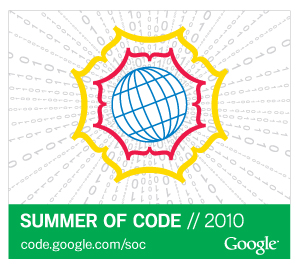

The OBF was accepted into the 2010 [Google Summer of
Code](http://code.google.com/soc) (GSoC) program as an umbrella
organization for all OBF-affiliated projects. [Program
Timeline](http://socghop.appspot.com/document/show/gsoc_program/google/gsoc2010/timeline).

2010 Funded Students and Projects (6 students)
----------------------------------------------

### Mark Chapman (BioJava)

-   [Improvements including Implementation of Multiple Sequence
    Alignment Algorithms](http://biojava.org/wiki/GSoC:MSA)
-   Mentor: [Andreas Prlic](http://biojava.org/wiki/Andreas_Prlic)
-   [Mark Chapman on BioJava](http://biojava.org/wiki/Mark_Chapman)

### Jianjiong Gao (BioJava)

-   [Packages for Identification, Classification, and Visualization of
    Posttranslational Modification of
    Proteins](http://www.biojava.org/wiki/GSoC:PTM)
-   Mentor: [Peter Rose](http://www.linkedin.com/in/peterrose)
-   [Jianjiong Gao on
    BioJava](http://www.biojava.org/wiki/Jianjiong_Gao)

### Jun Yin (BioPerl)

-   [BioPerl Alignment Subsystem
    Refactoring](http://bioperl.org/wiki/Google_Summer_of_Code#Alignment_Subsystem_Refactoring)
-   Primary mentor [Chris
    Fields](http://bioperl.org/wiki/User:Cjfields), secondary mentor
    [Mark Jensen](http://bioperl.org/wiki/User:Majensen)
-   [Project overview and updates](http://gsoc2010-junyin.blogspot.com/)

### João Rodrigues (BioPython)

-   [Extending Bio.PDB: broadening the usefulness of BioPython’s
    Structural Biology
    module](http://www.biopython.org/wiki/GSOC2010_Joao)
-   Mentor: [Eric Talevich](http://eric.talevich.com/)
-   [João Rodrigues on
    Biopython](http://www.biopython.org/wiki/User:Joaor)
-   [Project's Code on
    GitHub](http://github.com/JoaoRodrigues/biopython/tree/GSOC2010)

João continues to be an active contributor to Biopython and maintains
the Bio.PDB module.

### Kazuhiro Hayashi (BioRuby)

-   [Ruby 1.9.2 support of BioRuby](http://gsoc2010kh.blogspot.com/)
-   Mentor: Naohisa Goto

### Sara Rayburn (BioRuby)

-   [Implementing Speciation & Duplication Inference Algorithm for
    Binary and Non-binary Species
    Tree](http://wiki.github.com/srayburn/bioruby/gsoc-2010-implementing-sdi-project-updates)
-   Primary mentor [Christian
    Zmasek](http://www.linkedin.com/in/cmzmasek), secondary mentor Diana
    Jaunzeikare

