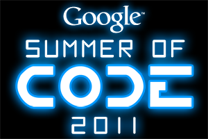

The OBF was accepted into the 2011 Google Summer of Code (GSoC) program
as an umbrella organization for all OBF-affiliated projects. [Program
Timeline](http://socghop.appspot.com/document/show/gsoc_program/google/gsoc2011/timeline).

Summer 2011 Projects
--------------------

Here are links to the progress report pages for OBF's 2011 Google Summer
of Code students:

### Sheena Scroggins (BioPerl)

  
[Major BioPerl reorganization](http://www.techomics.com/)

mentored by Robert Buels and Chris Fields

### Chuan Hock Koh (BioJava)

  
[Amino Acid Physico-Chemical Properties
Calculation](http://biojava.org/wiki/GSoC:AAPropertiesComputation)

mentored by Peter Troshin, Andreas Prlic, and Jay Vyas

### Michał Koziarski (BioRuby)

  
[Represent bio-objects and related information with
images](http://bioruby.open-bio.org/wiki/GSoC:Bio-images)

mentored by Raoul J.P. Bonnal and Francesco Strozzi

### Justinas Vygintas Daugmaudis (Biopython)

  
[Mocapy++ Plugin System](http://biopython.org/wiki/GSOC2011_MocapyExt)

mentored by Thomas Hamelryck and Eric Talevich

### Michele dos Santos da Silva (Biopython)

  
[Mocapy++ BioPython
Integration](http://biopython.org/wiki/GSOC2011_Mocapy)

mentored by Thomas Hamelryck and Eric Talevich

### Mikael Eric Trellet (Biopython)

  
[Interface analysis module for
BioPython](http://www.biopython.org/wiki/GSoC2011_mtrellet)

mentored by João Rodrigues and Eric Talevich

2011 Mentor Volunteers and Project Ideas
----------------------------------------

Mentors and project ideas are hosted on each member project's wiki on a
dedicated Google Summer of Code page. See each of the member projects,
linked below, for more details about any project:

BioPerl:  

:\* [Major BioPerl
reorganization](http://bioperl.org/wiki/Google_Summer_of_Code#Major_BioPerl_reorganization)

:\* [Lightweight Sequence objects and Lazy
Parsing](http://bioperl.org/wiki/Google_Summer_of_Code#Lightweight.2FLazy_BioPerl_Classes)

:\* [Perl Generic Wrappers for External
Programs](http://bioperl.org/wiki/Google_Summer_of_Code#Perl_Run_Wrappers_for_External_Programs_in_a_Flash)

:\* [BioPerl 2.0: Modern::Perl, Perl6, and
BioPerl](http://bioperl.org/wiki/Google_Summer_of_Code#BioPerl_2.0_.28and_beyond.29)

:\* \[<http://bioperl.org/wiki/Google_Summer_of_Code#Bio>::Assembly
Bio::Assembly updates\]

:\* [Semantic web
support](http://bioperl.org/wiki/Google_Summer_of_Code#Semantic_Web_Support)

BioPython:  

:\* [Mocapy++Biopython: from data to probabilistic models of
biomolecules](http://biopython.org/wiki/Google_Summer_of_Code#Mocapy.2B.2BBiopython:_from_data_to_probabilistic_models_of_biomolecules)

:\* [Variant representation, parser, generator, and coordinate
converter](http://biopython.org/wiki/Google_Summer_of_Code#Variant_representation.2C_parser.2C_generator.2C_and_coordinate_converter)

BioJava:  

:\* [Amino acids physico-chemical properties
calculation](http://biojava.org/wiki/Google_Summer_of_Code#Amino_acids_physico-chemical_properties_calculation)

:\* [Extend Sequence Viewer code to become a client for the Distributed
Annotation
System](http://biojava.org/wiki/Google_Summer_of_Code#Extend_Sequence_Viewer_code_to_become_a_client_for_the_Distributed_Annotation_System)

BioRuby:  

:\* [Support Next Generation Sequencing (NGS) in
BioRuby](http://bioruby.open-bio.org/wiki/Google_Summer_of_Code#Support_Next_Generation_Sequencing_.28NGS.29_in_BioRuby)

:\* [BioRuby Wrapper for Command line
application](http://bioruby.open-bio.org/wiki/Google_Summer_of_Code#BioRuby_Wrapper_for_Command_line_application)

:\* [Represent bio-objects and related information with
images](http://bioruby.open-bio.org/wiki/Google_Summer_of_Code#Represent_bio-objects_and_related_information_with_images)

:\* [Modular annotation knowledge base for
BioRuby](http://bioruby.open-bio.org/wiki/Google_Summer_of_Code#Modular_annotation_knowledge_base_for_BioRuby)

BioLib:  

:\* [Mapping JAVA libraries to Perl/Ruby/Python using Biolib+SWIG+JNI
(2011)](http://biolib.open-bio.org/wiki/GSoC2011)

:\* [Mapping EMBOSS to Perl, Ruby or Python using BioLib+SWIG+EMBOSS
(2011)](http://biolib.open-bio.org/wiki/GSoC2011)

BioDAS:  

:\* [Redesign of the DAS Registry](http://www.biodas.org/wiki/GSoC2011)

:\* [DAS Server for large files on local
filesystems](http://www.biodas.org/wiki/GSoC2011)

*Note to students: project ideas on the wikis of member projects are
only selected projects, albeit well thought-out ones. You are encouraged
to propose your own project, just make sure it is still a contribution
to one the OBF member projects (see list below)! If we like your
proposal, we will try to find a mentor to help you with the project.
Regardless of what you decide to do, make sure you read and follow the
guidelines for students below.*
