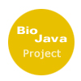

The details of each of our project ideas are listed below, including
potential mentors. Interested mentors and students should subscribe to
the OBF/GSoC [mailing
list](http://lists.open-bio.org/mailman/listinfo/gsoc) and announce
their interest.

See the main OBF [Google Summer of
Code](Google_Summer_of_Code "wikilink") page for more information about
the GSoC program and additional ways to get in touch with us.

Cross-project ideas
-------------------

### BioInterchange: Convert and Exchange Biological File Formants using RESTful web service

Rationale  
[BioInterchange](http://www.biointerchange.org/index.html) Interchange
data using the Resource Description Framework (RDF) and let
BioInterchange automagically create RDF triples from your TSV, XML,
GFF3, GVF, Newick and other files common in Bioinformatics.
BioInterchange helps you transform your data sets into linked data for
sharing and data integration via command line, web-service, or API.
BioInterchange was conceived and designed during NBDC/DBCLS's
[BioHackathon 2012](http://2012.biohackathon.org/). Architecture and RDF
serialization implementations were provided by Joachim Baran, Geraint
Duck provided JSON and XML deserialization implementations and
contributed to architecture decisions, guidance on ontology use and
applications were given by Kevin B. Cohen and Michel Dumontier, where
Michel brought forward and extended the Semanticscience Integrated
Ontology (SIO). Jin-Dong Kim helped to define ontology relationships for
RDFizing DBCLS' PubAnnotation category annotations. The main idea is to
have a central service with can be used as a validator and as
interchange service for different languages.

<!-- -->

Approach  
The project will identify the most common and used file formants for all
the currently used language under OBF and will design a RESTful API and
will project an implementation for all the supported languages.
BioInterchange was developed with Ruby but the scope of the project is
to have an agnostic system which let use implement a converter using the
best language for that functionality. It expected to have a high traffic
for the service so an appropriate refactoring or reimplementation using
parallel techniques or languages devoted to parallel programming would
be possible.

<!-- -->

Difficulty and needed skills  
The project is mid / high difficulty, aimed at talented students.
Previous knowledge of Ruby or other scripting language is preferred and
flexibility in learning other languages is requireed.

The project requires  
Knowledge of advanced programming languages and meta-programming and
some concept in parallelizing and web services design.

<!-- -->

Mentors  
Raoul J.P. Bonnal, Francesco Strozzi, Toshiaki Katayama, Joachim Baran

### Language APIs for the Systems Biology Markup Language (SBML) through the JVM

Rationale  
The standard Java implementation of SBML, JSBML, is used as a parser for
various Java-based systems biology applications. This fulfills one
niche, but the versatility of the JVM can be utilized to employ JSBML as
a parser for systems biology applications that are written in
other languages. Also, JSBML undergoes an active community effort to be
up-to-date with current SBML standards.

<!-- -->

Approach  
This project will aim to present language APIs for languages that may
want to employ the SBML structure without building a parser
from scratch. Matlab, Mathematica, and Python APIs will be the focus for
this project.

<!-- -->

Languages and skill  
Java, optional: Matlab, Python, (other language)

<!-- -->

Mentors  
Andreas Dräger, Alex Thomas

[BioPerl](http://bioperl.org/wiki/Google_Summer_of_Code)
--------------------------------------------------------

-   [Mailing lists](bp:Mailing_lists "wikilink")
-   IRC: `#bioperl` on [Freenode](http://freenode.net)
-   [Information for new developers](bp:Becoming_a_developer "wikilink")
-   Source code browser for
    [bioperl-live](http://code.open-bio.org/svnweb/index.cgi/bioperl/browse/bioperl-live/trunk)
    (the main BioPerl code base), and [all BioPerl
    sub-projects](http://code.open-bio.org/svnweb/index.cgi/bioperl/)
-   [Priority list](bp:Project_priority_list "wikilink") of things that
    need work, as another source for student-conceived project ideas

### [NGS-friendly BioPerl code](http://bioperl.org/wiki/Google_Summer_of_Code#NGS-friendly_BioPerl_code)

Rationale : BioPerl is known to be slow re: any data sets, but particularly when dealing with very large data (e.g. anything related to NGS analysis. Can we make it better? Where should we focus our efforts?  

<!-- -->

Approach : Under the supervision of their mentor(s), the GSoC student will:  

:\* Benchmark bottlenecks that lead to loss in performance for NGS
analyses

:\* Refactor old classes or develop new optimized code for NGS analysis

Challenges : This can be a self-contained project, but will require a lot of discussion on what areas to focus on.  

<!-- -->

Difficulty and needed skills : easy to hard, depending on student's familiarity with the tools to be used. Student will need:  

:\* excellent Perl programming skills, including familiarity with NGS
datasets

\* knowledge of modern Perl practices.  

<!-- -->

Mentors : Chris Fields, others?  

### \[<http://bioperl.org/wiki/Google_Summer_of_Code#Convert_BioPerl-DB_to_DBIx>::Class Convert BioPerl-DB to use DBIx::Class\]

Rationale : Bioperl-db (the BioPerl bindings to BioSQL) in essence constitute a self-made ORM, invented at a time when DBIx::Class didn't exist yet. As such, it has some advantages (if you are willing to count overly clever features to be counted in this category), but arguably many more disadvantages, chief among them being the unsustainably small (you could also say non-existent) developer community supporting it, and the fact that DBIx::Class now has existed for years, and is fairly mature. So, rewriting Bioperl-db with a DBIx::Class (or another well-supported generic ORM) would stand to make a considerable impact on our ability to further develop Bioperl's relational storage capabilities, as well as BioSQL itself.  

<!-- -->

Approach : Under the supervision of their mentor(s), the GSoC student will:  

:\* Start working on conversion of BioPerl-DB classes to using
DBIx::Class

:\* write additional tests and improve documentation as needed

Challenges : BioPerl-DB is self-contained; this may require looking at the BioSQL schema and determining whether there are specific areas that need the most focus.  

<!-- -->

Difficulty and needed skills : easy to hard, depending on student's familiarity with the tools to be used. Student will need:  

:\* excellent Perl programming skills, including familiarity with:

:\*\* DBIx::Class

Mentors : Hilmar Lapp, others?  

### [Major BioPerl Reorganization (Part II)](http://bioperl.org/wiki/Google_Summer_of_Code#Major_BioPerl_Reorganization.2C_part_2)

Rationale : The initial run at this project [had some success](http://bioperl.org/wiki/Google_Summer_of_Code#Major_BioPerl_reorganization), but more work needs to be done. The final goal of this project is to find and break out as many well-defined subsections of BioPerl as possible, releasing them to CPAN along the way.  

<!-- -->

Approach : Under the supervision of their mentor(s), the GSoC student will:  

:\* break current thousand-module monolithic distributions into smaller,
more manageable pieces

:\* improve characterization of dependencies

:\* improve build and testing systems for new distributions

:\* write additional tests and improve documentation as needed for the
reorganization

Challenges : BioPerl contains nearly 2000 modules, with very complex relationships between them.  

<!-- -->

Difficulty and needed skills : easy to hard, depending on student's familiarity with the tools to be used. Student will need:  

:\* excellent Perl programming skills, including familiarity with:

:\*\* testing (`prove`, `TAP::Harness`)

:\*\* module authoring (`Module::Build`,`Dist::Zilla`,PAUSE)

:\* good knowledge of command-line text-processing tools like `ack`,
`grep`, and Perl one-liners.

:\* version control systems (BioPerl uses [git](http://git-scm.com)).

Mentors : Chris Fields, others?  

### [Perl Run Wrappers for External Programs in a Flash](http://bioperl.org/wiki/Google_Summer_of_Code#Perl_Run_Wrappers_for_External_Programs_in_a_Flash)

Rationale : BioPerl has a long tradition of providing wrapper objects for running external programs and parsing their output, mainly through the distribution called [bioperl-run](http://bioperl.org/wiki/Bioperl-run). Wrappers make it relatively easy to process data in highly customizable pipelines with the benefits of BioPerl objects and I/O. They also help to standardize the interfaces to typically idiosyncratic open-source utilities, reducing the burden on the developer. With new bioinformatics tools being released almost daily, however, it can be difficult for the BioPerl regulars to maintain a stable of run wrappers for the latest and greatest tools. Even harder is making the wrapper interfaces themselves conform to a standard API that users can count on.  

<!-- -->

Possible approaches:  

1.  Integrate Galaxy's tool configuration file format in a pluggable way
    for developing a generic wrapper application.
2.  Improve/tighten/extend the `Bio::Tools::Run::WrapperBase` and
    `Bio::Tools::Run::WrapperBase::CommandExts` system for very general
    run wrappers, making them work robustly with the new
    `Bio::Tools::WrapperMaker` module currently under development. The
    goal will be to get these modules ready for release into the trunk.
3.  Are there any shortcomings to current schemes, such as Galaxy's or
    EMBOSS's acd format, that could be addressed with a newer schema?

See [HOWTO:Wrappers](http://bioperl.org/wiki/HOWTO:Wrappers) and the
above module documentation for more details.

Difficulty and needed skills : Medium. The student should understand or be willing to work hard at understanding BioPerl object-oriented style. Some familiarity with [XML](wp:XML "wikilink") and [XML Schema](wp:XML_Schema "wikilink") will help in getting up to speed. An interest in playing with new open-source bioinformatics tools, especially those for managing next-generation sequence assembly, would also be valuable.  

<!-- -->

Mentors : Mark Jensen, [ Chris Fields](User:Cjfields "wikilink")  

### [Lightweight BioPerl modules](http://bioperl.org/wiki/Google_Summer_of_Code#Lightweight.2FLazy_BioPerl_Classes)

Rationale : Many current BioPerl classes are implemented in a greedy or heavy way, where all information is pulled into memory as objects. For instance, the current `Bio::Seq` implementation is the primary bottleneck for sequence parsing speed and can take up a ton of memory, particularly with whole-genome information and next-generation sequencing information. Storing the data in memory in a simple data structure and generating the objects lazily could help with speed. Alternatively, storing the data in a persistent manner would also help with memory issues, with the obvious trade-off for speed but having the nice side-benefit of consistent and possibly persistent ways of handling data.  

<!-- -->

Approach : Implement a `Bio::Seq`/`Bio::PrimarySeq` class (or other commonly-used BioPerl classes) that can deal with very large datasets in a memory-efficient manner. Implement at least one corresponding parser that can either parse records lazily (akin to an XML pull parser) or create lightweight objects. These could be considered two projects but they are interrelated (lightweight objects could have many different backends, including lazy parsing), so development should proceed with this in mind.  

<!-- -->

Difficulty and needed skills : medium to hard. Student should have an excellent command of Perl and data structures, experience with persistent storage mechanisms (such as a SQL-based RDBMS, CouchDB, etc), and some familiarity with parsing methodologies.  

<!-- -->

Prior art : Jason Stajich has started a SQLite-based lightweight `Bio::Tree::Tree` implementation on [a GitHub branch](http://github.com/bioperl/bioperl-live/tree/topic/tree_dbsqlite_memoryfix) at the recent GMOD Evolutionary Biology Hackathon at NESCent in Fall 2010.  

<!-- -->

Mentors : Chris Fields, Jason Stajich  

### [BioPerl 2.0 and beyond](http://bioperl.org/wiki/Google_Summer_of_Code#BioPerl_2.0_.28and_beyond.29)

Rationale : Design or reimplement BioPerl classes without API constraint, using Modern Perl tools or Perl 6.  

<!-- -->

Approach : Most BioPerl code is over 6 years old and doesn't take advantage of Modern Perl tools, such as new methods available in Perl 5.10 and 5.12, Moose/MooseX, DBIx::Class, Catalyst, and more. Furthermore, a viable Perl6 implementation, Rakudo, is currently available. This gives us an enormous opportunity to redesign fundamental aspects of BioPerl without the necessity for development hindered by a requirement for backwards compatibility.  

Two projects, Biome (Moose-based BioPerl) and BioPerl6 (Perl 6 BioPerl)
have already started but are in a very early stage. One could
participate in:

-   IO implementations for object iteration, or Perl6 grammars for
    common formats
-   Redesign of common BioPerl classes
-   etc.

This is an area ripe for new student project ideas. The more focused the
better! Discussion is a must, either via IRC or email.

Difficulty : Project-dependent  

<!-- -->

Mentors : Chris Fields, Rob Buels  

### \[<http://bioperl.org/wiki/Google_Summer_of_Code#Bio>::Assembly Bio::Assembly\]

Rationale  
A followup to the 2010 project "Alignment Subsystem Refactoring":
Continued refinement of AssemblyIO.

<!-- -->

Approach  
SAM or ACE files once imported should have similar handles
and/or methods.

<!-- -->

Difficulty and needed skills  
Medium to hard. Excellent command of Perl, familiarity with sequence
alignment and alignment tools.

<!-- -->

Mentors  
To be determined.

### [Semantic Web Support](http://bioperl.org/wiki/Google_Summer_of_Code#Semantic_Web_Support)

Rationale : There are great development opportunities in information discovery for bioinformatics using semantic web, specially thinking in the implementation of SPARQL queries for a "discoverable bio-cloud".  

<!-- -->

Approach : Previous efforts can be adopted and extended, such as resulting code from [BioHackathon 3](http://hackathon3.dbcls.jp/) and the code provided by [Expasy](http://dev.isb-sib.ch/projects/expasy-rdf/). Using the modules of the [Semantic Web with Perl community](http://www.perlrdf.org), built around \[<https://metacpan.org/module/RDF>::Trine RDF::Trine low-level API\]. There are two main areas to explore:  

1.  Parsers and converters from and to RDF, including IO modules for
    GenBank, EMBL, several XML specifications, et cetera.
2.  Storage and retrieval of information using SPARQL.

Difficulty and needed skills : Medium. Familiarity with SeqIO modules and Perl itself. The student should also be familiar with RDF format and the RDF triples concept for Semantic Web.  

<!-- -->

Mentors : To be determined. [Kjetil Kjernsmo](http://bioperl.org/wiki/User:Kjetilk) can help mentor students wishing to explore the RDF::Trine direction.  

[BioJava](http://biojava.org/wiki/Google_Summer_of_Code)
--------------------------------------------------------

-   [Mailing lists](http://biojava.org/wiki/BioJava:MailingLists)
-   [BioJava modules](http://biojava.org/wiki/BioJava:Modules) as
    another source for student-conceived project ideas
-   Source code for
    [biojava-live](http://code.open-bio.org/svnweb/index.cgi/biojava/browse/biojava-live/trunk)
    (the main BioJava code base) and [all BioJava
    sub-projects](http://code.open-bio.org/svnweb/index.cgi/biojava/)

For GSoC 2014, BioJava is partnering with the Systems Biology Markup
Language (SMBL) team to bring enhancements to JSBML, the standard Java
implementation of SBML, and bring SBML features to other Java-based
systems biology software. See [the SMBL
website](http://sbml.org/GSoC2014) for more ideas from the SBML team.

### Add support for Schema-based validation of SBML

Rationale  
SBML files need to be validated carefully to ensure that they conform to
the specification. Currently, the most complete implementation of SBML
validation is embodied in libSBML, although the rules of SBML validity
are defined in the SBML specification documents. It is possible to
validate SBML from JSBML using either the Online SBML Validator or a
Java package we provide for calling libSBML locally (i.e., without a
network connection) but we want to move toward capturing all of the
SBML's validity rules in schema languages.

<!-- -->

Approach  
Capture all of the SBML's validity rules in schema languages such as
RELAX NG and Schematron, then have both libSBML and JSBML (and any other
SBML-using system) use schema validation engines instead of
hardcoded validation. This will be especially important as more SBML
Level 3 packages become implemented. We have already made great strides
in defining RELAX NG schemas for SBML Level 3, but we need to work on
providing the hooks in JSBML to using those schemas for validating
SBML files.

<!-- -->

Languages and skills  
Java, XML, RELAX NG, Schematron, SBML

<!-- -->

Mentors  
Sarah Keating, Andreas Dräger

### Redesign the implementation of mathematical formulas in JSBML

Rationale  
JSBML uses the concept of abstract syntax trees to work with
mathematical expressions. At the moment, all different kinds of formulas
are implemented in one complex class.

<!-- -->

Approach  
This project should implement a math package for JSBML, in which all
different kinds of tree nodes that can occur in formulas (e.g., real
numbers or algebraic symbols such as 'plus' or 'minus') would be
represented with an own, specialized class. In this way, the handling of
formulas would be much more straightforward and even more efficient.

<!-- -->

Difficulty and skills  
Medium; proficient in Java

<!-- -->

Mentors  
Andreas Dräger, Alex Thomas, Sarah Keating

### Implement support for the SBML Multistate/Multicomponent Species package

Rationale  
One of the many packages for SBML Level 3 is Multistate and
multicomponent species. This packages define constructs for models and
modelers to represent biochemical species that have internal structure
or state properties. These may involve molecules that have multiple
potential states, such as a protein that may be covalently modified, and
molecules that combine to form heterogeneous complexes located among
multiple compartments.

<!-- -->

Approach  
The JSBML team has already started implementation of the `multi`
package, but more needs to be done.

<!-- -->

Languages and skills  
Java, some exposure to biochemistry

<!-- -->

Mentors  
Nicolas Rodriguez, Nicolas Le Novère

### Improve the plugin interface for CellDesigner

Rationale  
One of the most frequently used programs in computational systems
biology is CellDesigner. JSBML provides an interface that facilitates
the development of plugins for this program. This interface has recently
been revised and improved.

<!-- -->

Approach  
Test cases and plugins for CellDesigner are to be implemented in order
to make use of it and ensure its correct behavior. It is, for instance,
possible to use CellDesigner's complex canvas user interface to create
or manipulate biochemical networks and to conduct numerical computation.

<!-- -->

Languages and skills  
Java, some basic understanding of visualization algorithms

<!-- -->

Potential Mentor  
Andreas Dräger

[BioPython](biopython:Google_Summer_of_Code "wikilink")
-------------------------------------------------------

-   **[ BioPython GSoC
    Page](biopython:Google_Summer_of_Code "wikilink")** - project ideas
    and mentors
-   [Project website](biopython:Main_Page "wikilink")
-   [Information for contributors](biopython:Contributing "wikilink")
-   [Mailing lists](biopython:Mailing_lists "wikilink")
-   [ Source Code](biopython:SourceCode "wikilink")
-   No IRC channel at present

### [Indexing & Lazy-loading Sequence Parsers](http://biopython.org/wiki/Google_Summer_of_Code#Indexing_.26_Lazy-loading_Sequence_Parsers)

Rationale  
[Bio.SeqIO](biopython:SeqIO "wikilink")'s indexing offers parsing on
demand access to any sequence in a large file (or collection of files
on disk) as a <biopython:SeqRecord> object. This works well when you
have many small to medium sized sequences/genomes. However, this is not
ideal for large genomes or chromosomes where only a sub-region may
be needed. A lazy-loading parser would delay reading the record
until requested. For example, if region *record\[3000:4000\]* is
requested, then only those 1000 bases need to be loaded from disk into
memory, plus any features in that region. This is how Biopython's
<biopython:BioSQL> interface works. Tools like tabix and samtools have
demonstrated efficient co-ordinate indexing which could be useful here.

Aside from being used via an index for random access, lazy-loading
parsers could be used when iterating over a file as well. This can
*potentially* offer speed ups for tasks where only a fraction of the
data is used. For example, if calculating the GC content of a collection
of genomes from GenBank, using Bio.SeqIO.parse(...) would currently
needlessly load and parse all the annotation and features. A lazy-parser
would only parse the sequence information.

Approach & Goals  
Useful features include:

-   Internal indexing of multiple file formats, including FASTA and
    richly annotated sequence formats like GenBank/EMBL
    and GTF/GFF/GFF3.
-   Full compatibility with existing SeqIO parsers which load everything
    into memory as a \`SeqRecord\` object.

Difficulty and needed skills  
Hard. Familiarity with the Biopython's existing sequence
parsing essential. Understanding of indexing large files will be vital.

Possible Mentors  
[Wibowo Arindrarto](https://github.com/bow), [Peter
Cock](https://github.com/peterjc/), others welcome

[BioRuby](http://bioruby.open-bio.org/wiki/Google_Summer_of_Code)
-----------------------------------------------------------------

-   **[BioRuby GSoC
    Page](http://bioruby.open-bio.org/wiki/Google_Summer_of_Code)** -
    project ideas and mentors
-   [Project website](http://bioruby.org)
-   [developers mailing
    list](http://lists.open-bio.org/mailman/listinfo/bioruby)
-   [source code](http://github.com/bioruby/bioruby/tree/master)
-   IRC: `#bioruby` on [Freenode](http://freenode.net)

### [An ultra-fast scalable RESTful API to query large numbers of genomic variations](http://bioruby.open-bio.org/wiki/Google_Summer_of_Code#An_ultra-fast_scalable_RESTful_API_to_query_large_numbers_of_genomic_variations)

Rationale  
VCF files are the typical output of genome resequencing
projects (http://www.1000genomes.org/node/101). They store the
information on all the mutations and variations
([SNPs](http://en.wikipedia.org/wiki/Single-nucleotide_polymorphism) and
[InDels](http://en.wikipedia.org/wiki/Indel)) that are found by
comparing the outputs of a
[NGS](http://en.wikipedia.org/wiki/DNA_sequencing#Next-generation_methods)
platform with a reference genome. These files are not incredibly large
(a typical uncompressed VCF file is few gigabytes) but they are full
with information on millions of positions in the genome where mutations
are found. Large resequencing projects can produce hundreds or thousands
of these files, one for each sample sequenced.

Existing tools (such as [VCFTools](http://vcftools.sourceforge.net) or
[BCFTools](http://samtools.sourceforge.net/samtools.shtml#4)) offer a
convenient way to access these files and extract or convert the
information present, but are limited in functionalities and speed when
more complex queries need to be performed on these data. With existing
tools it is very complicated, if not impossibile, to retrive information
when working on many VCF files and samples together to compare, for
instance, the variations found in 100 samples and extract all the
mutations that are present in 50 samples but are not present in the
other 50 and so on.

<!-- -->

Approach  
The project should develop a RESTful API to address the issues described
in the rationale and to allow users to manipulate and compare genomics
variation information for hundreds of samples. A database engine will be
required to store the information and to support the data mining.
Unstructured database engines such as noSQL databases or key-values
stores can all be valid alternatives to combine high-speed with
data flexibility. The decision on the best database engine to be used
will be discussed between the student and the mentors and within the
OpenBio community. Given the high amount of information that will need
to be processed by such an application, scalable and fast languages such
as JVM-based languages like Scala or JRuby will be a good choice. The
project should also take care of the deploy of such an API, by creating
a Ruby gem or a JAR that users can install and use right away with
their datasets.

<!-- -->

Difficulty and needed skills  
The project has an average difficulty and it is aimed at talented
students who wants to develop a fast API to address these problems.

The project requires  
Knowledge of advanced programming languages. Some experience and
knowledge of databases and data mining will help managing the
information of VCF files.

<!-- -->

Mentors  
Francesco Strozzi, Raoul J.P. Bonnal

[BioHaskell](http://biohaskell.org/Google_Summer_of_Code)
---------------------------------------------------------

:\* [Project website](http://biohaskell.org/)

:\* [Bioinformatics section on
HackageDB](http://hackage.haskell.org/packages/#cat:Bioinformatics)

### [Optimizing a novel, very sensitive alignment method](http://biohaskell.org/Google_Summer_of_Code#Optimizing_transalign)
